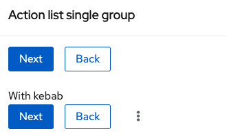
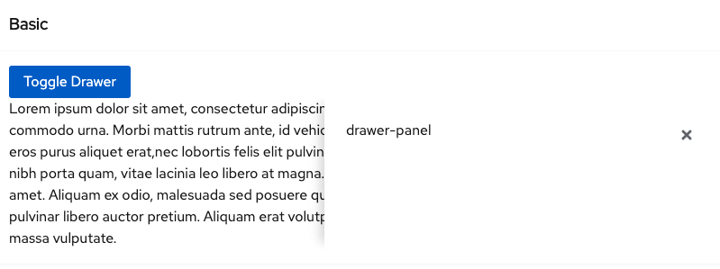
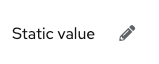
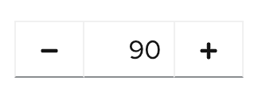
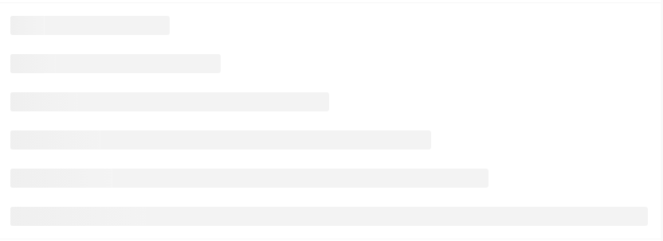
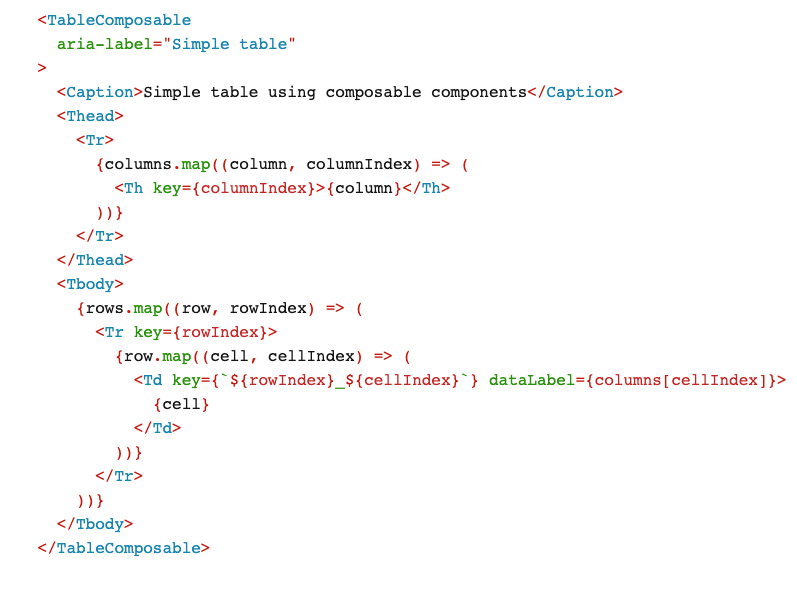
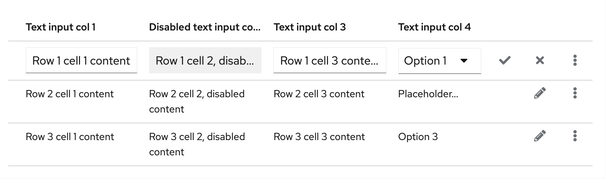
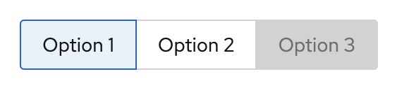
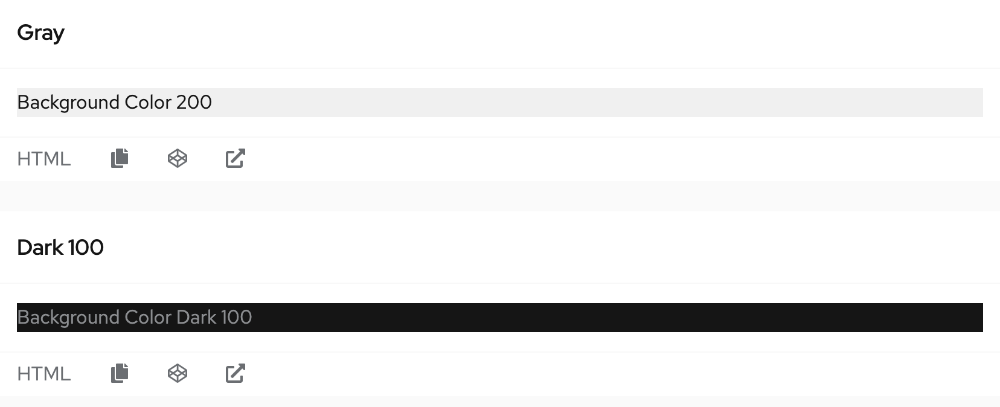
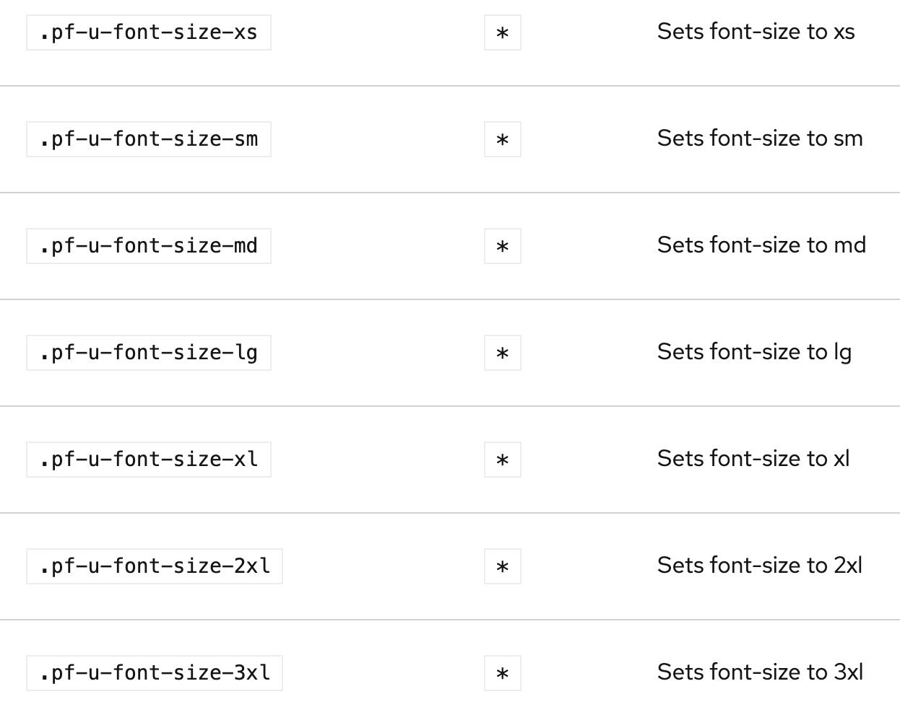

# PatternFly Beta Component Promotion Candidates
## For Release 2021.11

### ActionList
An action list is a group of actions with set spacing.

### Drawer
A drawer is a sliding panel that enters from the right edge of the viewport. It can be configured to either overlay content on a page or create a sidebar by pushing that content to the left.
This implementation includes resizable drawers, inline drawers, static drawers, and drawers opening from varying directions.

### InlineEdit
An inline edit component allows users to switch between a read-only view and an edit view of description lists, page text elements, or tables as needed. Inline editing saves the user from opening a modal window or redirecting to a separate edit page so that they can edit in context of their current view.
This implementation is only done in core and is consumed by other components, such as the inline edit variant of the table.

### NumberInput
A number input provides a quick and effective way for users to enter and modify a numeric value. Similar to input groups, number inputs combine two input types into one control: A text input field with buttons on either side. When combined, these elements allow users to input numeric values in a responsive and scalable way.

### Skeleton
A skeleton is a type of loading state that allows you to expose content incrementally. For content that may take a long time to load, use a progress bar in place of a skeleton.

### Table: Composable
The TableComposable component differs from the regular Table component, in that it allows you to compose the table by nesting the relevant Thead, Tbody, Tr, Th and Td components within it.
The TableComposable component is a second react implementation of the Table component.

### Table: Editable Rows
A table's editable rows can toggle between read only and editable. When editable, they can have a
combination of text inputs and select inputs in its cells. It also includes buttons to
save or cancel changes.

### ToggleGroup
A toggle group is a group of controls that can be used to quickly switch between actions or states.
Toggle items can consist of icons, text, or both. Styling of toggles is dependent on the background color.

### Utilities: Background color
Utility classes for modifying a component's background color.

### Utilities: Text
Utility classes for modifying text's weight, color, size, or wrapping behavior.

