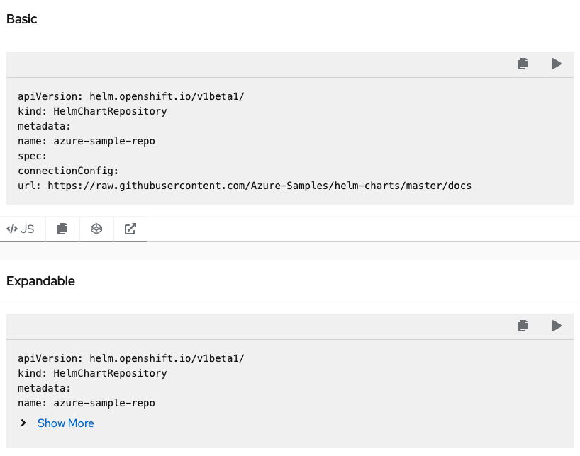
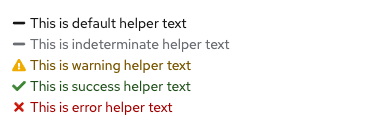
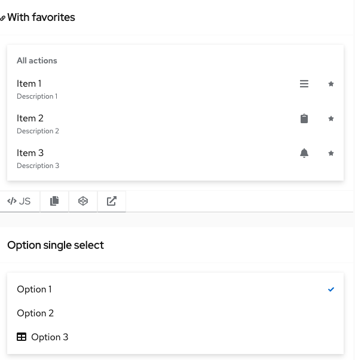
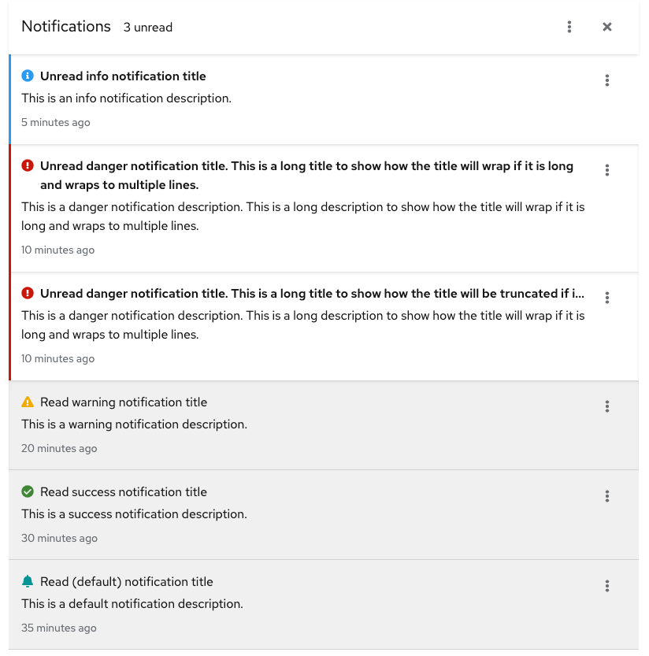
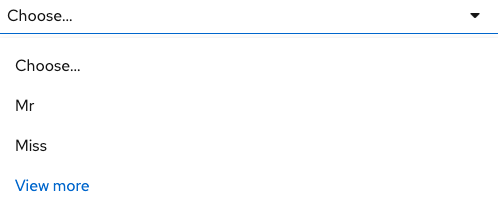
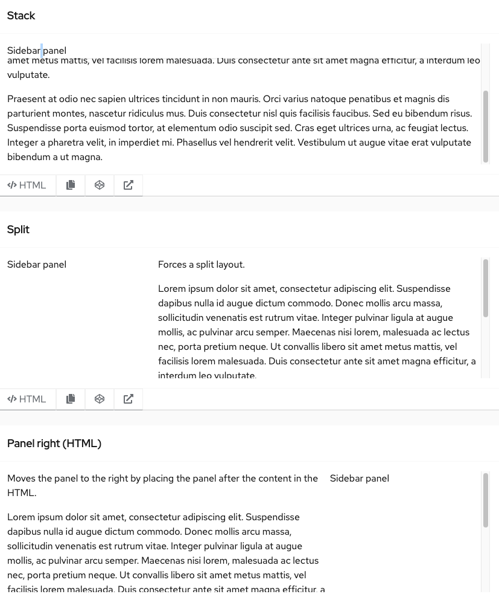

# PatternFly Beta Component Promotion Candidates
## For Release 2021.14

### Code block
A code block is a component that contains two or more lines of ready-only code. The code in a code block can be copied to the clipboard.

Code blocks can include multiple actions. By default, the copy action is always present and any other actions are optional and customizable.

There is the option to include a show more/less section in the code block. The show more/less section can be used to collapse larger code snippets. An expandable code block allows for long lines of code to be stored in an expansion panel. Expanding the code block allows the user to view the full string that they can copy.

### Helper text
Helper text is meant to provide guidance, warnings, success messages, or error messages below an input.

### Menu
A menu is a list of options or actions that users can choose from. It can be used in a variety of contexts whenever the user needs to choose between multiple values, options, or actions. A menu can be opened in a dropdown or select list, or it can be revealed by right clicking on a specific region within a page.

**NOTE: The drilldown variant and flyout demo will still be in `beta`.

### Notification drawer
A notification drawer is a place where users can view and manage notifications that are generated by the system. It allows them to see a list of notifications without the need to navigate away from the current screen.

### Select: Loading variant
When a select list contains more than 20 items, and the processing load may be too big to load all options at once, you have the option to add a “View more” link at the bottom of the menu. When the user clicks View more, more options are loaded and “view more” is replaced with the next available set of options.

### Select: isInputValuePersisted
The `isInputValuePersisted` is a new `Select` component prop which is a flag used for retaining a keyboard-entered value in typeahead text field when focus leaves the input.

### Side bar
The side bar is used to layout two content panels within a page section or parent component. 

