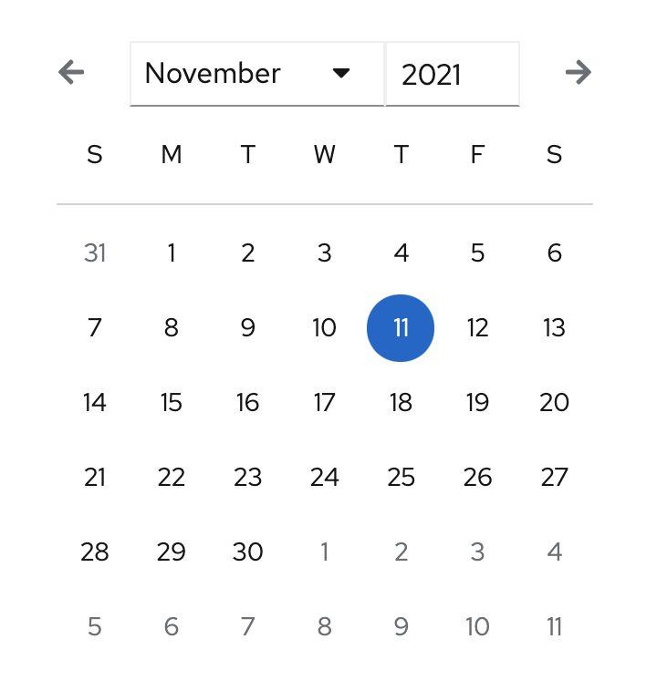
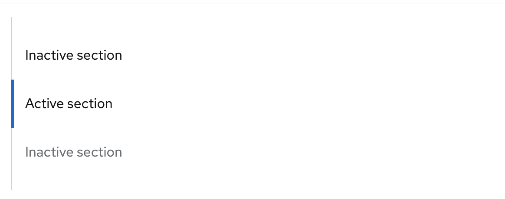

# PatternFly Beta Component Promotion Candidates
## For Release 2022.01

### Back to top
A back to top component improves ease of navigation. It allows users to programmatically return to the top of the content.

### Calendar month
A calendar month component allows users to select and navigate between days, months, and/or years. This component is usually used with the date picker component to display date options and selections. 

### Jump links
A jump links component provides a way to navigate through section headings on a page without scrolling. The highlighted active section changes as the user scrolls to the next section.

