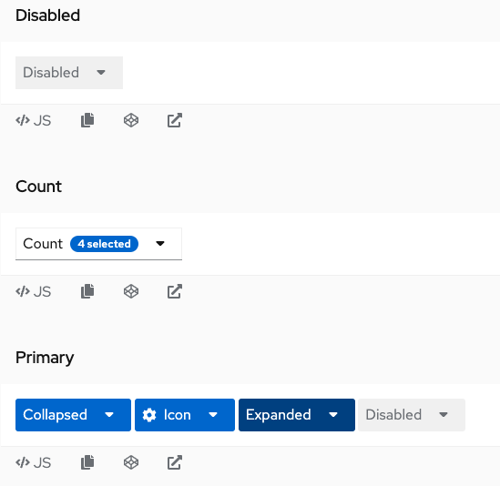
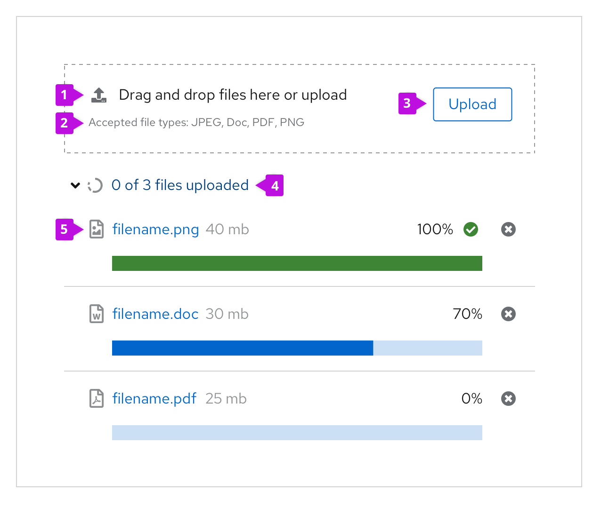
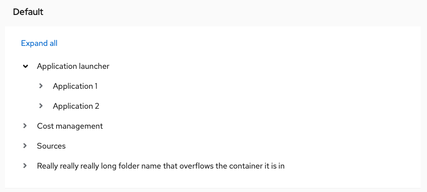

# PatternFly beta component promotion candidates
## For release 2022.14

### [AlertGroup: overflow](https://www.patternfly.org/v4/components/alert-group#toast-alert-group-with-overflow-capture)
If you don't want multiple alerts to stack and fill the screen until the user dismisses them, you may use the overflow footer in an alert group to manage overflow.

### [Calendar month](https://www.patternfly.org/v4/components/calendar-month)
A calendar month com. This component is usually used with the date picker component, to display date options and selections.

### [Card: raised variant](https://www.patternfly.org/v4/components/card#selectable)
An updated, animated style for selectable cards.

### [Code editor](https://www.patternfly.org/v4/components/code-editor)
A code editor is a versatile text editor that allows for editing various languages. The code editor is built on top of the Monaco Editor.

### [Data list: selectableRow prop](https://www.patternfly.org/v4/components/data-list#datalist)
Using the `selectableRow` property causes the data list to render hidden inputs in its selectable rows. This improve selectable item accessibility.

### [Dual list selector](https://www.patternfly.org/v4/components/dual-list-selector)
A dual list selector allows users to select and move items from one list of available items to another list of selected items. Unlike a select list, a dual list selector separates the available options and the selected options into two separate lists, which allows users to easily scan the items they selected.

### [Icon sprites](https://www.patternfly.org/v4/components/form-control#icon-sprite)
The icons for the success, invalid, calendar, etc varations in form control elemements are applied as background images to the form element. By default, the image URLs for these icons are data URIs. However, there may be cases where data URIs are not ideal, such as in an application with a content security policy that disallows data URIs for security reasons. The .pf-m-icon-sprite variation changes the icon source to an external SVG file that serves as a sprite for all of the supported icons.

### [Label group](https://www.patternfly.org/v4/components/label-group)
Use a label group when you have multiple labels to display at once. Label groups can be oriented either horizontally or vertically and can optionally be named and dismissible.

### [Masthead](https://www.patternfly.org/v4/components/masthead)
A masthead contains global properties such as logotype, navigation and settings in an organized fashion and it is accessible from all parts of the application. All pages should share a common masthead.

### [Menu: checkbox variant](https://www.patternfly.org/v4/components/menu#with-checkbox)
The menu's checkbox variant was built to allow for more customizable implementation of the checkbox select component.

### [Menu toggle](https://www.patternfly.org/v4/components/menu-toggle)
The menu toggle component pairs with the menu component to create composable dropdown and select menus. Using a menu toggle with a menu enables you to create custom component configurations not supported by the standard dropdown or select components. 

### [File upload - multiple](https://www.patternfly.org/v4/components/file-upload---multiple)
The file upload - multiple component allows users to select 1 or more files to upload to a specific location. 

### [Notification drawer](https://www.patternfly.org/v4/components/notification-drawer)
A notification drawer is a place where users can view and manage notifications that are generated by the system. It allows them to see a list of notifications without the need to navigate away from the current screen.

### [Panel](https://www.patternfly.org/v4/components/panel)
The panel component is a container that supports flexible content layouts. It can be used to house other components such as fields, forms, videos, buttons, and more. 

### [Popover: alert severity, icon](https://www.patternfly.org/v4/components/popover#alert-popover)
These popover are similar to default popovers, the key difference being the inclusion of status-like headers for the following alert types: default, info, success, warning, and danger.

### [Select: view more, loading variant](https://www.patternfly.org/v4/components/select#view-more)
When a select list contains more than 20 items, and the processing load may be too big to load all options at once, you have the option to add a “View more” link at the bottom of the menu. When the user clicks View more, more options are loaded and “view more” is replaced with the next available set of options.

### [Slider](https://www.patternfly.org/v4/components/slider)
A slider provides a quick and effective way for users to set and adjust a numeric value from a defined range of values.

### [Table: tree view](https://www.patternfly.org/v4/components/table#composable-tree-table)
Displays hierarchical tabular data. It provides a tree structure with items and errors to expand or collapse child items.

### [Tree view](https://www.patternfly.org/v4/components/tree-view)
A tree view is a structure that displays data in a hierarchical view. It can be used in a dropdown, drawer, primary-detail, modal, or wizard. Tree views are often used when grouping similar decisions, action items, or navigation elements together.

### [Wizard with drawer](https://www.patternfly.org/v4/components/wizard#wizard-with-drawer)
Wizards can trigger a drawer to open to provide guidance or more information for individual steps or on the wizard's workflow overall

