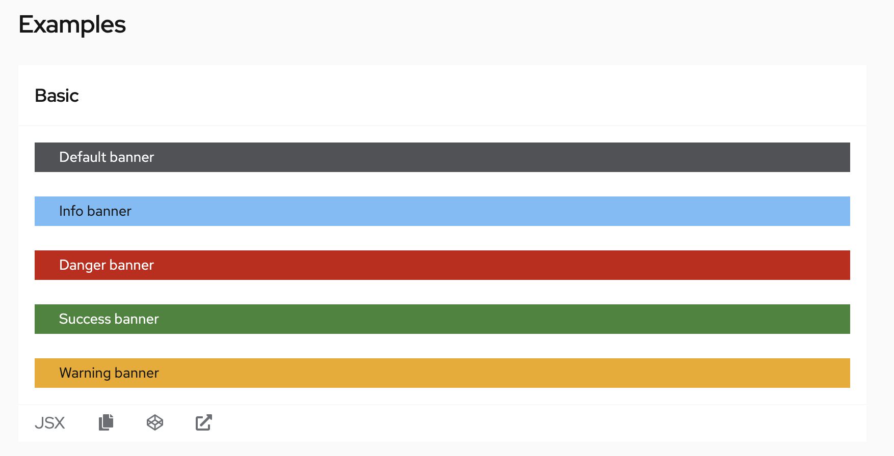
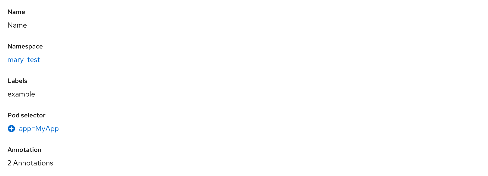
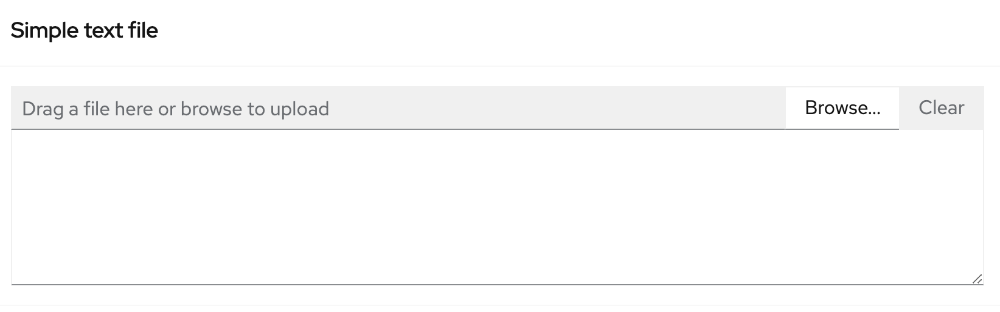
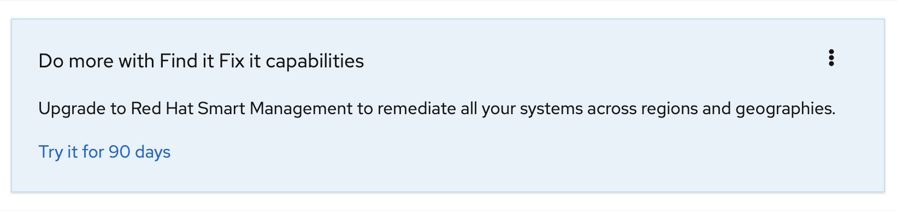
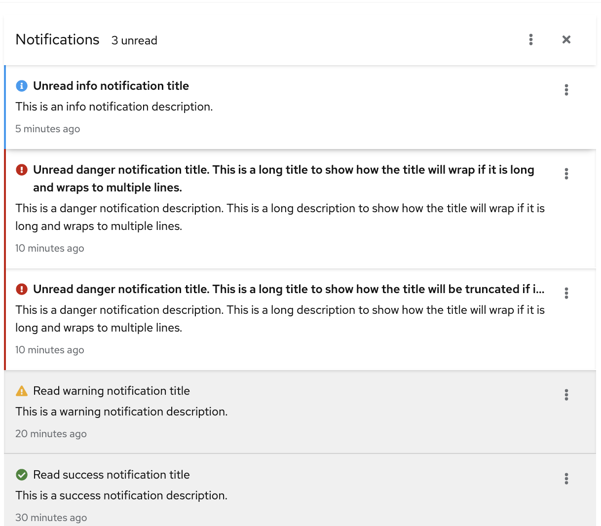
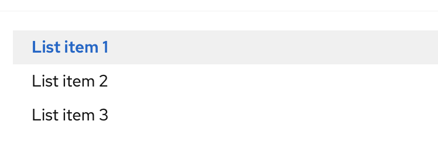
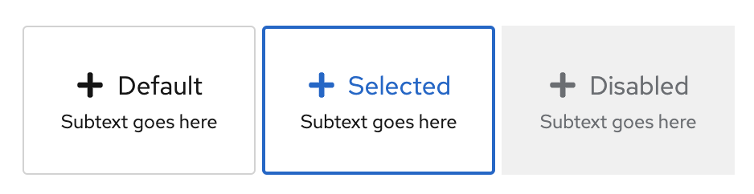

# PatternFly Beta Component Promotion Candidates
## For Release 2021.08
### [Banner](https://www.patternfly.org/v4/components/banner)
A banner is a one-line, full color, full width container that can be used to communicate short snippets of information to users. Banners are un-intrusive, non-dismissible, and only support link buttons.

### [Button: inoperableEvents](https://www.patternfly.org/v4/components/button)
Button prop. An array of events to prevent when the button is in an aria-disabled state.

### [Button: isAriaDisabled](https://www.patternfly.org/v4/components/button)
Button prop. Adds disabled styling and communicates that the button is disabled using the aria-disabled html attribute

### [Description list](https://www.patternfly.org/v4/components/description-list)
A description list contains terms and their corresponding descriptions.

### [FileUpload](https://www.patternfly.org/v4/components/file-upload)
A file upload component uploads the contents of a file into the browser for further processing. Once uploaded, content may optionally be edited. While the component can upload any file, it is primarily designed for use with text files where the context can easily be displayed in the text area.

### [Hint](https://www.patternfly.org/v4/components/hint)
A hint is in-app messaging that provides a one-step reminder, explanation, or call to action for a page or modal.

### [NotificationDrawer](https://www.patternfly.org/v4/components/notification-drawer)
A notification drawer is a place where users can view and manage notifications that are generated by the system. It allows them to see a list of notifications without the need to navigate away from the current screen.

### [SimpleList](https://www.patternfly.org/v4/components/simple-list)
A simple list provides a list of selectable items that can be shown within a page. Each item is described by a text label. The list may be divided into logical sections by introducing group headers.

### [Tile](https://www.patternfly.org/v4/components/tile)
A tile is a form of selection that can be used in place of a radio button and is commonly used in forms.

