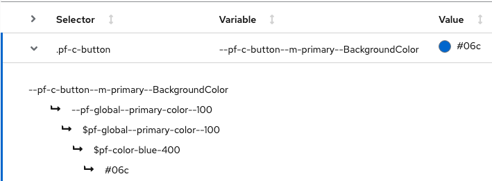

import { CSSVariables } from '../components/cssVariables/cssVariables';


## About CSS variables

The CSS variable system is a two-layer theming system where global variables inform component variables.

### Global variables

Global variables define and enforce global style elements (like values for color, spacing, and font size) across the entire system.

Global variables follow this formula:

`--pf-global--concept--PropertyCamelCase--modifier--state`

Where...

- A `concept` is something like a `spacer` or `main-title`.
- A `PropertyCamelCase` is something like `BackgroundColor` or `FontSize`.
- A `modifier` is something like `sm` or `lg`.
- A `state` is something like `hover` or `expanded`.

Example:
- Note: global variables are scoped to `:root`
  ```css
  :root {
    /* Default & hovered link colors */
    --pf-global--link--Color: #06c;
    --pf-global--link--Color--hover: #004080;
  }
  ```

<br/>
The [full list of global CSS variables](#global-css-variables) can be found below.

### Component variables

Component variables are used to define custom properties at the component-level. Component variables are always defined by global variables.

Component variables follow this formula:

`--pf-c-block__element--modifier--state--breakpoint--pseudo-element--PropertyCamelCase`

Where...

- `pf-c-block` refers to the block, usually the component or layout name, like `pf-c-alert`.
- `__element` refers to the element inside of the block, like `__title`.
- `modifier` is prefixed with`-m` and refers to a modifier class such as `.pf-m-danger`.
- `state` is something like `hover` or `active`.
- `breakpoint` is a media query breakpoint such as `sm` for `$pf-global--breakpoint--xs`.
- `pseudo-element` is either `before` or `after`.

Example:
- Note: component variables are scoped to the top-level component selector
  ```css
  .pf-c-button {
    /* Default, primary, and primary hovered button background colors */
    --pf-c-button--BackgroundColor: transparent;
    --pf-c-button--m-primary--BackgroundColor: var(--pf-global--primary-color--100);
    --pf-c-button--m-primary--hover--BackgroundColor: var(--pf-global--primary-color--200);
  }
  ```

<br/>
Component variables are listed at the bottom of each component page (for example, [button css variables](/components/button#css-variables)).

Note that all component variables are declared at the top component level (for example, `.pf-c-button`). The component variable table linked above also shows all usages of each variable and the values they evaluate to in each case - expand any component variable row to view the global variable it is mapped to.



### Breakpoint variables and class suffixes

PatternFly defines a number of standard breakpoints. These are always used as a `min-width` breakpoint; i.e. using the `-md` breakpoint would apply to everything at the `-md` width and wider. (There is one exception to this, which is in the responsive behavior of the [table component](/components/table).)

Breakpoint suffixes are used in utility classes and layouts as well as in many components as a way to apply class styles at a specified breakpoint. When available, `{-on-[breakpoint]}` will be shown as an available suffix for the class in the usage section of the documentation. The breakpoint suffix is optional and if not specified, the base class will be used. There are breakpoints for `sm`, `md`, `lg`, `xl`, and `2xl`, and the values for the corresponding breakpoints are defined below in the global variables `—pf-global—breakpoint—[breakpoint]`.

### Using the variable system

PatternFly 4 styles provide a default starting point. You can use the variable system to make adjustments to that default styling. When you change one or more elements, you should package those values into a new SCSS stylesheet to replace the default styling.

Overrides to PatternFly variables should be made at the `:root` level for global variables or at the top-level component selector for component variables (for example, `.pf-c-button`), as these overrides will cascade down to children elements accordingly.

Example:
- Change the global primary color to red, but keep the original primary blue color as the background for primary buttons.
  ```css
  /* Override global primary color 100 to red */
  :root {
    --pf-global--primary-color--100: var(--pf-global--palette--red-400);
  }

  /* Override the above override for only the primary button background color */
  .pf-c-button {
    --pf-c-button--m-primary--BackgroundColor: var(--pf-global--palette--blue-400);
  }
  ```

## Global CSS variables

<CSSVariables prefix="patternfly_variables" selector=":root" hideSelectorColumn />

## Chart CSS variables

<CSSVariables prefix="patternfly_charts" hideSelectorColumn />
