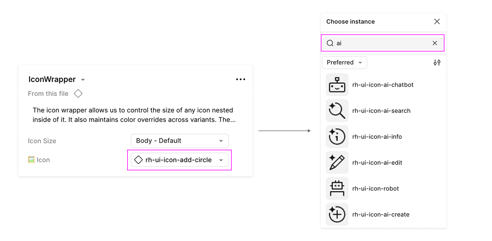

import { Alert, AlertActionLink, Accordion, AccordionItem, AccordionContent, AccordionToggle, Button, Card, CardHeader, CardTitle, CardBody, CardFooter, Checkbox, Divider,  DescriptionList, DescriptionListTerm, DescriptionListGroup,  DescriptionListDescription, Grid, GridItem} from '@patternfly/react-core';
import ExternalLinkSquareAltIcon from '@patternfly/react-icons/dist/esm/icons/external-link-square-alt-icon';
import DownloadIcon from '@patternfly/react-icons/dist/esm/icons/download-icon';
import { Icon } from '@patternfly/react-core';
import RhUiAiCreateIcon from '@patternfly/react-icons/dist/esm/icons/rh-ui-ai-create-icon';
import RhUiAiEditIcon from '@patternfly/react-icons/dist/esm/icons/rh-ui-ai-edit-icon';
import RhUiAiEnhanceIcon from '@patternfly/react-icons/dist/esm/icons/rh-ui-ai-enhance-icon';
import RhUiAiErrorIcon from '@patternfly/react-icons/dist/esm/icons/rh-ui-ai-error-icon';
import RhUiAiExperienceFillIcon from '@patternfly/react-icons/dist/esm/icons/rh-ui-ai-experience-fill-icon';
import RhUiAiExperienceIcon from '@patternfly/react-icons/dist/esm/icons/rh-ui-ai-experience-icon';
import RhUiAiFilterIcon from '@patternfly/react-icons/dist/esm/icons/rh-ui-ai-filter-icon';
import RhUiAiInfoIcon from '@patternfly/react-icons/dist/esm/icons/rh-ui-ai-info-icon';
import RhUiAiSearchIcon from '@patternfly/react-icons/dist/esm/icons/rh-ui-ai-search-icon';
import RhUiAiTroubleshootIcon from '@patternfly/react-icons/dist/esm/icons/rh-ui-ai-troubleshoot-icon';

When used thoughtfully, **AI** can enhance user experiences through personalized interactions, increased efficiency, and innovative designs. Regardless of the AI resources or workflows you use, it's important to ensure that you're aligned with the compliance rules, ethical considerations, and best practices on this page.

## PatternFly AI resources

### Guidelines

- **[AI design principles](/ai/guidelines/ai-design-principles):** Core principles for designing AI-enabled experiences at Red Hat.
- **[Legal requirements](/ai/guidelines/legal-requirements):** Legal review requirements for AI-enabled features.
- **[Transparency notices](/ai/guidelines/transparency-notices):** Guidelines for communicating AI usage to users through visual and verbal indicators.
- **[Iconography](/ai/guidelines/iconography):** Guidelines for using AI-related icons, sparkles, and visual representations.
- **[Color](/ai/guidelines/color):** Color usage guidelines for AI-enabled features.
- **[Chatbot avatars](/ai/guidelines/chatbot-avatars):** Guidelines for chatbot avatar design, robot icons, and launch buttons.
- **[Animation](/ai/guidelines/animation):** Guidelines for AI-related animations and sparkle effects.
- **[Conversation design](/ai/guidelines/conversation-design):** Guidance for designing effective and human-centered AI conversations.

### AI-assisted development

- **[Marketplace](/ai/ai-assisted-development/marketplace):** Plugins that give AI coding assistants knowledge and skills to generate more accurate, PatternFly-compliant code.
- **[PatternFly CLI](/ai/ai-assisted-development/patternfly-cli):** A command-line tool for scaffolding projects, performing code modifications, and running project-related tasks.
- **[PatternFly MCP](/ai/ai-assisted-development/patternfly-mcp):** An MCP server that gives AI coding tools PatternFly knowledge and capabilities.
- **[Rapid prototyping](/ai/ai-assisted-development/rapid-prototyping):** Guidance for generating and iterating AI features during early stages of design.
- **[AI-assisted code migration](/ai/ai-assisted-development/ai-assisted-code-migration):** Guidance for using AI to speed up and simplify codebase migrations.
- **[Compass layout (org demos)](/components/compass/org-demos):** Full-page Compass layout examples for generative UI patterns. For React Flow integration, see the [React Flow guide](/developer-guides/react-flow).

---

## Using AI icons in React

The following AI icons are available in the [@patternfly/react-icons](https://www.npmjs.com/package/@patternfly/react-icons) package. For detailed usage guidelines, see [Iconography](/ai/guidelines/iconography).

| **Icon** | **React** | **Text label** | **Usage** |
| :---: | --- | --- | --- |
| <Icon size="lg"><RhUiAiExperienceIcon /></Icon> | RhUiAiExperienceIcon | | General AI identification, or when no other AI icon is appropriate. |
| <Icon size="lg"><RhUiAiExperienceFillIcon /></Icon> | RhUiAiExperienceFillIcon | | General AI identification, or when no other AI icon is appropriate. |
| <Icon size="lg"><RhUiAiCreateIcon /></Icon> | RhUiAiCreateIcon | "Create with AI" | Create something new with the help of AI. |
| <Icon size="lg"><RhUiAiEditIcon /></Icon> | RhUiAiEditIcon | "Edit with AI" | Edit something with the help of AI. Typically used for editing text. |
| <Icon size="lg"><RhUiAiEnhanceIcon /></Icon> | RhUiAiEnhanceIcon | "Enhance with AI" | Enhance something with AI. |
| <Icon size="lg"><RhUiAiErrorIcon /></Icon> | RhUiAiErrorIcon | "Error found by AI" | A problem has been identified by AI. |
| <Icon size="lg"><RhUiAiFilterIcon /></Icon> | RhUiAiFilterIcon | "Filter with AI" | Filter data with the help of AI. |
| <Icon size="lg"><RhUiAiInfoIcon /></Icon> | RhUiAiInfoIcon | "Information by AI" | Information partially or completely generated by AI. |
| <Icon size="lg"><RhUiAiSearchIcon /></Icon> | RhUiAiSearchIcon | "Search with AI" | Search with the help of AI. |
| <Icon size="lg"><RhUiAiTroubleshootIcon /></Icon> | RhUiAiTroubleshootIcon | "Troubleshoot with AI" | Receive help from AI when troubleshooting issues. |

In Figma, these icons are available in the PatternFly components library via the Red Hat brand library. Using the icon wrapper component, you can swap the icons in the instance menu:

---

## What rules and best practices do I need to follow?

All AI systems built with PatternFly must adhere to Red Hat's legal and ethical framework.

### Red Hat policies

When using PatternFly to design Red Hat products, you *must* adhere to AI-related policies that Red Hat has previously outlined. This means you must:
- Gain approval before using AI technology for business related to Red Hat.
- Gain approval before using certain information as input for AI technology.
- Review, test, and validate generative AI model output.
- Always consider data privacy when entering company or personal information into AI resources, and ensure compliance with all company data protection policies and rules around AI usage.

<Button component="a" href="https://source.redhat.com/?signin&r=%2fdepartments%2flegal%2fglobal_legal_compliance%2fcompliance_folder%2fpolicy_on_the_use_of_ai_technologypdf" target="_blank" variant="link" isInline icon={<ExternalLinkSquareAltIcon />} iconPosition="end">
      View policy details (requires Red Hat login)
</Button>

### PatternFly AI principles

These five core principles create our ethics-first framework, which should guide the use of AI related to PatternFly.

<Grid hasGutter>
<GridItem span={6}>
    <Card isFullHeight>
    <CardHeader>
    <CardTitle>Accountability</CardTitle>
    </CardHeader>
    <CardBody>
        All people involved in any step of creating AI are **accountable** for considering its impact. Roles and processes are clearly defined and documented.
    </CardBody>
    </Card>
</GridItem>
<GridItem span={6}>
    <Card isFullHeight>
    <CardHeader>
    <CardTitle>Explainability</CardTitle>
    </CardHeader>
    <CardBody>
        AI systems should be easy to **explain** and comprehend. Humans should be able to easily perceive, recognize, and understand their decision-making processes. Imperceptible AI is *not* ethical.
    </CardBody>
    </Card>
</GridItem>
<GridItem span={6}>
    <Card isFullHeight>
    <CardHeader>
    <CardTitle>Transparency</CardTitle>
    </CardHeader>
    <CardBody>
        All processes, decisions, and practices involved in AI systems should be open and **transparent**&mdash;not hidden. Users should be able to understand who is making decisions and how these decisions are made.
    </CardBody>
    </Card>
</GridItem>
<GridItem span={6}>
    <Card isFullHeight>
    <CardHeader>
    <CardTitle>Fairness</CardTitle>
    </CardHeader>
    <CardBody>
        AI systems that are **fair** should be intentionally designed to prioritize and promote inclusion. They should focus **on** accessibility for all humans and should minimize&mdash;not amplify&mdash;bias.
    </CardBody>
    </Card>
</GridItem>
<GridItem span={12}>
    <Card isFullHeight>
    <CardHeader>
    <CardTitle>Human-centeredness</CardTitle>
    </CardHeader>
    <CardBody>
        At their core, AI systems must prioritize a **human-centered** approach, focusing on addressing real needs and empowering humans. They should emphasize accessibility, transparency, user autonomy, and privacy. To build trust and promote understanding, these systems should provide users with intuitive interfaces and clear communication of intentions and capabilities.
    </CardBody>
    </Card>
</GridItem>
</Grid>

## How do I design AI features with best practices in mind?

When designing, developing, and using AI, consider the following ethical and best-practice guidelines.

### Document your value proposition

Every AI product should begin with a documented user need and problem statement. Before choosing a technology, identify the specific gap in the current experience that AI is uniquely qualified to fill.

### Determine if AI adds value

Not all uses of AI are good for your UX strategy. Conduct research to identify real user needs where AI provides a clear advantage over traditional UI patterns.

**Do not** add AI features simply because they are new or trendy. If the value proposition isn't documented and validated by research, stick to standard UI.

#### When to use AI
- **Improve productivity:** Streamlining onboarding, data entry, or routine job tasks.
- **Offer better personalization:** Tailoring search results or dashboard views to a user's unique history.
- **Support sustainability:** Making design and development processes more repeatable.

#### Choosing the right AI technology
Some AI features are better suited for different types of AI, and they should align with the user's risk tolerance.

| AI feature type | Usage | Risk tolerance |
| :--- | :--- | :--- |
| **Generative AI** | Summarization, creative brainstorming, and conversational support. | **Lower:** Best when a "human-in-the-loop" can verify and edit the output. |
| **Predictive or structured AI** | Data classification, trend forecasting, and risk scoring. | **Higher:** Best for tasks requiring high precision and repeatable, data-driven outcomes. |

## Ethical design and compliance checklist

When working on an AI system, you should consciously check that you're in alignment with the core principles and best practices of PatternFly and Red Hat.

To help teams navigate best practices and requirements, we offer a guiding checklist that covers accountability, transparency, and fairness standards. Note that this resource is open to change and is not exhaustive. Always ensure you're following the most up-to-date industry standards and Red Hat AI requirements.

<Button
  variant="secondary"
  icon={<DownloadIcon />}
  component="a"
  href="https://raw.githubusercontent.com/patternfly/patternfly-org/main/packages/documentation-site/patternfly-docs/content/AI/Red-Hat-AI-Ethics-Compliance-Checklist.pdf"
  target="_blank"
  rel="noopener noreferrer"
>
  Download Ethics and Compliance Checklist (PDF)
</Button>

### Core guidelines for AI

While the checklist handles the details, keep these three non-negotiables in mind:

- **Imperceptible AI is not ethical:** Users must always be able to recognize when they are interacting with an AI system.
- **Communicate uncertainty:** If a model has low confidence in a result, the UI must reflect that uncertainty to the user.
- **Human-in-the-loop:** AI should augment human expertise. Always have a human review AI-generated output for accuracy and tone before it is finalized.