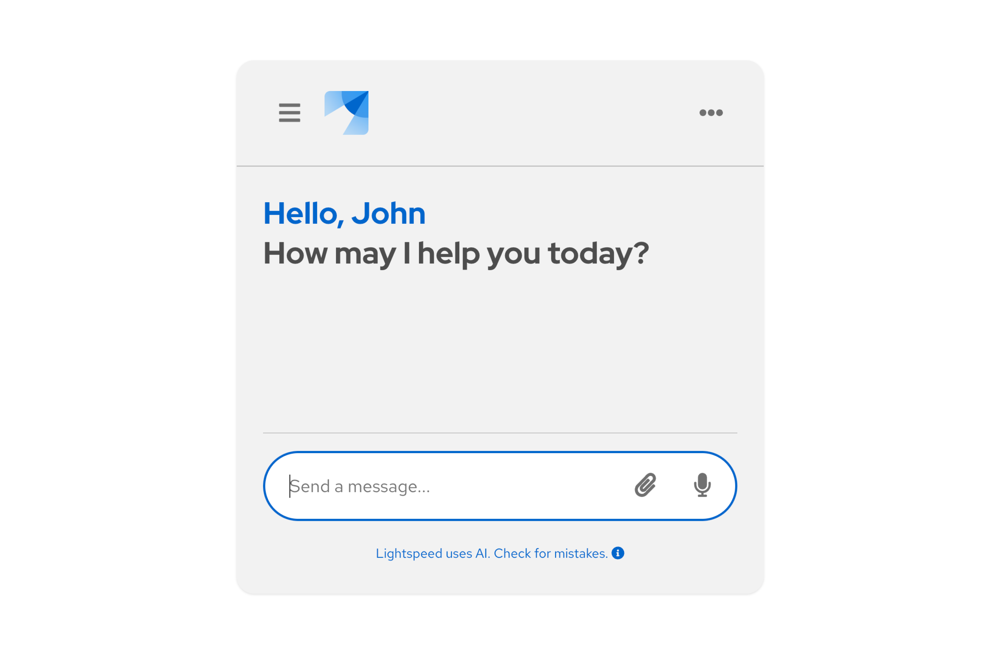
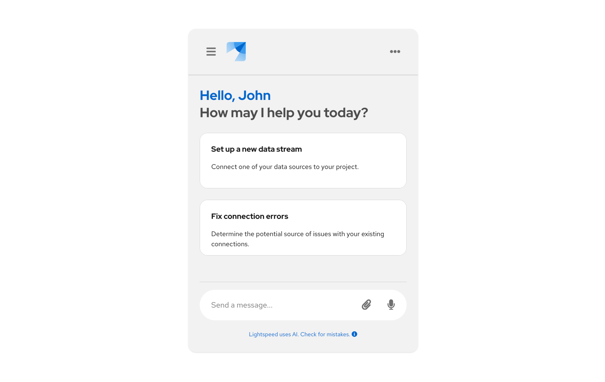

import { Button, Flex, FlexItem } from '@patternfly/react-core';
import ArrowRightIcon from '@patternfly/react-icons/dist/esm/icons/arrow-right-icon';

# Conversation design guidelines

**Conversation design** is a method of writing for conversational interfaces, like chatbots or voicebots. The goal of conversation design is to create an interactive experience that resembles human-to-human conversation as much as possible. Like traditional content design, conversation design is focused on using words to make experiences clear, concise, and well-timed.

Good conversation design combines content strategy, writing, and design to ensure that the development and use of chatbots is centered on real user needs. This includes making sure that all text related to the conversational UI supports easy engagement with chatbots, while staying aligned with brand standards.

When designing AI conversations alongside PatternFly-based projects, it is important to align with our established [brand voice and tone](/content-design/brand-voice-and-tone), as well as our [ethical guidelines for AI.](/ai/overview)

## Best practices 

Following these best practices to help ensure that your users can complete their goals through an AI-based conversation: 

- Be transparent about AI use. 
- Be direct, brief, and consistent. 
- Frame questions in terms of value for the user.
- If you ask for personal info, tell users "why" you're asking first. 
- Always have the last word.

## Writing for chatbots

When chatbots are designed to meet the needs of your users, they can improve the overall UX of your product. They are convenient, efficient, and persistent. 

[Our ChatBot extension](/extensions/chatbot/overview) utilizes PatternFly components to create a foundation for an AI-based chatbot, with additional customization options.

<Flex>
<FlexItem>
<Button component="a" href="/extensions/chatbot/overview" target="_blank" variant="primary" size="lg">Use the ChatBot extension <ArrowRightIcon /></Button>
</FlexItem>
</Flex>

Chatbots are only as good as the writing that goes into them. The language they use must build trust, clearly establish the “rules” of the conversation, and support users' goals. 

In addition to general microcopy, like headings or buttons, you will need to write:
- Welcome and goodbye messages. 
- Bot prompts. 
- AI disclosures.

### Welcome and goodbye messages 

It is important to always welcome users to the chatbot experience, and (if applicable) to say goodbye when they've ended the chat. A goodbye message isn't always necessary, like in instances where users can "minimize" a chat window to come back to it later. 

When you know your user's name, address them directly. 

### Bot prompts 

When writing your bot's prompts: 

- Keep messages short and simple. Try to stick to 3 lines of text in a message and only send 3 messages at most before allowing a user to provide input. 
- Be direct and limit choices for users as much as possible. 
- Unlike traditional content design, *don't lead with the benefit.* End with the benefit to be sure that it's read and acted upon. Users should be able to complete an action solely based on a chatbot's last sentence. 
- Frame any questions from the bot in terms of value for the user.
- Provide examples when relevant.
- Avoid open-ended questions. If you ask any, make them very simple, increase pause time between messages, and tell users when they should type. 
- Utilize different methods of presenting information, like cards or buttons. You don't have to always use plain text in your messages; sometimes different message types can be more convenient and engaging.

### AI disclosure 

Make sure to disclose any use of AI in chatbots. Our users should be able to trust that we are honest and transparent with them as much as possible.

- Use labels and other visual styling cues to clearly identify AI features. 
- Add necessary legal disclosures where you can, like in the chatbot footer. 
- Display an indicator when the bot is "thinking" or "typing," so that users know to expect feedback.

### LLM guardrails

Guardrails are safety mechanisms that moderate how a model handles sensitive, risky, or disrespectful prompts. [Research shows](https://arxiv.org/html/2506.00195v1) that a user's experience is shaped more by how a model handles a refusal than by the user's initial intent.

Most models default to direct or explanation-based refusals (for example, "I can’t do that" or "I can’t assist because of a safety policy"), but these can be perceived as frustrating or patronizing.

While users generally prefer full compliance from a model, safety and policy requirements often make this impossible. When a guardrail is triggered, your goal is to "let them down easy" to maintain trust and engagement.

When a user requests something unsafe or inappropriate from a model: 

- **Prioritize partial compliance:** Whenever possible, answer the general or theoretical parts of a user's request without providing actionable, dangerous, or sensitive details.
- **Avoid explicit refusal statements:** To reduce user friction, the model should try to respond without using definitive phrases like "I refuse" or "I cannot." 
- **Pivot to safer topics:** If a full refusal is unavoidable, briefly explain why and immediately suggest a related, safer topic to keep the conversation productive.

| Strategy | When to use | Example |
| :---: | :---: | :---: |
| **Partial compliance** | Default for ambiguous intent. | "The process of [Topic] generally involves [General Principle]..." |
| **Redirection** | When the specific request is blocked. | "I can’t provide specifics on that, but I can suggest some resources on [Related Topic]." |
| **Explanation** | When transparency is required for trust. | "To ensure user privacy, I don't have access to individual [Data Type]..." |

#### Message streaming considerations

Streaming text in real-time presents unique challenges for guardrail implementation. 

- **Handling late-trigger detections:** If a guardrail is triggered after a response has already started streaming, do not simply delete the message from the UI, as this is confusing. Instead, replace the partial text with a standard refusal or redirection message.
- **Simulated streaming for safety:** To avoid the "wait time" of running guardrails before a message starts, you can run detectors in the background. If the initial check is fast enough, you can "simulate" the stream once the content is cleared, ensuring the user doesn't see harmful content that is later retracted.
- **Guidance on blocked responses:** If a guardrail prevents a model response from ever being generated, provide a clear system-level message in the chat UI so the user isn't left waiting for a response that will never arrive.