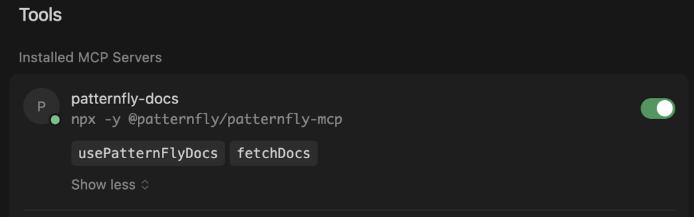
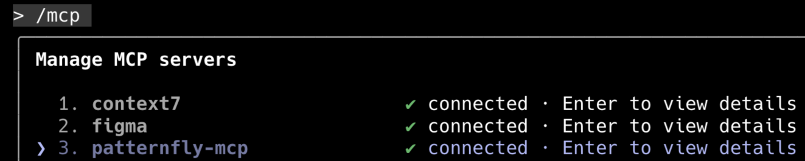

---
id: PatternFly MCP
section: AI
--- 
import '../components/components.css';

This guide provides an overview of the PatternFly MCP server, including its benefits and instructions for setting up the tool.

For full technical documentation, setup instructions, and to contribute, visit our [PatternFly MCP GitHub repository](https://github.com/patternfly/patternfly-mcp).

## What is the PatternFly MCP?
The **PatternFly MCP** is a tool designed to integrate our design guidelines, component documentation, and accessibility best practices directly into your AI-powered development environment. 

MCP stands for Model Context Protocol, an open standard that allows AI assistants to securely and accurately access external data sources and tools. The PatternFly MCP is a server that connects your AI assistant (like those within Cursor or Claude Code) directly to official PatternFly documentation. Instead of relying on a model's potentially outdated or overgeneralized knowledge, your assistant can query the PatternFly MCP to get answers based on real, up-to-date, and verified sources. 

Beyond offering these enhanced AI assistant conversations, the PatternFly MCP can also work in the background and incorporate into your existing workflows. For example, it can ensure that vibe coding will automatically utilize the latest and most applicable PatternFly elements, without requiring you to specifically ask an assistant to do so. It will quietly supply an assistant with the information necessary to make these recommendations and decisions.

## What are the benefits of the PatternFly MCP?

This tool is valuable for developers, designers, and other stakeholders, like product managers. This can look different depending on your needs, but the primary benefit is trust. The PatternFly MCP helps reduce AI "hallucinations" by ensuring the answers you receive are quoted directly from our documentation and are linked to the correct sources.

- **For developers:** Receive quick and accurate information about component props, implementation details, and accessibility requirements. The PatternFly MCP can also help validate component usage or choose the right component for a specific need.
- **For designers:** Quickly reference design guidelines and usage patterns while you work. You can ask for best practices, such as "Which component should I use for a gallery view?", and get answers rooted in our official standards.
- **For stakeholders:** By embedding the design system directly into the development workflow, the PatternFly MCP ensures consistency and adherence to design and accessibility standards across all projects. This speeds up development and review cycles by reducing errors and guesswork.

## What does the PatternFly MCP provide? 
There are 2 main tools provided by the PatternFly MCP:
- `usePatternFlyDocs`: Used to answer high-level questions about components, design guidelines, and accessibility. 
- `fetchDocs`: Used to retrieve the full documentation for a specific component via a URL provided by `usePatternFlyDocs`.

## Get started
You can install the PatternFly MCP in your preferred development environment. Here are the instructions for popular clients.

### Cursor
1. While in Cursor, press **cmd** + **shift** +**P**. 
1. Search for and select **View: Open MCP Settings**. 
1. At the bottom of the settings menu, click **New MCP Server** to open the `mcp.json` file.
1. Add the following JSON block within the `mcpServers` object. If `mcpServers` already exists, just add the `patternfly-mcp` block inside it.

    ``` 
    {
        "mcpServers": {
            "patternfly-mcp": {
            "command": "npx",
            "args": [
                "-y",
                "@patternfly/patternfly-mcp@latest",
            ],
            "description": "PatternFly React development rules and documentation"
            }
        }
    }
    ```
1. Save and close mcp.json. The MCP Settings will now show "patternfly-mcp" as an installed server with its tools enabled.
<br/ ><br/ >
	<div class="ws-docs-content-img">
    
    </div>
    
### Claude Code

1. From your terminal (before opening Claude Code), run the `claude mcp add` command with your preferred configuration: 
    - To install the server globally (recommended, so it's available across all your projects), use the `-s user` flag:
        ```claude mcp add patternfly-mcp -s user -- npx -y @patternfly/patternfly-mcp@latest```
    - To install for the current project only, run:
        ```claude mcp add patternfly-mcp -- npx -y @patternfly/patternfly-mcp@latest```
1. Open Claude Code by typing `claude`.
1. Inside Claude Code, type the `/mcp` command to view and manage your running MCP servers. You should see `patternfly-mcp` listed as "connected".
<br/ ><br/ >
	<div class="ws-docs-content-img">
    
    </div>

## Example prompts
Once installed, you can begin asking questions in your chat window and the PatternFly MCP will automatically be referenced for PatternFly-related requests. You can use the PatternFly MCP’s tools for a range of use cases, but here are a few sample scenarios to explore:

### Verifying installation
- **Prompt:** "Can you see the PF MCP running? If so, what are the tools?"
- **Expected AI behavior:** The assistant will confirm it sees the PatternFly MCP and list the available tools: mcp_patternfly-mcp_usePatternFlyDocs and mcp_patternfly-mcp_fetchDocs.
- **Response:** Yes, the PatternFly MCP is running successfully. There are 2 available tools for you to use: `mcp_patternfly-mcp_usePatternFlyDocs` and `mcp_patternfly-mcp_fetchDocs`.

### Fetching specific documentation
- **Prompt:** "Fetch docs for a PatternFly card"
- **Expected AI behavior:**  This will trigger the `fetchDocs` tool. The assistant will return a detailed, organized summary of the card component's documentation, including design guidelines (elements, usage, variations), accessibility guidelines (key requirements, React props), and more.
- **Response:** “Here’s the current PatternFly card documentation, including the general design guidelines and key accessibility requirements: [documentation summary]“

### Get design guidance
- **Prompt:** "Which PatternFly components should I use if we want a user to be able to select several different cards from a gallery view?"
- **Expected AI behavior:**   This will trigger the `usePatternFlyDocs tool`. The AI assistant will analyze your request and provide a recommendation based on PatternFly's design guidelines, likely suggesting the use of selectable cards and noting that multi-select is achieved using cards with checkboxes.
- **Response:** “If you want to let users select several cards within a gallery view, you could use the selectable cards variation, which would allow multiple card selection via checkboxes that are placed within a card’s header.”

## Experimentation and feedback

The PatternFly MCP is still an evolving experiment, and we'd love to learn from your experiences:
- Share your feedback and experiences on our [GitHub discussions board](https://github.com/orgs/patternfly/discussions).
- Connect with the community on our [PatternFly Slack workspace](https://join.slack.com/t/patternfly/shared_invite/zt-1npmqswgk-bF2R1E2rglV8jz5DNTezMQ).

As our AI tooling evolves, we'll continue to refine our recommendations based on community feedback and real-world usage.