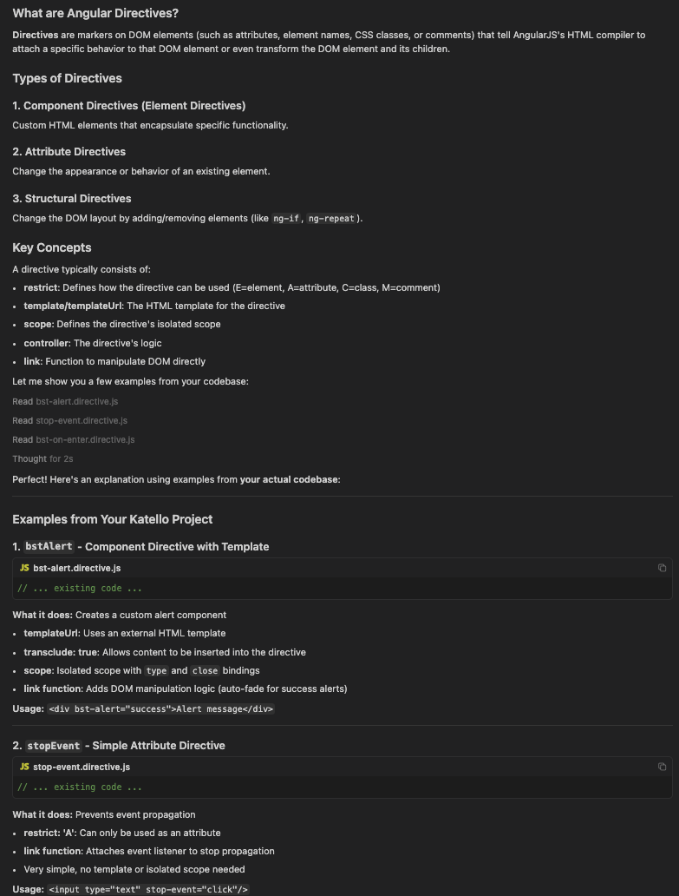
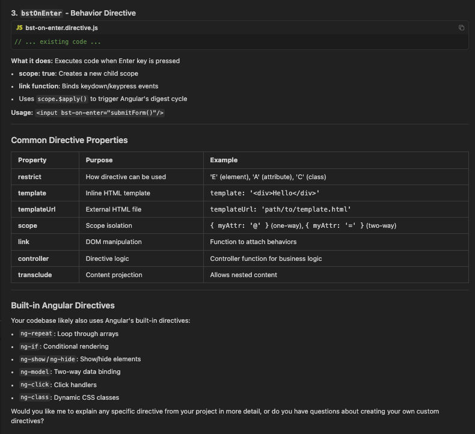
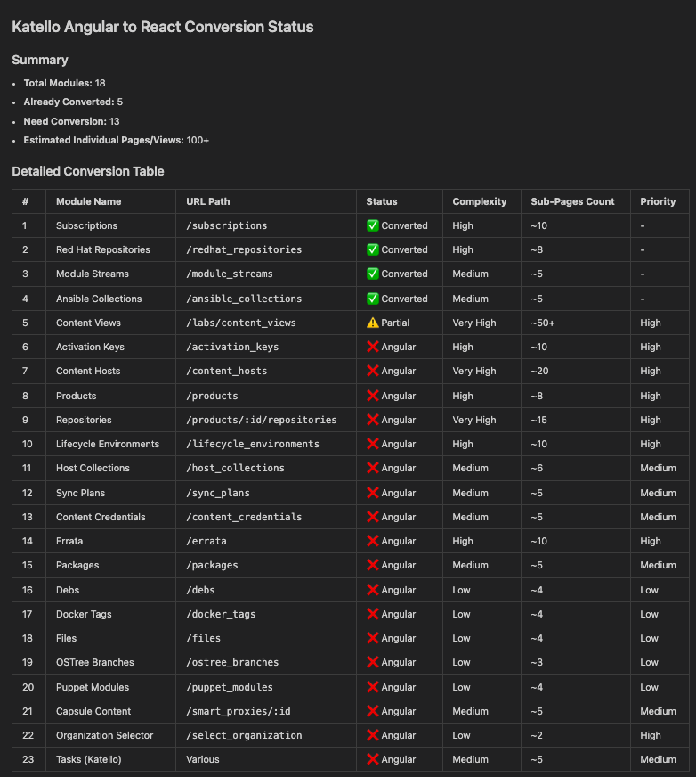
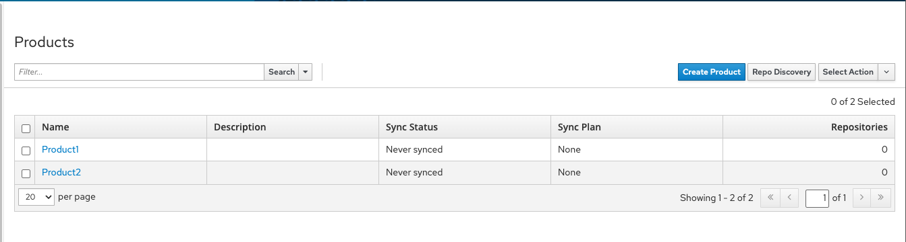
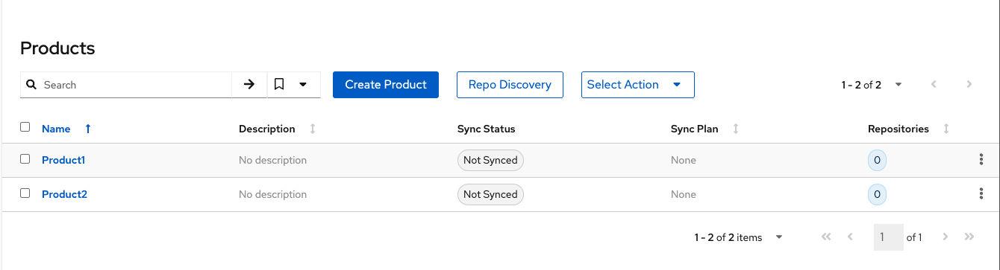

This guide explores a workflow that enables developers to leverage AI to accelerate code migrations. 

## What is AI-assisted code migration?

For the purposes of this guide, a code migration refers to moving your project from a legacy or dated framework to PatternFly React components. An **AI-assisted code migration** heavily utilizes AI tools and models to help speed up the process of modernizing your UI, while adhering to best practices. 

## What are the benefits of AI-assisted migrations? 

Even when its initial output is imperfect, using AI in combination with engineering judgment and domain expertise can significantly speed up the development process.

While AI is *not* a replacement for human developers, it offers key benefits: 
- **Faster migrations:** Migrate simple pages up to 4 times faster, compared to a fully manual migration. 
- **Learning support:** Quickly develop an understanding of the project's unique context by prompting AI to explain topics. 
- **Planning support:** Identify and scope all requirements and steps needed for the migration. 

## Multi-phased workflow example

AI serves as a powerful accelerator throughout all steps of the migration process, including learning, planning, and development phases. This example outlines an AI-assisted workflow through all phases of a migration project.

### 1. Learning phase

Query AI to help build project-specific context by bridging knowledge gaps, setting up development environments, and identifying relevant code sections.

For example, if your project is written with Angular, AI can help explain Angular-specific patterns (like directives or services) and point to their equivalents in React and PatternFly. An example prompt might be _"Can you explain the Angular directives to me?"_

 

### 2. Planning phase

Use AI for scope estimation and mapping features:
- Generate a list of components that need migration.
- Identify potentially difficult areas, such as state management and routing.

For example, a prompt might be: _"I want to convert all the Katello pages that are written in Angular to React. Can you list the Katello pages that would need to be converted. Give results in a table format."_

### 3. Development phase

Use AI to build features iteratively, especially for generating forms, validation logic, and creating reusable components.

For example, you could use AI to migrate a simple Angular feature like this to React using PatternFly components:
        

To migrate the code from Angular to PatternFly React:
1. Create a placeholder page.
2. Prompt AI to migrate the content. Your query might resemble this: _"Copy the Angular Products page content into  PF6placholder.js using React and PatternFly6, using best practices with bias towards how other React and PatternFly files in this project are doing things."_

With this simple and direct prompt, the same feature can be quickly and successfully recreated within PatternFly components:  

### 4. Testing phase

Use AI to accelerate test coverage by generating boilerplate unit tests, mocks for API integrations or dependencies, and end-to-end test outlines using tools like Cypress.

For example you might use the following prompt _"Generate tests for PF6placeholder.js page following best practices and what is done in this project."_

## Best practices
	
Because AI can make inaccurate assumptions, providing it with careful direction helps ensure that it will perform more reliably. Follow these best practices to help ensure consistency in AI behavior.
    
- Use AI as a helper for planning and managing tasks. For example, use AI-generated to-do lists for easier and more streamlined task management.
- Avoid using AI for common tasks that can be done more easily manually and explicitly. Instead ask it to focus on more complex tasks that will have more impact. 
- Leverage different language models throughout your migration and swap to more efficient models for different tasks. 
- Avoid overloading a model with a long or time consuming task. If a request is taking longer than you'd like, or is going beyond what you intended, use the "Stop" button and refine your prompt.
- Ensure that you understand the product architecture and are familiar with any technologies used. Otherwise, using AI can actually be more time consuming than a manual migration.
- Follow our [prompting tips](#prompting-tips) when requesting something from an AI model.

### Prompting tips 

When interacting with AI, especially with tools like Cursor, specificity is key. In order to efficiently and successfully request something from an AI tool, there are a few "do's and don'ts" to follow:

| **Don't** | **Do** |
| --- | --- |
| Expect AI to assume your needs. | Be specific and clearly state what you want to achieve. |
| Let AI follow its own rules. | Instruct AI to follow best practices for React and PatternFly, providing clear definitions and examples. |
| Restrict yourself to text-based prompts. | When text prompts are insufficient, share screenshots with AI to provide valuable context. |
| Reinvent the wheel. |  Use previously completed features and functionalities as models for new requests. |

## Experimentation and feedback 

AI-assisted code migrations are still an evolving experiment, and we'd love to learn from your experiences: 
- Share your feedback and experiences on our [GitHub discussions board](https://github.com/orgs/patternfly/discussions).
- Connect with the community on our [PatternFly Slack workspace](https://join.slack.com/t/patternfly/shared_invite/zt-1npmqswgk-bF2R1E2rglV8jz5DNTezMQ).
 
As this process evolves, we'll continue to refine our recommendations based on community feedback and real-world usage. 
