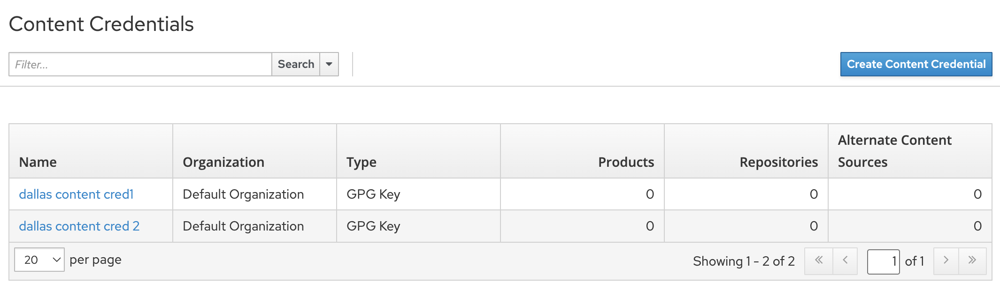
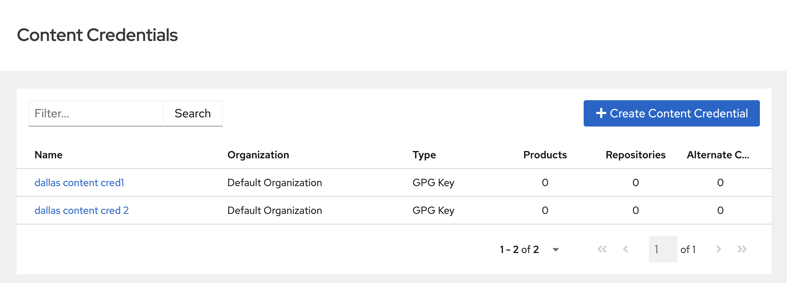

This guide outlines steps you can take to leverage AI to migrate your project from a legacy or dated framework to PatternFly React components, to modernize your UI while adhering to best practices. 

While AI is **not** a replacement for human developers, it is still a valuable accelerator for code migrations. Even when its initial output is imperfect, using AI in combination with engineering judgment and domain expertise can significantly speeds up the development process. Our team's experiments with this process have shown that, compared to manual migration, AI-assisted migrations for non complex pages can be 4 times faster if you have expertise in the technologies you are migrating from and to along with a sound understanding of the product architecture. However, be aware that the opposite can be true when it comes to manually debugging the output if you have limited product and technology knowledge. 

For example, in our experimination one developer spent almost an entire day trying to get an AI generated migrated page to work. This was 2 - 3 times as long as it took to migrate the page manually. Another developer took less than hour to get the AI migrated page to work versus 2 hours manually.

## Using AI in each migration phase

AI serves as a powerful accelerator throughout the migration process. Below, we break it down by phase with practical examples.

### Learning phase

The learning phase of a migration project often requires building project-specific context, such as understanding the architecture, code-base, best practices and diffrences in technologies. You can query AI to help bridge knowledge gaps, set up development environments, and identify relevant code sections.

For example, if your project is written with Angular, AI can help explain Angular-specific patterns (like directives or services) and point to their equivalents in React and PatternFly.

- Query AI to explain things such as Angular-specific patterns (like directives or services) and their React/PatternFly equivalents.
- Query AI to explain project specific details.
- Use AI to configure tools like Podman.

### Planning phase

AI aids in estimating migration scope and mapping existing features to latest PatternFly React equivalents:

- Query AI to generate a list of components that need to be migrated.
- Query AI to identify areas that may be difficult. Examples could include state management and routing.

### Development phase

AI can assist in building features iteratively, particularly in generating:

- Forms
- Validation logic
- Reusable components

In our experimentation we converted a simple Angular page to React using PatternFly components. A prompt we used after creating a placeholder page for our experimentation was: "Copy the Angular content credentials page content into the ReactPf5PlaceholderPage.js using React and PatternFly5 using best practices with bias towards how other React and PatternFly files in this project are doing things."

We got the following results:

**Before:**

**After:**

### Testing phase

AI can significantly accelerate test coverage by generating:

- Boilerplate unit tests using a testing library
- Mocks for API integrations dependencies
- End-to-end test outlines using tools like Cypress

## Best practices

To maximize the effectiveness of AI in development, consider the following tips:

- **Prioritize tasks**: Avoid using AI for common tasks that can be done more easily manually. Explicitly instruct it not to perform such tasks.
- **Leverage different models**: Utilize various language models to suit different needs.
- **Optimize requests**: Avoid overloading requests to the AI; the "Stop" button is a useful tool.
- **Utilize to-do lists**: Take advantage of AI-generated to-do lists for task management.

## Prompting tips for cursor

When interacting with AI, especially with tools like Cursor, specificity is key:

| **Don't** | **Do** |
| --- | --- |
| Expect AI to assume your needs. | Be specific and clearly state what you want to achieve. |
| Let AI follow its own rules. | Instruct AI to follow best practices for React and PatternFly, providing clear definitions and examples for these practices. |
| Restrict yourself to text-based prompts. | When texts prompts are insufficient, you can share screenshots with AI to provide valuable context. |
| Reinvent the wheel|  Use previously completed features and functionalities as models for new requests. |
