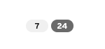
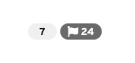

import { Checkbox, List, ListItem } from '@patternfly/react-core';

## Accessibility

To implement an accessible PatternFly **badge**:

- Ensure the badge itself is not interactive in any way. 
- Ensure badge information is not conveyed by only color, such as a read or unread badge.
- Ensure that the surrounding context can convey the purpose of the badge to users via screen reader or similar assistive technologies.
  - A heading or other text element prefacing the badge or visually hidden text content accessible only to assistive technologies are some examples of a surrounding context.

  ```
  <h2>Notifications <Badge>5</Badge></h2>

  <Badge>5 <span class="pf-screen-reader">unread notifications</span></Badge>
  ```

## Testing

 At a minimum, a badge should meet the following criteria:

<List isPlain>
  <ListItem>
    <Checkbox id="badge-a11y-checkbox-1" label="Users should not be able to interact with or navigate to the badge with the keyboard, as it is not an interactive element." />
  </ListItem>
  <ListItem>
    <Checkbox id="badge-a11y-checkbox-2" label="Information about a badge is not conveyed by only color."/>
  </ListItem>
  <ListItem>
    <Checkbox id="badge-a11y-checkbox-3" label="Users navigating via screen reader or similar assistive technology should understand the purpose of the badge by its surrounding context." />
  </ListItem>
</List>

## React customization

A badge does not have any further React props for accessibility.

## HTML/CSS customization

A badge does not have any further HTML/CSS attributes or classes for accessibility.

## Additional considerations

Consumers must ensure they take any additional considerations when customizing a badge, using it in a way not described or recommended by PatternFly, or in various other specific use cases not outlined elsewhere on this page.

### Color

Generally you should avoid using only color to convey information about different types of badges, such as between read and unread notifications.

If a badge will always be rendered whether it's unread or read, or different badges will convey different types of information, it may be difficult for users to perceive or understand the difference between the two badges.

You should do the following to supplement color to convey badge information:

- Add an icon to visually convey information
- Add a visually-hidden element via the `pf-screen-reader` class to convey information to users of screen readers and similar assistive technologies

In Figure 1, note that the lack of visual cues make it difficult to differentiate unread or actionable items associated with the badges. Compare this to Figure 2, where an icon indicates that the second badge is associated with actionable or unread content.

Figure 1.



Figure 2.


