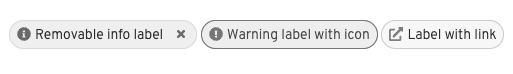

import { Checkbox, List, ListItem } from '@patternfly/react-core';
import { Link } from '@patternfly/documentation-framework/components/link/link';

## Accessibility

To implement an accessible PatternFly **label** and **label group**:

- Ensure any interactive elements - such as close buttons or overflow buttons - within a label group can be navigated to and interacted with via keyboard and other assistive technologies such as a screen reader
- Provide an `aria-label` if the label group does not have a visible text category name
- Provide an `aria-label` for a label group's or a label's "close" button
- Ensure a label that contains a link has descriptive text content

## Testing

 At a minimum, a label and label group should meet the following criteria:

 <List isPlain>
  <ListItem>
    <Checkbox id="label-a11y-checkbox-1" label="Standard keyboard navigation can be used to navigate between label group close buttons, label close buttons, or other focusable elements." description={<span><kbd>Tab</kbd> navigates to the next label group close button, label close button, or focusable element, and <kbd>Shift</kbd> + <kbd>Tab</kbd> navigates to the previous label group close button, label close button, or focusable element.</span>} />
  </ListItem>
  <ListItem>
    <Checkbox id="label-a11y-checkbox-2" label="Standard keyboard interaction can be used to interact with the label group close button, label close button, or other interactive elements inside the chip group." description={<span><kbd>Enter</kbd> and <kbd>Space</kbd> should be able to activate the label group close button, individual label close buttons, or an overflow chip. This can usually be achieved by using "click" events.</span>} />
  </ListItem>
  <ListItem>
    <Checkbox id="label-a11y-checkbox-3" label="If the label group's category name or an individual label's content is truncated, the entire category name or label can receive focus, not just the close button." description={<span>This can be achieved by ensuring the category name or label component itself has the <code className="ws-code">tabindex="0"</code> attribute. The category name/label content should then be included in the standard keyboard navigation.</span>} />
  </ListItem>
  <ListItem>
    <Checkbox id="label-a11y-checkbox-4" label="If the label group's category name or an individual label's content is truncated, it has a tooltip that displays on hover or focus." description={<span>Follow the <Link href="/components/tooltip/accessibility">tooltip accessibility documentation</Link>.</span>} />
  </ListItem>
  <ListItem>
    <Checkbox id="label-a11y-checkbox-5" label={<span>If a label group does not have a visible category name, it has an <code className="ws-code">aria-label</code> instead.</span>} description="This will help users of assistive technologies differentiate multiple label groups on a page, and provide context of what content the label group contains." />
  </ListItem>
</List>

## React customization

The following React props have been provided for more fine-tuned control over accessibility.

### Label React properties

| Prop | Applied to | Reason | 
|---|---|---|
| `closeBtnAriaLabel="[text that labels the label close button]"` | `Label` | Adds an accessible name to a label's close button. By default this value will announce "close" followed by the content of the label. <br/><br/> When passing in a custom value, you should pass in a verb such as "close" or "remove" followed by the content of the label. |
| `editableProps={[object with additional props]}` | `Label` | Adds additional props to an editable label when editing isn't active and the input element when editing is active. This should be passed an `aria-label` and `aria-labelledby` property when editing is not active to help convey that a label is editable. |
| `isEditable` | `Label` | When passed in, adds a button to the label to convey that the button can be interacted with. **Required** when the label is intended or expected to be editable. |
| `isOverflowLabel` | `Label` | When passed in, uses a button element as the label wrapper. **Required** when a user is intended or expected to click the label to control an overflow state. |

### Label group React properties

| Prop | Applied to | Reason | 
|---|---|---|
| `addLabelControl={interactive element that controls adding new labels}` | `LabelGroup` | Adds a control to the label group for adding additional labels. The control passed in should be an interactive element, such as a button or menu toggle, so that users know they can interact with the control. |
| `aria-label="[text that labels the label group]"` | `LabelGroup` | Adds an accessible name to the label group. **Required** when the label group does not have a visible category name. |
| `closeBtnAriaLabel="[text that labels the label group close button]"` | `LabelGroup` | Adds an accessible name to the label group's close button. **Required**. <br/><br/> When passing in a custom value, you do not need to repeat the chip group's category name and should only include a verb such as "close" or "remove". |

## HTML/CSS customization

The following HTML attributes and PatternFly classes can be used for more fine-tuned control over accessibility.

### Label HTML attributes and classes

| Attribute or class | Applied to | Reason | 
|---|---|---|
| `aria-label="[text that labels the editable label]"` | `.pf-m-editable > button.pf-v6-c-label__content` | Adds an accessible name to an editable label. **Required**. |
| `aria-labelledby="[id value of button.pf-v6-c-label__content] [id value of .pf-v6-c-label__text]"` | `.pf-m-editable > button.pf-v6-c-label__content` | Adds an accessible name to an editable label by using the label's internal button `aria-label` and the label text's content. **Required**. |
| `aria-label="[text that labels the label's close button]"` | `.pf-v6-c-label__actions > button` | Adds an accessible name to the label group's close button. **Required**. |
| `aria-labelledby="[id value of .pf-v6-c-label__actions > button] [id value of .pf-v6-c-label__content]" ` | `.pf-v6-c-label__actions > button` | Adds an accessible name to the label's close button by using the close button's `aria-label` and the label's accessible name. **Required**. |
| `aria-hidden="true"` | `.pf-v6-c-label__icon` | Removes the label icon from the accessibility tree, preventing assistive technologies from potentially announcing duplicate or unnecessary information without visually hiding it. **Required**. |

### Label group HTML attributes and classes

| Attribute or class | Applied to | Reason | 
|---|---|---|
| `aria-label="[text that labels the label group's close button]"` | `.pf-v6-c-label-group__close > button` | Adds an accessible name to the label group's close button. **Required**. |
| `aria-labelledby="[id value of .pf-v6-c-label-group__close > button] [id value of .pf-v6-c-label-group__label]" ` | `.pf-v6-c-label-group__close > button` | Adds an accessible name to the label group's close button by using the close button's `aria-label` and the label group's accessible name. **Required**. |
| `role="list"` | `.pf-v6-c-label-group__list` | Indicates that the label group list is a list element. **Note:** typically you should not manually add the same role that an element already has. Due to a bug in certain browsers, however, this role must be manually added to ensure assistive technologies announce the list properly. |

## Additional considerations

Consumers must ensure they take any additional considerations when customizing a label or label group, using them in a way not described or recommended by PatternFly, or in various other specific use-cases not outlined elsewhere on this page.

### Custom tooltips

Labels and label group category names are not interactive by default and typically should not be given custom tooltips. Tooltips on static elements may not be announced by some assistive technologies, meaning any additional context provided by a tooltip may be lost.

One alternative to placing a tooltip on a static element is to wrap the label in a button, then apply the tooltip to that button instead. For example:

```noLive
<Tooltip content="Supplementary information about the label">
  <Button size="sm" variant="plain">
    <Label>Non-truncating label with tooltip</Label>
  </Button>
</Tooltip>
```

You should still follow any [tooltip accessibility documentation](/components/tooltip) as well as [button accessibility documentation](/components/button). One thing to note is that buttons typically will trigger an action to occur upon clicking it, so it might be confusing to some users navigating via screen reader or similar assistive technologies if they click the button and nothing happens.

### Accessible label status and severity

While labels can be styled using a variety of colors, relying on color alone to communicate information such as status or severity ("Loading" or "Danger") causes barriers to access. Users that are colorblind or have limited or no vision may not be able to perceive and understand a label's color, and users that rely on assistive technologies such as screen readers won't have those colors announced to them.

When a label is intended or expected to convey information such as status or severity, you must ensure the label includes the following:

- An appropriate color that matches the information being conveyed, if applicable. For example, "red" is commonly used to convey "danger" or "error".
- An icon that matches the information being conveyed. For example, a lowercase "i" icon is commonly used to convey an informational status.
- Visually hidden text that is accessible only to assistive technologies that conveys the status or severity. This can best be achieved by using the `pf-v5-screen-reader` class on an element within the label content. For example:

    ```
    <Label>
      <span 
        className="pf-v5-screen-reader"
      >
        Hidden text accessible only to assistive technologies
      </span>
      Visible text
    </Label>
    ```

In both Figure 1 and Figure 2 below there are 3 labels: a blue informational label, an orange warning label, and a cyan link label. Figure 1 does not include any icon to help convey that information, which can make it difficult to tell what each label is intended to convey, while Figure 2 includes helpful icons that help convey the severity as well as the fact that a label is an external link.

Figure 1.


Figure 2.

