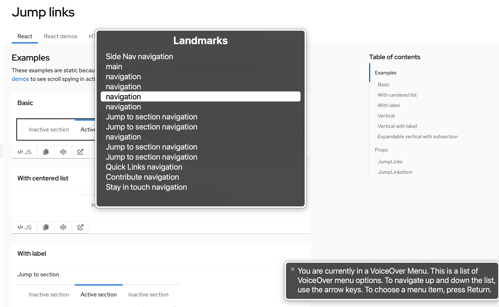

import { Checkbox, List, ListItem } from '@patternfly/react-core';

## Accessibility

To implement accessible PatternFly **jump links**:

- Provide a unique and descriptive `aria-label` to the jump links component.
- Ensure a jump link item has the `aria-current="location"` attribute when it is selected.
- Ensure that the jump links toggle has an `aria-expanded` attribute that matches its expanded state. For example, a collapsed jump links toggle should have `aria-expanded="false"`.
- Provide a unique and descriptive `aria-label` to the jump links toggle if the jump links component is expandable.
- Ensure each jump link item has descriptive text content that conveys what the user will be jumping to upon selecting it, such as a section heading.

## Testing

At a minimum, jump links should meet the following criteria:

<List isPlain>
  <ListItem>
    <Checkbox id="jumpLinks-a11y-checkbox-1" label={The jump links component has a unique and descriptive <code className="ws-code">aria-label</code>.} description="This helps users differentiate the jump links from other navigation elements on the page." />
  </ListItem>
  <ListItem>
    <Checkbox id="jumpLinks-a11y-checkbox-2" label={Once a jump link item has been selected, it has the <code className="ws-code">aria-current="location"</code> attribute.} description="This will announce to users navigating via assistive technologies such as a screen reader that a jump link item has already been jumped to when navigating through the list of jump link items." />
  </ListItem>
  <ListItem>
    <Checkbox id="jumpLinks-a11y-checkbox-3" label={If the jump links component is expandable, the jump links toggle can be collapsed or expanded via keyboard by pressing <kbd>Space</kbd> or <kbd>Enter</kbd>.} />
  </ListItem>
  <ListItem>
    <Checkbox id="jumpLinks-a11y-checkbox-4" label={If the jump links component is expandable, it has an <code className="ws-code">aria-expanded</code> attribute that matches its current expanded state.} />
  </ListItem>
  <ListItem>
    <Checkbox id="jumpLinks-a11y-checkbox-5" label={If the jump links component is expandable, the jump links toggle has a unique and descriptive <code className="ws-code">aria-label</code>.} />
  </ListItem>
  <ListItem>
    <Checkbox id="jumpLinks-a11y-checkbox-6" label="Each jump link item has descriptive text content that conveys where a user will be jumping to upon selecting it." description={`This will typically be the same text as a section header, but in general avoid vague text such as "this section".`} />
  </ListItem>
  <ListItem>
    <Checkbox id="jumpLinks-a11y-checkbox-7" label="Standard keyboard navigation can be used to navigate between jump link items or other focusable elements." description={<kbd>Tab</kbd> navigates to the next jump link item or focusable element, and <kbd>Shift</kbd> + <kbd>Tab</kbd> navigates to the previous jump link item or focusable element.} />
  </ListItem>
  <ListItem>
    <Checkbox id="jumpLinks-a11y-checkbox-8" label="Standard keyboard interaction can be used to select a jump link item." description={Only <kbd>Enter</kbd> should select a jump link item since it is an anchor element.} />
  </ListItem>
</List>

## React customization

The following React props have been provided for more fine-tuned control over accessibility.

| Prop | Applied to | Reason | 
|---|---|---|
| `aria-label="[text that labels the jump links navigation]"` | `JumpLinks` | Adds an accessible name to the jump links' `nav` element for assistive technologies. This should generally be descriptive and unique, especially if there are multiple `nav` elements on the page. |
| `isExpanded` | `JumpLinks` | Sets the default `aria-expanded` attribute. **Required** if the jump links component should be expanded by default. |
| `toggleAriaLabel="[text that labels the expandable toggle]"` | `JumpLinks` | Adds an accessible name to the expandable toggle for assistive technologies. **Required** when the jump links component is expandable. |
| `children` | `JumpLinksItem` | The content of the jump links item. This content should be descriptive in order to convey what a user will be jumping to upon selecting it. |
| `isActive` | `JumpLinksItem` | Sets the `aria-current="location"` attribute on the jump links item. **Required** when the jump links item has been selected. |

## HTML/CSS customization

The following HTML attributes and PatternFly classes can be used for more fine-tuned control over accessibility.

| Attribute or class | Applied to | Reason | 
|---|---|---|
| `aria-label="[text that labels the jump links navigation]"` | `.pf-v6-c-jump-links` | Adds an accessible name to the jump links' `nav` element for assistive technologies. This should generally be descriptive and unique, especially if there are multiple `nav` elements on the page. |
| `aria-expanded="[true or false]"` | `.pf-v6-c-jump-links__toggle > button` | Indicates whether the jump links toggle is expanded (true) or collapsed (false) to assistive technologies. **Required** when the jump links component is expandable. |
| `aria-label="[text that labels the expandable toggle]"` | `.pf-v6-c-jump-links__toggle > button` | Adds an accessible name to the expandable toggle for assistive technologies. **Required** when the jump links component is expandable. |
| `aria-hidden="true"` | `.pf-v6-c-jump-links__toggle-icon > i` | Removes the expandable toggle icon from the accessibility tree, preventing assistive technologies from potentially announcing duplicate or unnecessary information without visually hiding it. **Required**. |
| `role="list"` | `.pf-v6-c-jump-links__list` | Indicates that the jump links list is a list element. **Required**.  This role is redundant since `.pf-v6-c-jump-links__list` is a `<ul>` element, but it is required for assistive technologies to announce the list properly. |
| `aria-current="location"` | `.pf-v6-c-jump-links__item.pf-m-current` | Announces to users navigating via assistive technologies such as a screen reader that a jump link is selected. **Required** after a jump link item has been selected. |

## Additional considerations

Consumers must ensure they take any additional considerations when customizing jump links, using it in a way not described or recommended by PatternFly, or in various other specific use-cases not outlined elsewhere on this page.

### Unique nav labeling

Whenever multiple navigation elements are present on a page, an `aria-label` is highly recommended. Users navigating via assistive technologies such as a screen reader may be using an elements list or rotor menu to navigate the page, and will be unable to distinguish between the various navigation elements without a unique accessible name. 

The following image demonstrates the lack of information presented in VoiceOver's rotor menu when an `aria-label` is not present nor unique:

