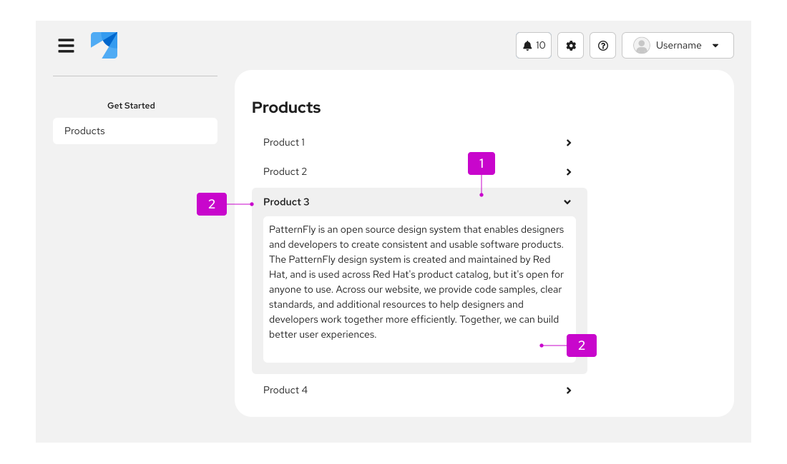
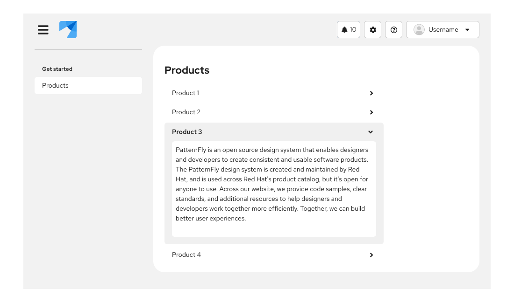
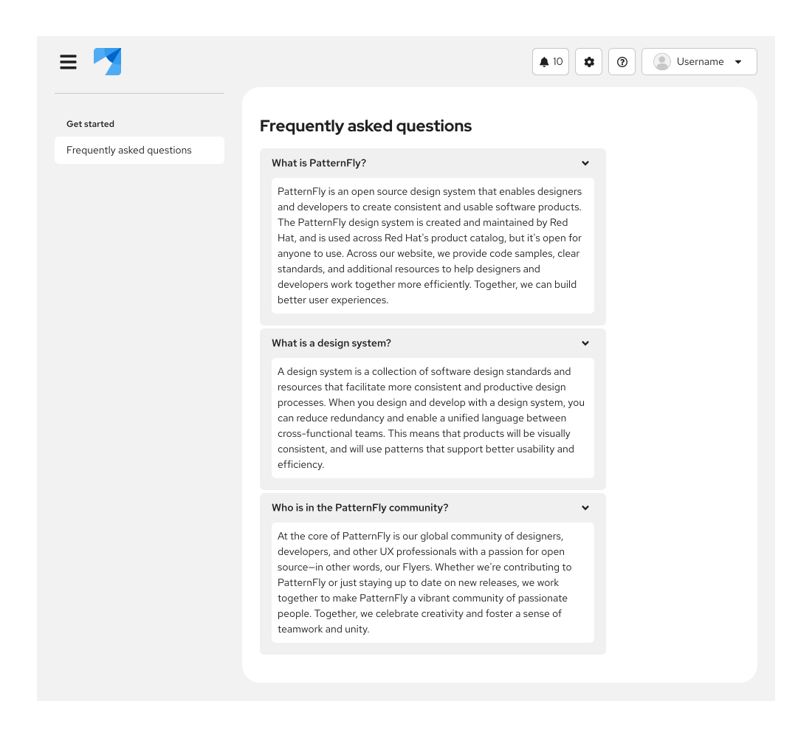

import '../components.css';

## Elements

1. **Header:** Interactive link that expands or collapses to reveal the nested content.
2. **Label:** Summary descriptions of the nested content.
3. **Content panel:** Area that holds the information associated with the header.

## Usage
Accordions are one of many ways to organize large amounts of content when there is limited space. It provides a grouping structure while the header title gives an overview of the content hidden underneath it. Due to their high interaction cost, we recommend that you use accordions sparingly when you need an additional layer of structure to your content. 

### When to use accordions vs. tree tables vs. tree views

**Use accordions:**
- When you have content that users should be able to hide and display as needed.
- When you need to make long content sections easier to navigate and parse through. 
- When your content only includes simple blocks of text or lists&mdash;not complex information, like tables. 

**Use [tree tables](/components/table#tree-table):** 
- When you need to nest related information within a table.

**Use [tree views](/components/tree-view):** 
- When you need to communicate a hierarchical structure.
- When you need to change content on a page, based on selection in a tree view.

## Behavior
Users click or tap on section header of collapsed accordion and content area will expand.

## Variations

* **Single expand behavior**: 
Use when you are trying to bring focus to a single row at a time, by default the first row is always open. This is ideal for content that is mutually exclusive and doesn’t all need to be shown at once. Single expand accordions are particularly useful when working with forms, navigation and subnavigation.  

   

  

  
  

* **Multiple expand behavior**: Use when users may want to view content from different sections simultaneously. This variation gives users the ability to open multiple rows at a time, content will expand or collapse per each interaction. This variation is frequently used in FAQ sections and product comparisons.

   
  
  

   
  

## Accessibility

For information regarding accessibility, visit the [accordion accessibility](/components/accordion/accessibility) tab.