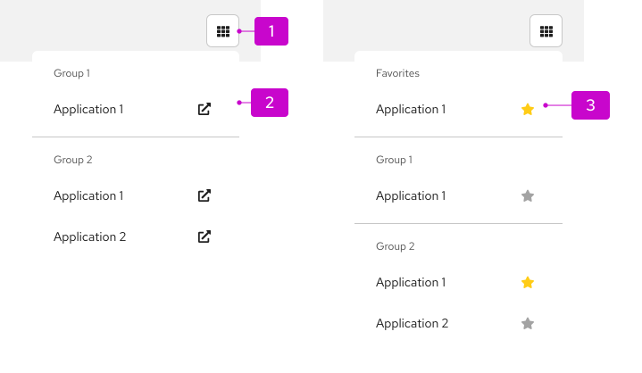
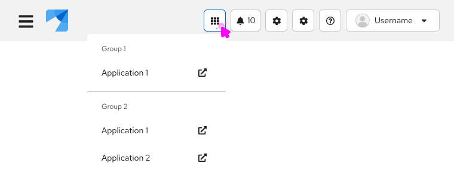
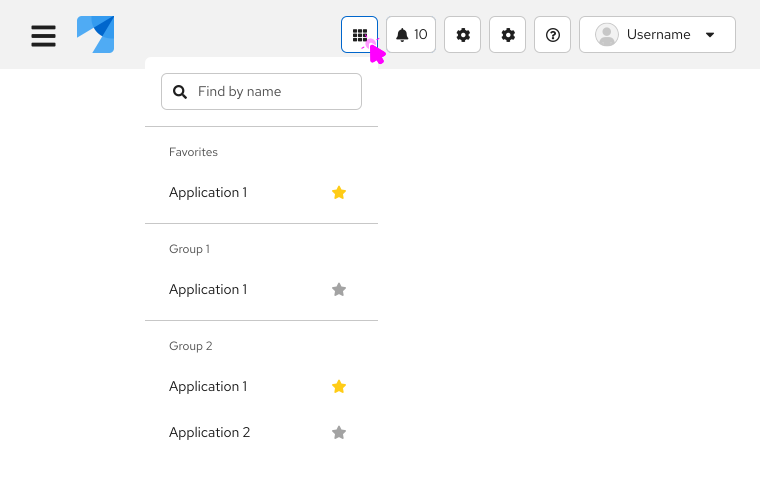

import '../components.css';

## Elements

1. **Icon:** Used to open and close the menu.
2. **Menu:** Contains a list of links to applications.
3. **Favorites (optional):** Section at the top of the menu that contains pinned items.

## Usage

Application launchers are usually found within the [masthead](/components/masthead) of a UI. They are commonly used when you want to allow users to launch multiple applications from a common location. Use the external link icon to indicate when a link opens a new window. You can also use icons in the list.

For longer lists, you can optionally add the ability to search the list and favorite items. Favoriting an item using the star icon allows users to pin items to the top of the menu in a separate "Favorites" section. The item will appear in the list twice: once in the "Favorites" section and once in its original location.

### Examples
**Application launcher with external links**

**Application launcher with favorites and search**

## Accessibility
For information regarding accessibility, visit the [application launcher accessibility](/components/menus/application-launcher/accessibility) tab. 
