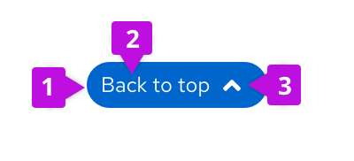
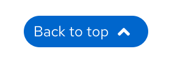
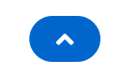

## Elements 

1. **Button**: clickable feature
2. **Content**: "Back to top"
3. **Up-arrow icon**: optional to include but encouraged

## Usage 

### When to use

* Use the back to top component on large-medium screens when content fills up more than two screens in length. 
* Use on small screens when content fills up more than four screens in length. 

### When not to use

* Don’t use on pages with static content that is short in length. 

## Behavior 
As the user scrolls down the page, the back to top component will reveal itself as a sticky button on the lower right edge of the screen. The color of the button will change on the hover to insinuate its clickability. Once the user selects the button the page will jump back to the top of the page.

## Variations
* Use the button with “Back to top” content and up-arrow icon for larger screens and standard web pages

  
  
* Use button with up-arrow icon only on smaller screens and mobile platforms

  

## Content guidelines
* The button should consistently be placed on the lower right side of the page.
* Only use 1 back to top component per page, avoid using multiple buttons in different sections.
* Keep the button stationary. Once the button reveals itself, it should not move on the page.
* Include proper spacing around the button, see CSS variables under React and HTML tabs.
