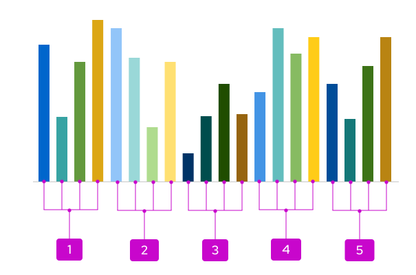
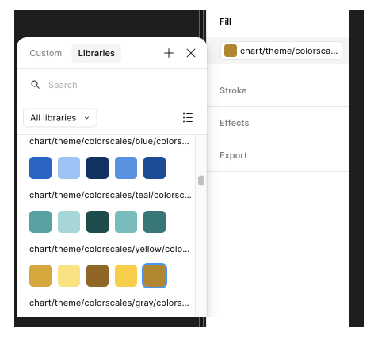
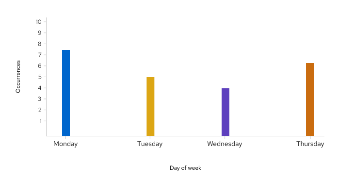
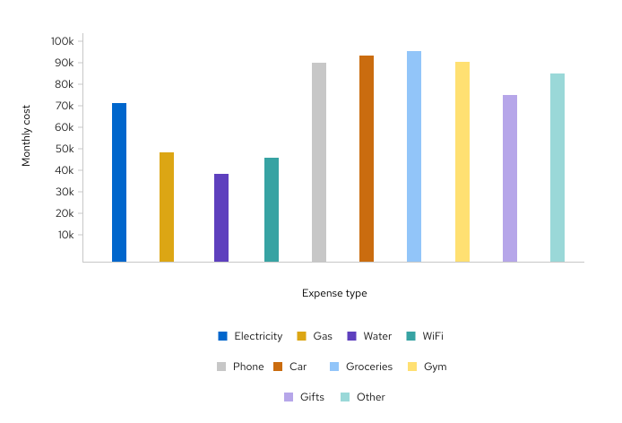
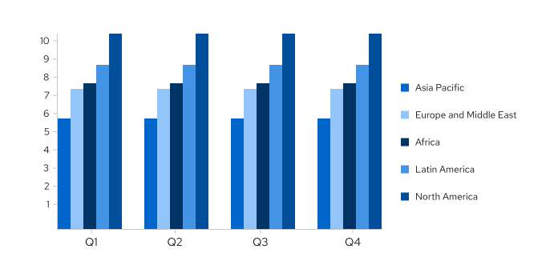
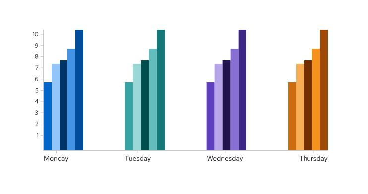
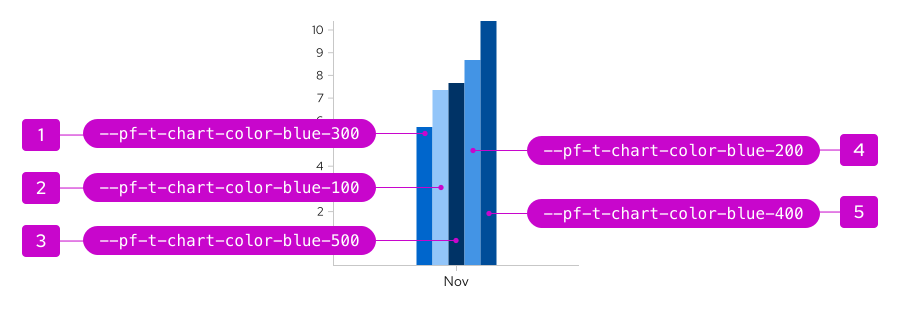

import { Alert, Grid, GridItem, Divider } from '@patternfly/react-core';
import ColorsGrid from './colors-grid.js';
import './colors-for-charts.css';

import '../../components.css';

**Note:** Our charts use separate design tokens from our standard library. To view a list of all chart tokens, apply the "chart" category filter to [the design tokens table](/foundations-and-styles/design-tokens/all-patternfly-tokens).

## Color palettes

To create well-designed charts, you typically need to use multiple colors to best communicate your data. Our chart color options are all pulled from [standard PatternFly color palettes](/foundations-and-styles/colors), but the amount of hues within each color family are more limited to ensure that your chart colors are distinct enough from each other. Your data will determine the number of colors and the type of colors you will need. 
 
<ColorsGrid />

## Usage

Our chart color system is completely customizable. Once you choose your base colors and the total number of colors you need, the system will sort them correctly. 

The system will first use each base color from the families you selected. Once all base colors have been used, the system alternates between choosing the lightest and darkest values of each family. The color picking system will continue to alternate between the remaining lightest and darkest colors of each family until it has reached the total number of colors you selected. 

No matter which base colors you select, this process will remain the same.

### Example palette

If you select 4 color families&mdash;blue, teal, green, and yellow color&mdash;your chart could look like this:

1. Base colors: `--pf-t-chart-color-[colorname]-300`
1. Lightest: `--pf-t-chart-color-[colorname]-100`
1. Darkest: `--pf-t-chart-color-[colorname]-500`
1. Second-lightest: `--pf-t-chart-color-[colorname]-200`
1. Second-darkest: `--pf-t-chart-color-[colorname]-400`

### Figma color scales 

To simplify the process of selecting hues for your design, we offer premade color scales in Figma for each color family. These color scales arrange a family's hues based off our recommendations, so you can use colors in the order that they appear within a color scale.

### Best practices

When selecting colors for your chart, adhere to these general rules:

1. Within a color family, use the base color first. Then use the other lighter and darker hues. 
1. Some families have predetermined uses:
    - **Blue:** Use to show success.
    - **Red-orange:** Use to show failure. Do not use this family unless you're communicating failure.
    - **Other colors:** Use for neutral purposes or categories.

1. Use **patterns** to deemphasize a section of a chart.
      - To best highlight chart sections that utilize solid colors, only use patterns for a single chart portion or type of portion. For example, you could use a pattern on your "success" portions to help "failure" portions stand out.
      - Do not use patterns for every section of a chart.

1. When using certain hues of red-orange and green together in a single chart, they might not always pass accessibility requirements. To improve your chart's accessibility in these cases, add a pattern to the section that you want to deemphasize.

## Variations

### Few chart variables 
When working with *7 or fewer variables*, align each variable to an available base color. 

For example, the following chart displays sales data per product over a period of time:

### Many chart variables 
If the set of data includes *more than 7 variables*, apply a multichromatic order system that includes all of the colors in the color system.

For example, the following chart displays the cost of living expenses over a period of time:

### Nested or grouped chart variables
If your dataset includes grouped variables, align each group to a color family. When you select multiple color families, your chart will automatically arrange the order of colors as follows: blue, green, teal, purple, yellow, orange, red orange, and then black. If there are more than 6 groups, this order would restart and continue to cycle.

For example, the following chart includes quarterly sales data that is broken down by geographical locations:

### Monochromatic charts

To create a monochromatic effect in your chart, you can also apply a color order system within 1 color family. This effect is particularly helpful for charts with nested variables. 

Within a family, the color order follows the same pattern used when combining multiple families. The chart palette begins with the base hue, then uses the lightest, darkest, second lightest, and second darkest hues. Regardless of color family, hues will always follow this order. 

As design tokens, this order looks like: 
1. Base hue: `--pf-t-chart-color-[colorname]-300` 
1. Lightest hue: `--pf-t-chart-color-[colorname]-100`
1. Darkest hue: `--pf-t-chart-color-[colorname]-500` 
1. Second-lightest hue: `--pf-t-chart-color-[colorname]-200` 
1. Second-darkest hue: `--pf-t-chart-color-[colorname]-400` 