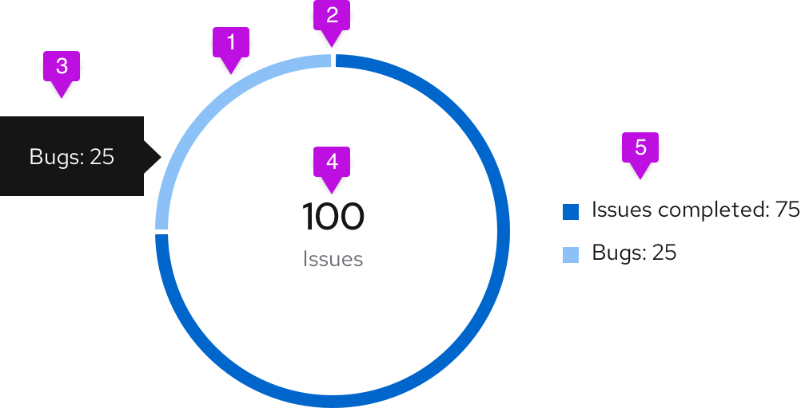

A **donut chart** represents relative amounts that must add up to 100%.

## Usage
In donut charts, you can choose to use percentages or integer values to compare parts to the whole. When deciding which to use, consider the information that is most important to your user and what makes the most sense for your use case. For example, if a user knows they have 123 farm animals and they’re interested in knowing how many of those animals are cows, it probably makes more sense to use an integer value. If that same user is interested in knowing how much storage space they have left in their grain silo, a percentage might be better.

Do not try to represent more than six categories in a donut chart. We recommend using the [colors for charts](/charts/colors-for-charts) guidelines to represent your data when thresholds are not present.

The most common use cases for donut charts are:
- Showing the relationship of a set of values to a whole.
- Showing utilization for an object as a percentage (with or without thresholds).

If you need to compare one category to another, consider using a [bar chart](/charts/bar-chart).

### Example

1. **Segment fill:** We recommend using [colors for charts](/charts/colors-for-charts) for different items within the donut chart.
2. **Segment padding:**  Always provide 3px of padding between segments.
3. **Chart tooltip:** A tooltip will appear upon hover that states the name of the segment and corresponding value. For example, if the segment represents "Bugs," and the value being represented is 25, your chart tooltip would state, "Bugs: 25."
4. **Label:** When a donut chart is contained within a dashboard card, a label defines what the chart represents. The label may also represent the total value of the data set. If this optional representation is chosen, it should follow the format of **[total numeric value] + [data set label]** (example: "100 Issues"). The total numeric value should be rounded to two decimal places or less (14 characters max) and should be styled using 24px font in standard text color. The data set label cannot contain more than 24 characters and should be styled using 14px font in secondary text color. Center them within the donut and style as shown. If the label exceeds the max character count, place it outside of the donut and leave the center empty.
5. **Legend:** In order to be compliant with accessibility guidelines, a legend is necessary. Each variable on the legend should report their current value.