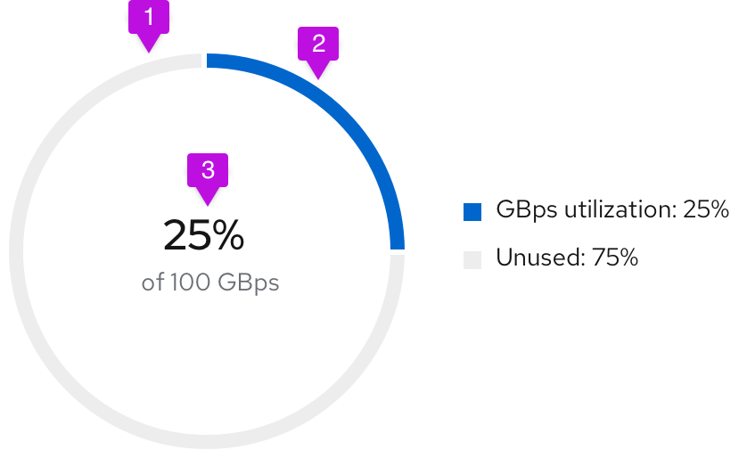
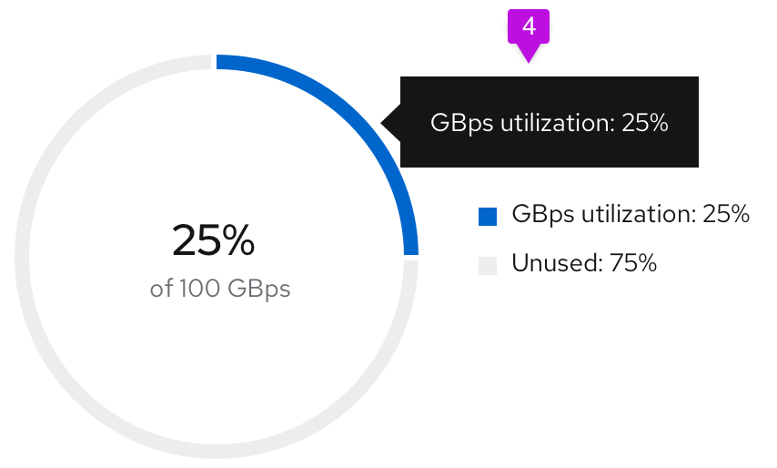
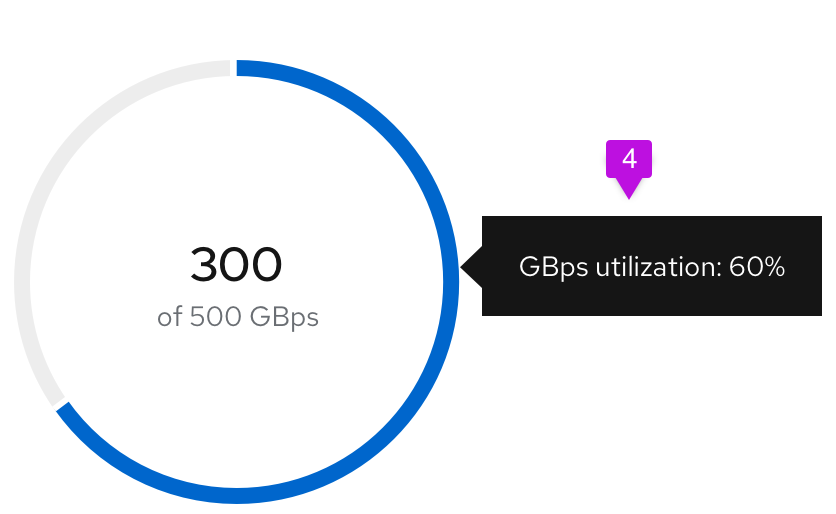
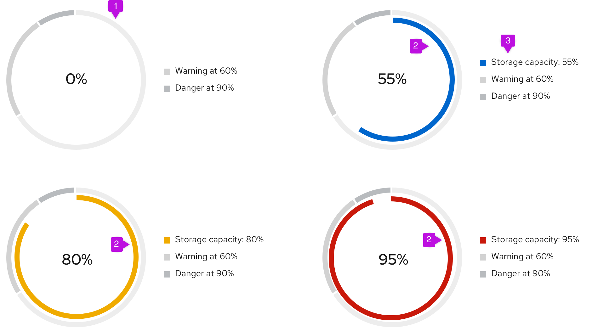
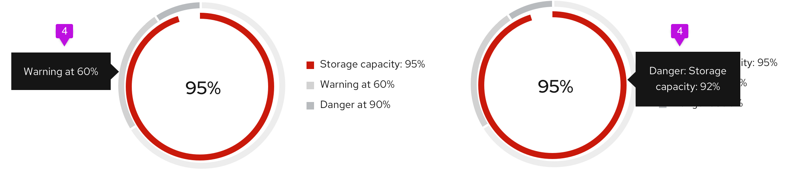

A **donut utlization chart** is a donut chart used specifically to show utilization metrics. 

## Usage
### Donut chart - Utilization

1. **Unused segment fill:** The unused area of the donut chart will always remain at #EDEDED.
2. **Used segment fill:** We recommend using #0066cc for the used area of the donut chart. See [colors for charts](/charts/colors-for-charts) for other recommended color options.
3. **Utilization label:** Both percentages and whole numbers can be used to represent the utilization.
4. **Chart tooltip:** Since this is a utilization donut chart, the tooltip will display the percentage of data utilized. Chart tooltips only appear on hover over the utilization segment of the chart. We recommend stating the segment name and the utilization value being captured. For example, if the user is tracking GBps utilization, the chart tooltip would state "GBps utilization: 75%."

### Donut chart - Utilization with threshold

1. **Threshold segment fill:** The outer segments of the chart are static and represent the thresholds for your use case. The example diagrams show utilization thresholds for a database and are used to let users know when they move from a safe zone into a danger zone. For threshold segments, use incremental shades of  grey starting at #EDEDED then to #D2D2D2 then to #BBBBBB. Provide 3px of padding between each segment.
2. **Utilization segment fill:** This dynamic chart is a concentric circle within the donut thresholds and will represent the data set. For this chart, we recommend using the following colors:
    - #0066cc before the data set has hit a threshold
    - #F0AB00 once the data set has hit the warning threshold
    - #C9190B once the data set has hit the danger threshold
3. **Legend:** The utilization segment color swatch will change in accordance to the chart.

4. **Chart tooltip:** Chart tooltips appear on hover for both threshold segments and utilization segments. We recommend stating the threshold name, the segment name, and the value being represented. For example, if the threshold being met is "Danger," and the segment represents "Storage capacity," and the value being represented is 92%, your chart tooltip would state, "Danger: Storage capacity: 92%." We recommend stating the threshold name "at" the percentage the threshold begins, so a threshold name might read, "Warning at 60%."
