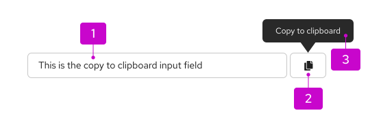
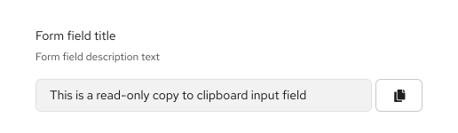
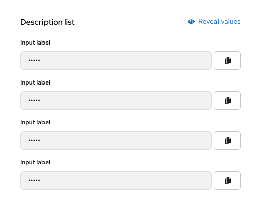
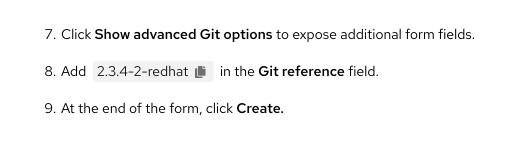
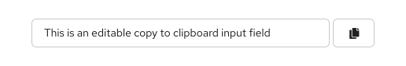
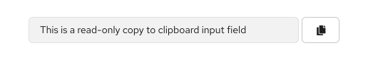
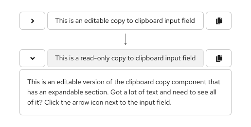
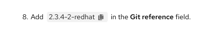
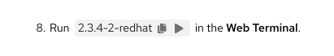

import '../components.css';

## Elements
Clipboard copy has 3 main components.

1. **Copy content:** The content that will be copied to the user’s clipboard.
2. **Clipboard button:** Completes the copy action when clicked.
3. **Tooltip:** Informs users that clicking the button will copy the content to their clipboard. Once a user has clicked this button, this tooltip will update to convey success.

## Usage
Use clipboard copy to allow users to quickly and easily copy content to their clipboard to paste it in another location. Copy content can vary but is usually a line or block of text or code. This is useful for copying system generated key values, to both reduce user effort and the occurrence of entry errors, for example.

### Examples
Clipboard copy can be used almost anywhere in a UI. It is commonly used in forms and definition lists.

**Clipboard copy in a form**

**Clipboard copy in a description list**

**Inline compact clipboard copy in context**

## Variations
The clipboard copy component has a few features that can be used to customize the component to fit different use cases. For example, it can be editable or read-only, with options for expansion.

### Editable

An editable clipboard copy allows users to edit the text input. Their edited text will be copied when the clipboard button is clicked.

### Read-only

A read-only clipboard copy only allows the user to copy a predefined line of text that is not editable by the user.

### Expandable

An expandable clipboard copy allows for long lines of text to be stored in an expansion panel. Expanding the clipboard copy allows the user to view the full string that they can copy.

When collapsed, users can edit the text input. When expanded, the text input becomes read-only and users can instead edit the text in the expansion panel.

### Inline compact  

An inline compact clipboard copy is placed directly inline with other text or used on its own when you want a lighter weight clipboard copy treatment.

An inline compact clipboard copy can include 1 or 2 action buttons next to it. The second action is customizable and optional.

