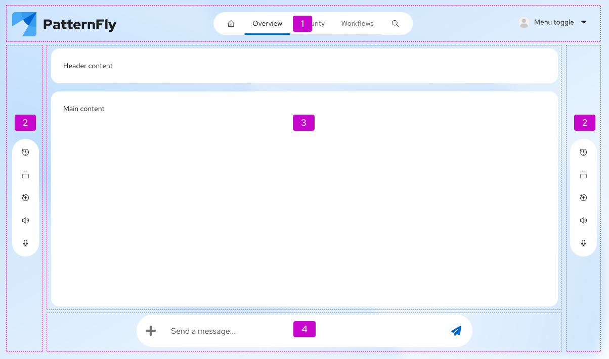

import '../components.css';

Use Compass to build AI-driven and generative UI experiences. It gives you a structured canvas that organizes navigation, content, and conversational inputs into a single, structured interface — well-suited to applications where your users interact with AI-generated content in real time.

## Elements

A Compass layout is made up of several distinct regions. You can use them independently or together.

1. Header
2. Sidebars
3. Main content
4. Footer

### Header

The header spans the full width of the viewport at the top of the page. It typically contains 3 areas:

- **Logo:** A brand image or product logo.
- **Navigation:** Primary navigation tabs or links, using the `Tabs` component with the `isNav` flag.
- **Profile:** A user account control, such as a dropdown with an avatar.

### Sidebars

Compass gives you 2 vertical sidebars — one at the start (left) and one at the end (right) of the page. Use them for contextual actions, secondary navigation, or persistent tooling that doesn't belong in the main content flow. Actions in the sidebars can trigger menus and drawers.

### Main content

The main content region fills the center of the viewport. It typically contains:

- **Main header:** A title area or [hero](/components/hero) section that contextualizes the current view.
- **Content area:** The primary body of generated content or interactive data.

### Footer

The footer provides a stable, anchored input zone at the bottom of the viewport. Use it to hold a `MessageBar` or similar input control. You have 2 placement options:

- **Full-width footer** (via the `footer` prop): Spans the entire viewport and causes sidebars to adjust their height in response to footer height changes.
- **Inline footer** (via `CompassMainFooter`): Contained within the main content region, allowing sidebars to extend the full viewport height regardless of footer size changes.

## Usage

### When to use Compass

- **AI assistant pages:** Use Compass when building a dedicated experience for interacting with a conversational AI, where the message bar is a persistent, central affordance.
- **Generative dashboards:** Use Compass when displaying AI-generated content that is dynamically assembled and may update in real time.
- **Immersive full-page layouts:** Use Compass when the interface requires a structured, full-bleed canvas that goes beyond a standard page shell.

### When not to use Compass

- **Standard application pages:** For typical create, read, update, and delete (CRUD) pages, data tables, or form-driven workflows that don't involve generative or AI-driven content, use PatternFly's standard [Page](/components/page) component instead.
- **Embedded content:** Use Compass for top-level, full-page layouts only — not as a nested layout within another page.

## Layout variations

### Default layout

The default Compass layout includes a header, optional sidebars, a main content area, and a footer message bar. This suits AI assistant applications where navigation and conversation input are always visible.

### Dashboard layout

For dashboard views, replace the main header with a `Hero` component and arrange content cards in a `Grid`. Each card should be wrapped in its own glass `Panel` to maintain visual separation between data regions.

### Docked navigation layout

Use the `dock` prop to consolidate all navigation into a single anchored vertical `[docked navigation]`(/components/navigation/react-demos#docked-nav). This layout works well when horizontal screen space is at a premium or when following a vertical-nav design convention.

## Visual style

### Glass mode

Compass is designed to work with the **Glass mode** (`pf-v6-theme-glass`). When using the Glass mode:

- The glass mode is applied globally to the `html` element, similar to enabling dark mode.
- Glass mode works best with a full-page background image. 
- Wrap glass-styled containers in a `Panel` with the `isGlass` modifier.
- Do not nest glass-styled components like `Cards` inside `Panels`. This can cause legibility, accessibility, and performance issues.

## Content considerations

- **Main header text:** Keep the main header or hero title concise and action-oriented. For generative UI, this area often reflects the user's current query or context.
- **Message bar placeholder text:** Write placeholder text that sets clear expectations. For example, "Ask a question or describe what you need."
- **Loading and thinking states:** When AI is processing a request, apply the thinking animation to indicate active generation. Ensure there is also a screen reader announcement so that assistive technology users are informed.
- **Empty states:** When no content has been generated yet, use a clear empty state in the main content area that guides the user toward their first interaction.

## Accessibility

- Ensure that the `MessageBar` region has an appropriate `aria-label` describing its purpose.
- Add a visually hidden `aria-live` region near the `MessageBar` to announce dynamic status changes (for example, when AI begins generating a response).
- Navigation landmarks (`<nav>`, `<main>`, `<header>`) should be present and correctly ordered so that keyboard and screen reader users can orient themselves within the layout.
- Avoid relying solely on color or animation to communicate AI processing state; always pair visual indicators with text or ARIA announcements.

For more information, visit the [Compass accessibility tab](/components/compass/accessibility).
