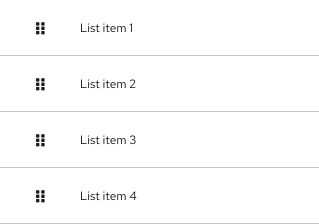
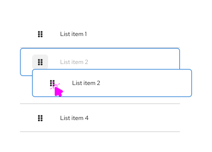
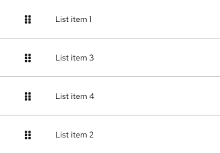
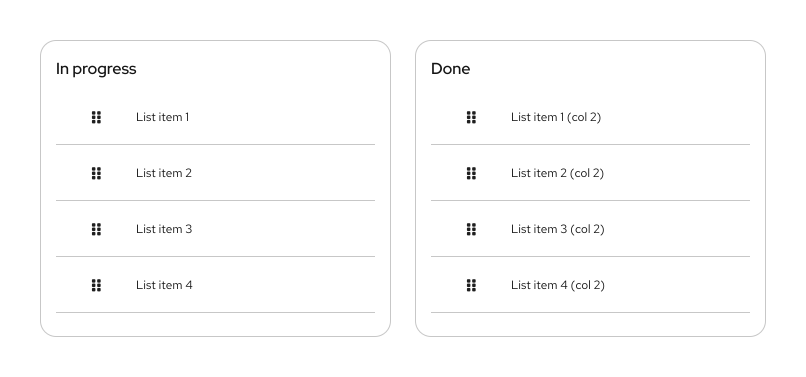
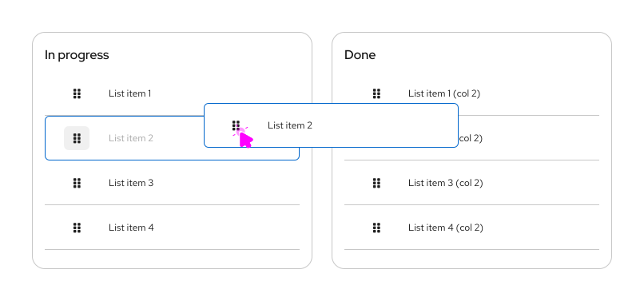
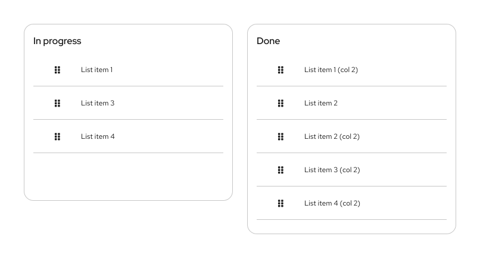
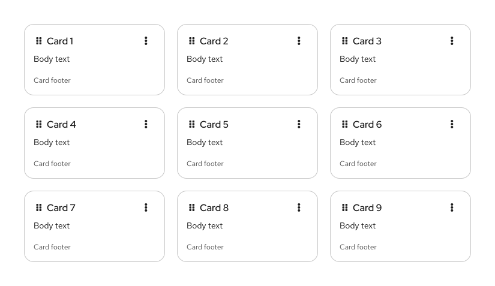
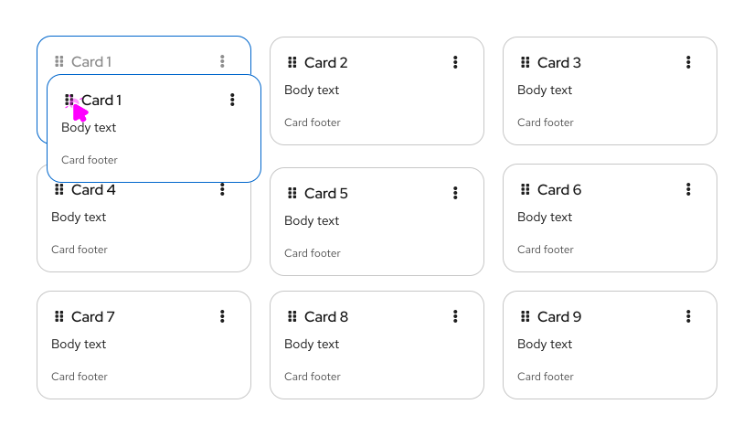
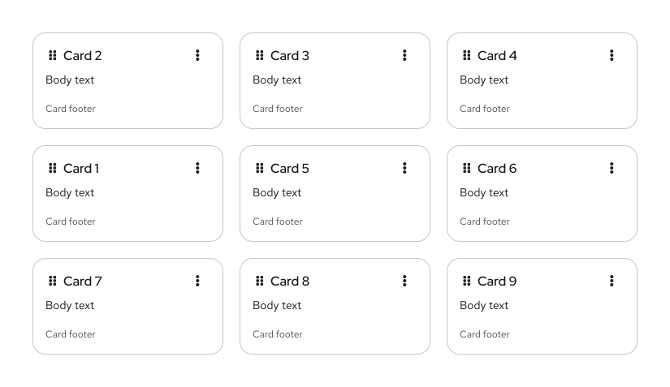

import '../components.css';

## Usage
### Simple list
1. **Draggable area:** The drag and drop interaction can be triggered with click and hold over any part of the item. The `fa-grip` icon is used to show that the drag and drop interaction is available.

2. **Ghost item:** Upon click and hold, a duplicate "ghost" item with a  `--pf-v6-global--active-color--100` border will appear "on top" of the list. This ghost item represents the initial item being moved.

3. **onDrag event:** While a ghost item is being dragged, the original item will move its position in the list to align with the hovered position.

4. **postDrag event:** Once dropped, the ghost item will become an item in the list, which will be reordered based on the user’s action. 

### Multiple lists
PatternFly drag and drop allows users to move items between different list groups. For example, in a To-Do list scenario users can quickly drag list items from the ”In progress” column to the “Done” column.

1. **Draggable item**

2. **onDrag event**

3. **postDrag event**

### Draggable cards
In a card view, when the selected card has been dropped the others will reposition following a left-to-right flow by default.

1. **Draggable item**

2. **onDrag event**

3. **postDrag event**

