import '../components.css';

## Usage

Drawers can be used to store and show more information than immediately presented on a page. A drawer with more information is usually prompted by a user click. Upon the click, the drawer comes out and shows more information, which is usually relevant to a whole page.

Drawers appear as a sliding panel that can be attached to the bottom or sides of a window. They’re commonly used in a [primary-detail](/patterns/primary-detail), which is a layout that uses a drawer for details and spans the height of the primary content. The primary content can be placed in any container, and the details drawer will span the height of that container. The drawer component is used for the details because it's common for the "detail" in primary-detail to be toggled open/close, while the primary content should always be present on the screen. For a primary-detail in a card, the details section is still built with a drawer component even when it's not collapsible.

In addition to primary-details, the drawer component is frequently used in [notification drawers](/components/notification-drawer) or terminal windows.

### Splitter in a drawer

A splitter allows you to create a layout with resizable panes. The orientation of a splitter can be set to vertical or horizontal. Depending on the direction the drawer opens within the page, you can place a splitter at the start or end of a drawer.

### When to use a splitter
Add a splitter to a drawer if you need to resize the width or height of a panel to give content more space. If data shown in a drawer has enough space, then you don’t need to use a splitter.

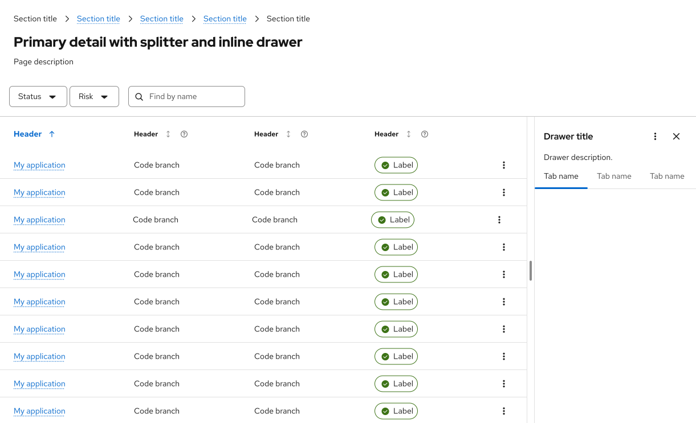

## Variations

There are 2 types of drawer displays: overlay and inline.

### Overlay drawer

An overlay drawer appears "on top" of page content, and must be minimized or closed in order for users to view the content that is covered by the expanded drawer. Overlay drawers in default and glass mode will have the `--pf-t--global--background--color--floating--default` token applied.

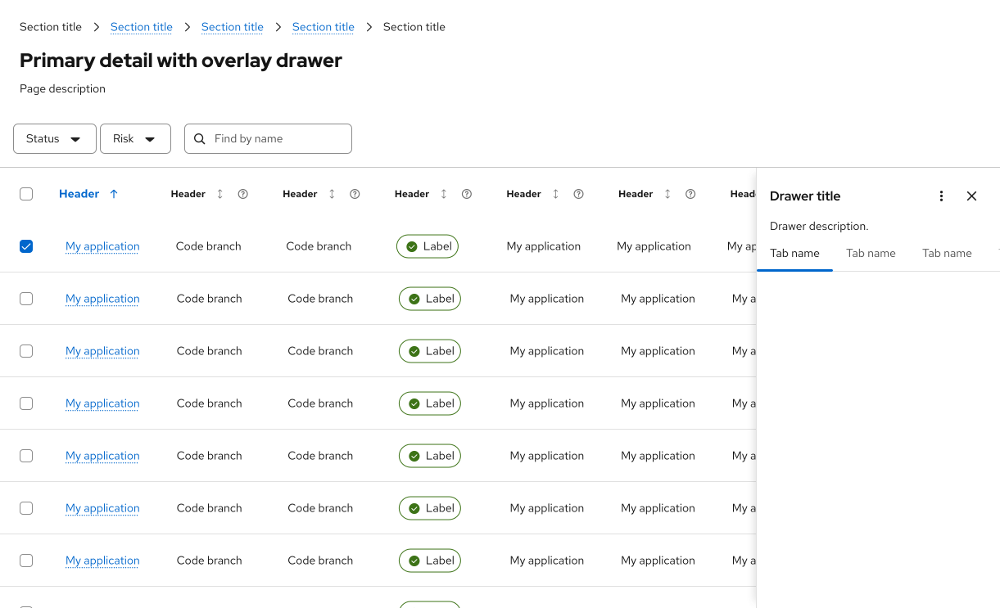

### Inline drawer

An inline drawer is placed beside page content, making the rest of the page content more compact (but still visible). All inline drawer variants have a `--pf-t--global--background--color--primary--default` token applied.

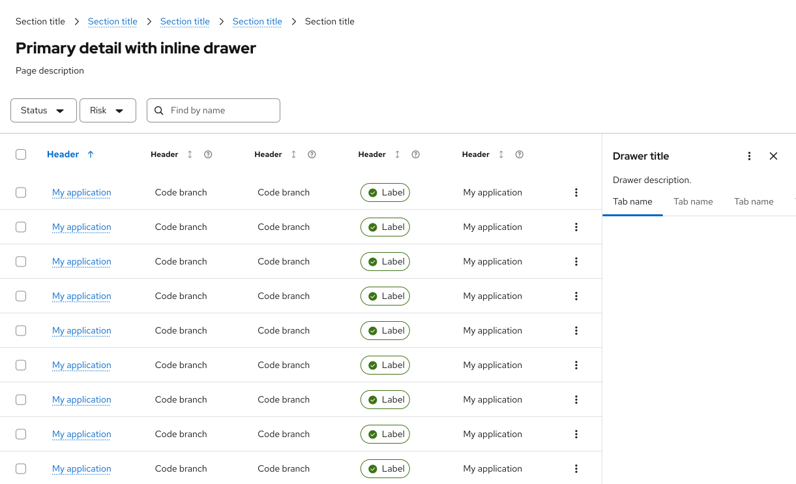

### Overlay pill

A rounded overlay drawer is available across all themes. Apply the `pf-m-pill` modifier—either by applying the class or using the `isPill` prop for React—to enable the rounded style. The `--pf-t--global--border--radius--medium` (16px) border radius token and `--pf-t--global--border--color--subtle` border color token are applied to all rounded drawers. When placing a rounded drawer in a page, use the `global/spacer/inset/page-chrome` gutter token to ensure consistent spacing.

The rounded overlay drawer has a `.pf-v6-u-box-shadow-md` (medium box shadow) applied to the entire drawer.

For an overlay pill drawer sitting above the main content area, the margin around the overlay drawer should use gutter spacer `--pf-t--global--spacer--gutter--default` on the top, bottom, and right if possible (or look visually equivalent if another code implementation is needed).

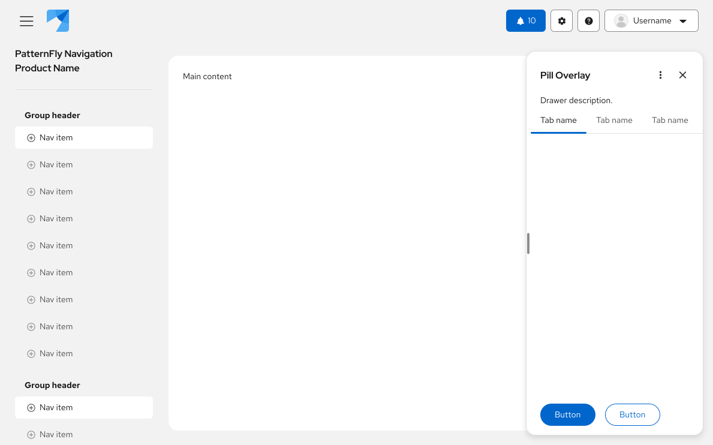

#### Compass layout - Pill overlay

To see the drawer in a compass layout, view the [compass layout demo](/components/compass/org-demos/card-and-data-view-layout/).

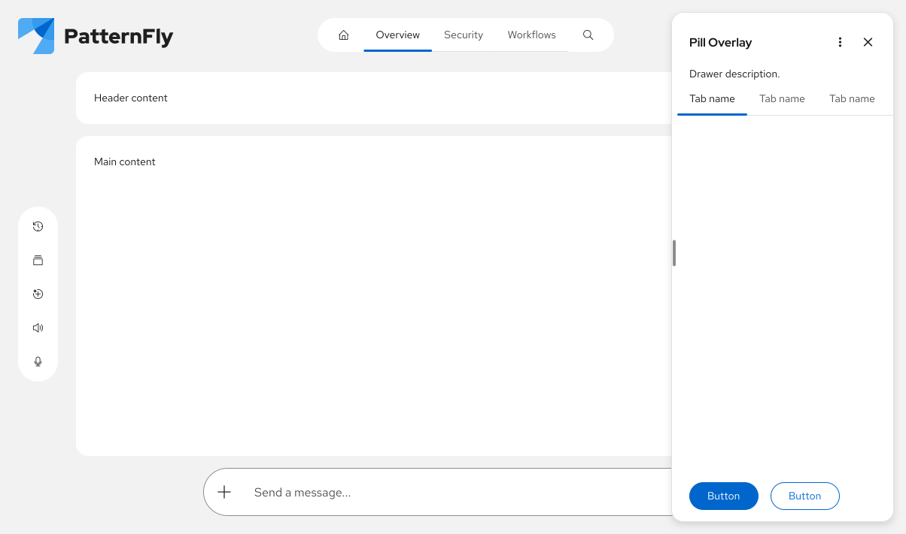

#### Over main page content - Pill overlay

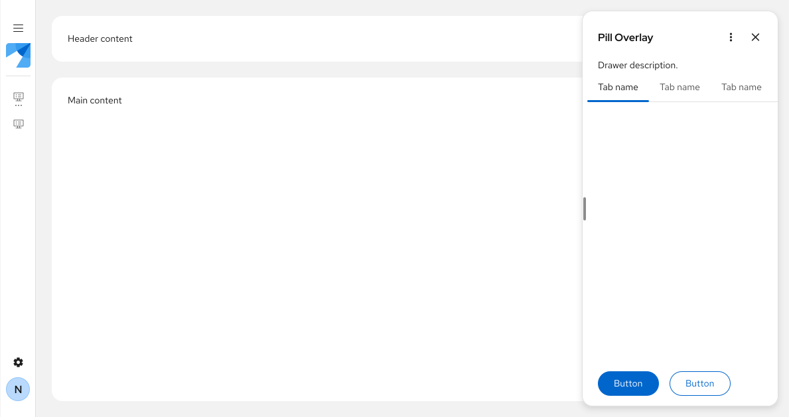

#### In main page area - Pill overlay

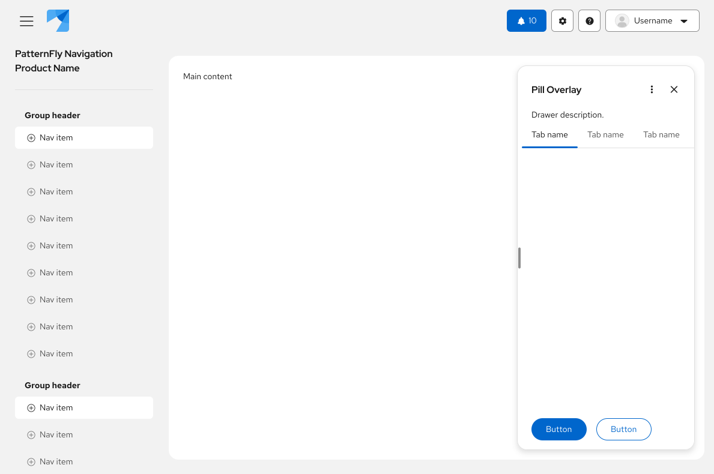

### Inline pill

The rounded inline drawer shares the same base styling as the rounded overlay drawer. In the glass theme, a `.pf-v6-u-box-shadow-md` (medium box shadow) is applied to the entire drawer.

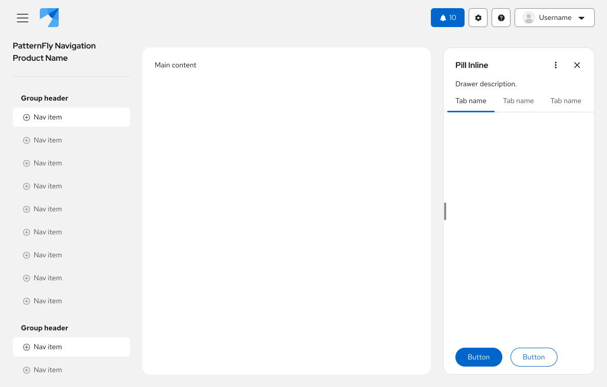

#### Without masthead - Inline pill

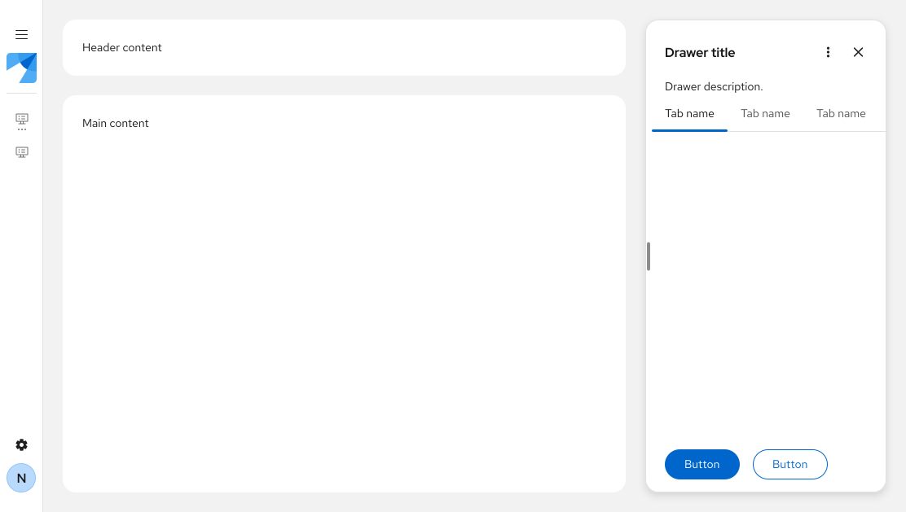

## Placement

By default, a drawer is placed on the right side of the UI. Depending on your user case, you can adjust this so that the drawer is on the left or at the bottom of the page instead. 

### Right (default)

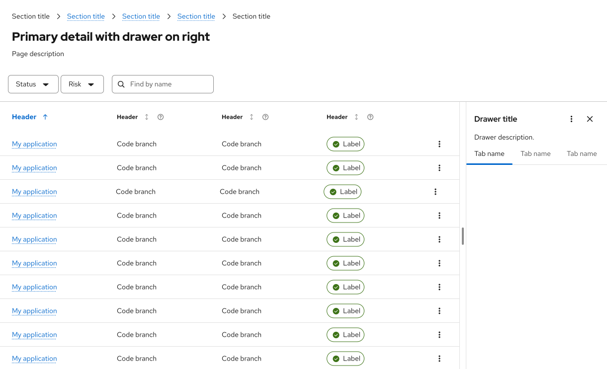

### Left

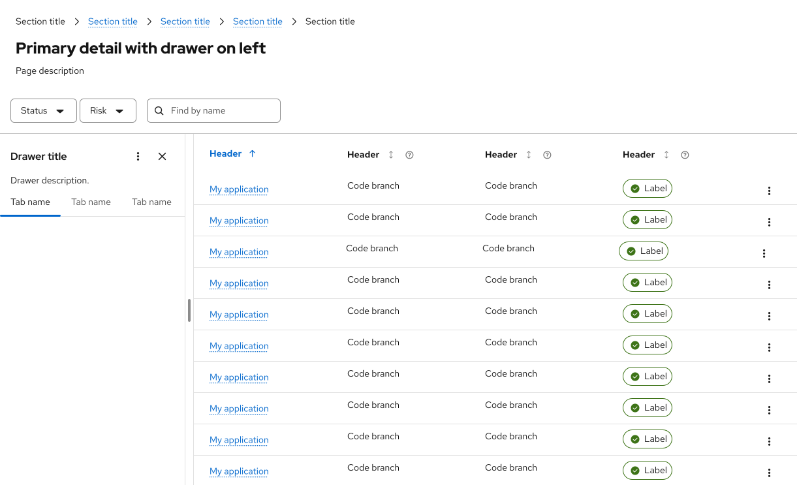

### Bottom

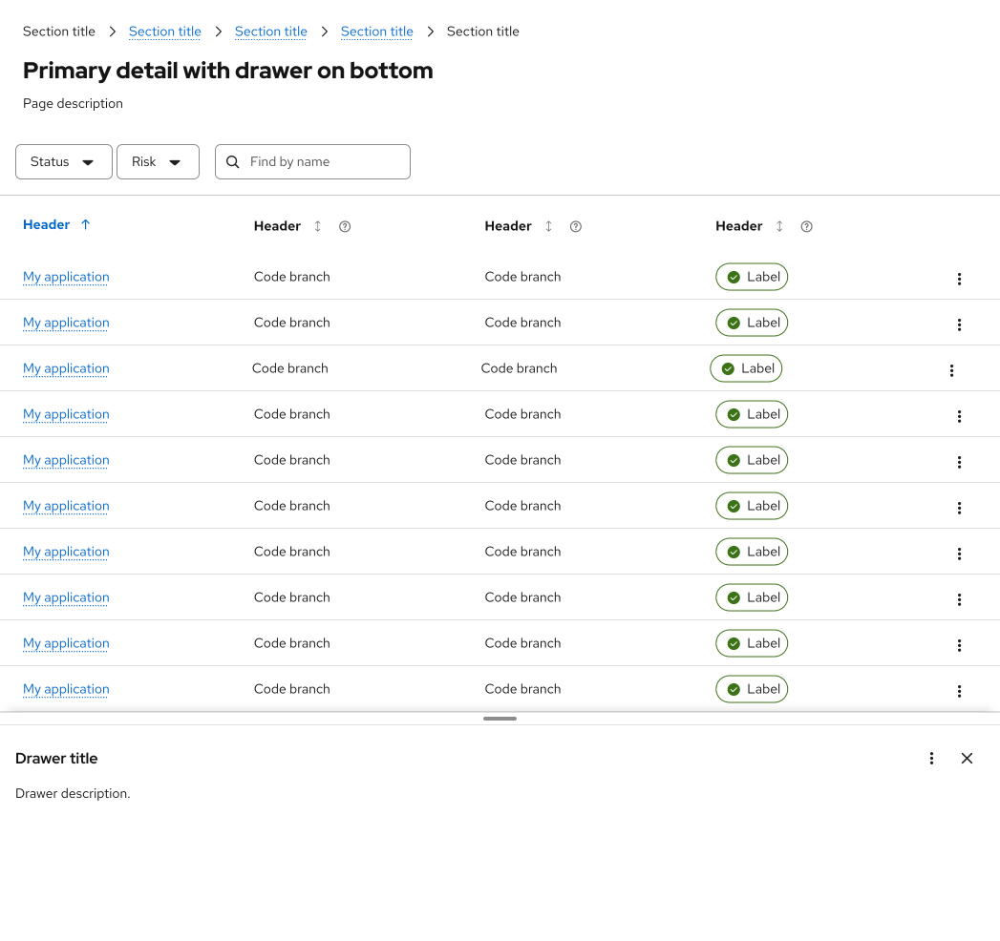

