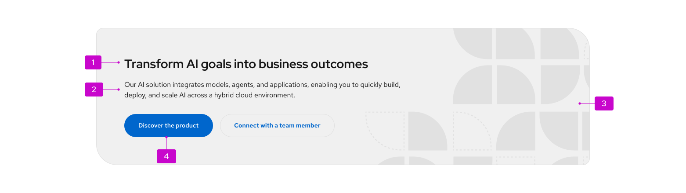
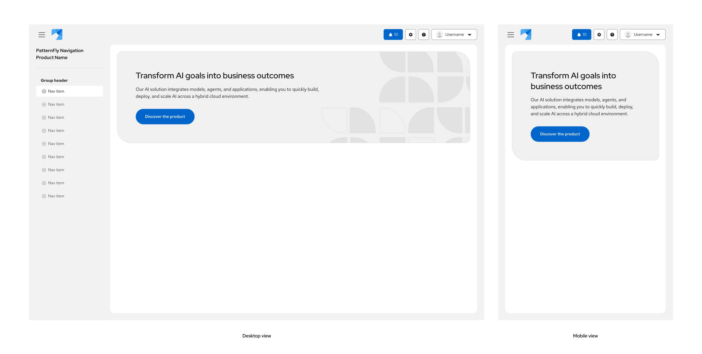

import '../components.css';

Use a hero at the top of a home page or landing page to introduce a clear value proposition and primary call to action.

## Elements

A hero is a compositional container. Structure content with PatternFly typography and button components inside the hero body.

1. **Headline:** A concise statement about the offering or page purpose. Use heading XL typography (28px, Red Hat Display Medium). On a landing page, this should typically be the page `h1`.
2. **Description:** Supporting context for the headline. Use body large typography (16px).
3. **Visual content (optional):** A right-aligned brand asset applied as a background image. Decorative assets should support the message without competing with text.
4. **Call to action(s):** Include at least one primary action; one secondary or tertiary action is optional. Use [CTA buttons](/components/button#call-to-action-cta-buttons) at size `lg`.

## Usage

### When to use

Use a hero when the primary purpose of the page is to:

- Establish brand tone and communicate a key value proposition.
- Introduce a new product, feature, or campaign.
- Drive users toward a specific high-value action or conversion.

Common placements include homepages, product landing pages, and main dashboard landing views (such as Compass).

### When not to use

Do not use a hero as a generic page header on:

- Pages focused on content discovery, data management, or dense workflows (use a standard page header instead).
- Detail views, settings pages, or views where the user's primary task is utility- or task-driven rather than conversion-oriented.

For in-page promotional content that is not at the top of the view, use a [hint](/components/hint/design-guidelines) or horizontal split card instead.

### Placement

- Place the hero at the top of the page content area, spanning the full content width.
- Do not place a hero in the middle or bottom of a page.
- In Compass or layered layouts, place a Glass hero directly over the page background&mdash;not inside a [Panel](/components/panel) (`.pf-v6-c-panel`), or within `.pf-v6-c-compass__main-header` or `.pf-v6-c-compass__content`.
- Constrain text content with the hero body defaults (`bodyWidth` 800px, `bodyMaxWidth` 80%) so copy stays on the left and does not collide with a right-aligned background asset.

## Variants

### Default

Use by default on standard landing pages. Default heroes use asymmetric corner radii to reflect Red Hat brand styling (16px on the start-start and end-end corners; 48px on the start-end and end-start corners) and uniform 64px padding to draw attention.

### Glass

Use in glass theme contexts&mdash;especially Compass and generative UI layouts&mdash;when the hero sits directly over a background image rather than within a standard page section.

Glass styling requires **both**:

- The glass theme (`.pf-v6-theme-glass`), and
- The glass variant (`isGlass` in React, or `.pf-m-glass` in HTML/CSS)

Glass heroes use a translucent background, backdrop blur, and the glass box shadow token.

**Note:** Compact, expandable, and dismissable variants are in design review and will be documented once implemented.

## Content considerations

Write hero content that is clear, concise, and action-oriented:

| Element | Guidance |
| --- | --- |
| **Headline** | 1 short sentence. Lead with the core user benefit. Use sentence case. |
| **Description** | 1–2 sentences maximum. Add essential context without repeating the headline. |
| **Primary CTA** | Start with an action verb. Be specific ("Start free trial," not "Click here"). |
| **Secondary CTA** | Use for a lower-commitment or supporting action ("Learn more," "View documentation"). |

- **CTA limit:** Use a maximum of 2 buttons. If more links are needed, put them in the description or in the page body below the hero.
- For voice and tone, follow [brand voice and tone](/ux-writing/brand-voice-and-tone). Hero copy should feel informative and supportive.

## Visual content and responsive behavior

### Brand assets

- Apply visual assets as a **background image** (not a separate image slot). Position on the right, aligned to right-center (`background-position: right center`, `background-size: contain`).
- Ensure sufficient contrast between text and any part of the background the text might sit over.
- Provide distinct light- and dark-theme asset variants when using background imagery (`backgroundSrcLight` / `backgroundSrcDark` in React).

### Responsive behavior

- Keep the headline and description left-aligned within the hero body so they do not overlap the right-hand brand asset.
- On mobile and narrow viewports, **omit or override** the background image so content can stack cleanly. Hero does not hide the background asset automatically at small breakpoints.
- Call-to-action buttons may wrap to a second row on narrow viewports.

### Gradients and backgrounds

When using gradient overlays or background images, verify color contrast in both light and dark themes. If you remove the background asset, adjust `bodyWidth` and `bodyMaxWidth` as needed so text still reads well at large viewport sizes.

## Spacing and typography reference

### Hero container

| Spec / Element | Value | Token |
| --- | --- | --- |
| **Padding** | 64px (all sides) | `--pf-t--global--spacer--3xl` |
| **Body width** | 800px | `--pf-v6-c-hero__body--Width` |
| **Body max width** | 80% | `--pf-v6-c-hero__body--MaxWidth` |
| **Border radius (small corners)** | 16px | `--pf-t--global--border--radius--medium` |
| **Border radius (large corners)** | 48px | Custom value (no global token) |
| **Default background** | Tertiary fill | `--pf-t--global--background--color--tertiary--default` |
| **Glass background** | Glass primary | `--pf-t--global--background--color--glass--primary--default` |
| **Glass shadow** | Glass default | `--pf-t--global--box-shadow--glass--default` |

### Recommended composition

These gaps come from nested content components (`Content`, `Flex`, `ActionList`), not from `.pf-v6-c-hero` itself:

| Spec / Element | Recommended value | Token |
| --- | --- | --- |
| **Headline** | Heading XL (28px / ~36.4px line-height) | `--pf-t--global--font--size--heading--xl` |
| **Body** | Body large (16px / 24px line-height) | `--pf-t--global--font--size--body--lg` |
| **Headline → description gap** | 16px | `--pf-t--global--spacer--md` |
| **Content → CTAs gap** | 32px | `--pf-t--global--spacer--xl` |
| **CTA gap** | 16px between buttons | `--pf-t--global--spacer--gap--action-to-action--default` |
