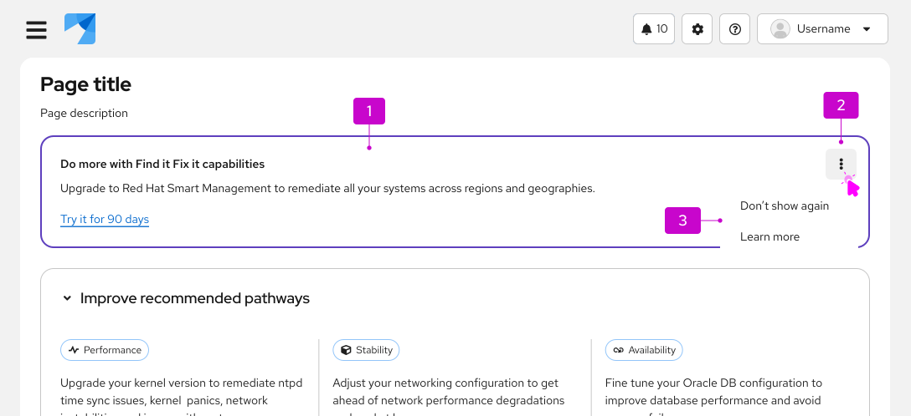

import '../components.css';

## Elements

1. **Content:** A description of the hint, containing a title (optional), body, and link.
1. **Options menu toggle** 
1. **Options menu:** User options for the hint. Can be customized to allows users to dismiss the hint, learn more at another resource, or anything else relevant to your scenario.

## Usage

Use hints to share information about an interaction or prerequisite step that might not be immediately obvious to the user.

For information on other forms of on-screen help, see [tooltip](/components/tooltip/design-guidelines) and [popover](/components/popover/design-guidelines).

## Content considerations 
- Use full sentences with punctuation.
- Include relevant links to documentation when necessary.
