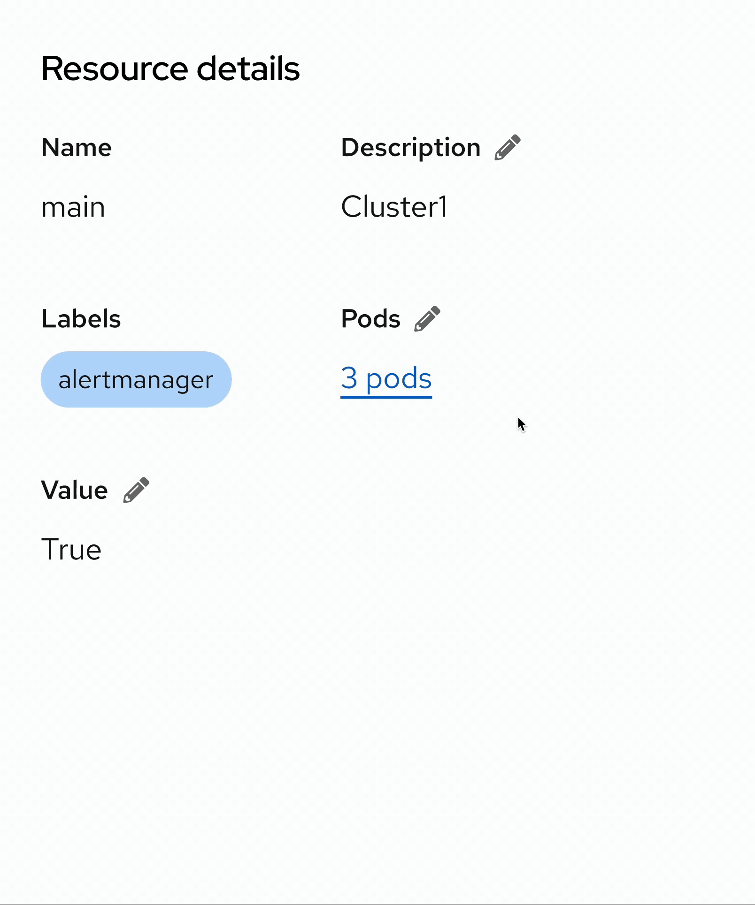
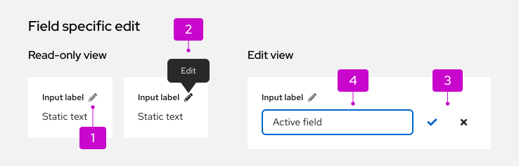
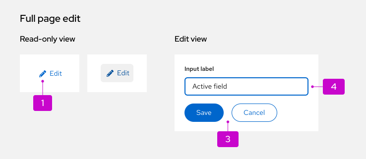
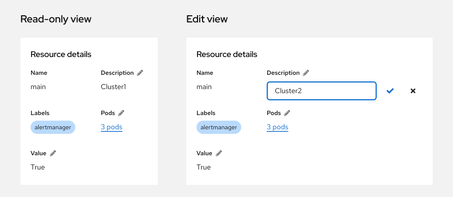
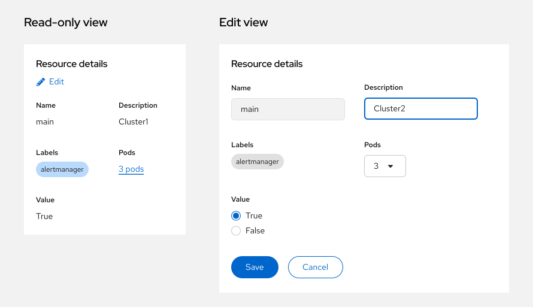
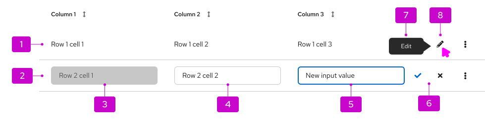
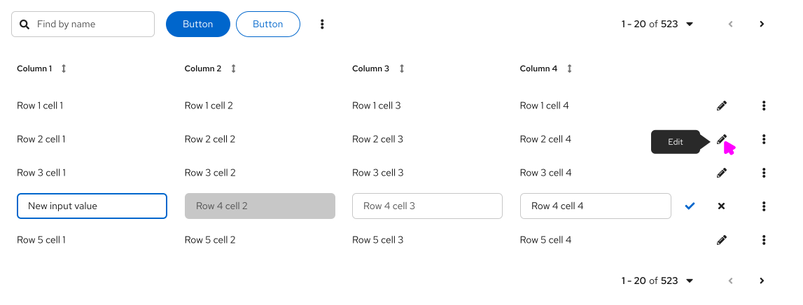

import '../components.css';

## Elements

Elements vary depending on the inline edit variation. Refer to element annotations with the page and table inline elements sections: 
* [Page inline elements](#page-inline-elements)
* [Table inline elements](#table-inline-elements)

## Usage

### When to use
* All editable elements can be viewed within the row or expanded row.
* The data needs to be updated frequently.

### When not to use
* The editing is the primary function of the view. For example, in an edit modal.

## Behavior

When an inline edit is triggered (either a [field-specific edit](#field-specific-edit), a [full-page edit](#full-page-edit), or a [table edit](#table-edit)), users can adjust existing values as needed. Saving the edit will change the value in the element to match a user's update.

## Variations
1. **[Page inline edit](#page-inline-edit):** Enables the user to edit a [specific field](#field-specific-edit) in a details page or in a [full page](#full-page-edit).
2. **[Table inline edit](#table-inline-edit):** Enables the user to [edit elements in a row](#row-editing).
 
### Page inline edit

* **[Field-specific edit](#field-specific-edit):** Allows users to make changes to one field at a time.
* **[Full page edit](#full-page-edit):** Allows users to make multiple changes at a time, in a larger area with more fields.
 
#### Page inline elements
 

 
1. **Pencil toggle (fa-pencil-alt):** Indicates the edit action.
2. **[Tooltip](/components/tooltip):** Provides a short description of the inline edit toggle.
3. **Action group:** Allows the user to save or cancel changes.
4. **Form elements:** Examples include [text input](/components/forms/text-input) or [text area](/components/forms/text-area). See [forms](/components/forms/form) for more information about form elements.
 
### Field-specific edit
 
#### When to use

Use field-specific edit when you want to allow users to make small edits to specific fields in a page. 
 
#### How to use
The pencil toggle is placed inline with the header for fields that are editable. Clicking on this toggle allows the user to edit inline, or can trigger a modal for more complex edits. In edit mode:
* **The check icon (fa-check)** saves the changes and switches the item back to read-only mode.
* **The close icon (fa-times)** returns to the read-only mode without saving new data.
 

 
### Full-page edit
 
#### When to use
Use the full-page edit when you want to allow users to edit a larger area with many editable elements all at once.
 
#### How to use
Any editing is triggered by an edit link for the whole section. All edits should be easily done in the context of the page. Clicking the pencil icon toggles the page or description list into edit mode.
* **Non-editable fields** should use read-only styling. For example, "Name", and "Labels".
* **Editable fields** should function like any form.
* Users can save or cancel changes using the "Save" or "Cancel" button. Both actions return a page or description list to the read-only mode.
 

 
### Table inline edit

* **[Row edit](#row-editing):** Allows users to make changes to a specific table row.
 
#### Table inline elements
 

 
1. **Editable inactive row:** Inactive row with read-only styling.
2. **Editable active row:** Ability to edit form components is enabled.
3. **Disabled input field:** Non-clickable and unusable input field.
4. **Editable input field:** Changes for this input are allowed.
5. **Active input:** Selected input field with new content.
6. **Action group:** Allows users to save or cancel changes.
7. **[Tooltip](/components/tooltip):** Provides a short description of the inline edit toggle.
8. **Toggle:** Indicates the edit action.
 
#### Row editing
Row editing allows a user to edit items that are visible in the table by having a pencil toggle pinned to the right side, with the [kebab toggle (fa-ellipsis-v)](/components/menus/dropdown#with-kebab). 
 
##### When to use
Use row editing when:
* You need to change the data in a table.
* The data is not dependent on each other. For example, changing the data in row 5 will not affect row 3.
 
##### How to use
Clicking the pencil icon toggles the particular table row into edit mode. In the edit mode:
* The kebab is replaced with a check icon for saving and a close icon for canceling. 
* Once changes begin, the check icon turns to `global/icon/brand/default` (in this case, PatternFly blue) to increase the visibility of the save action.
* **The check icon button** submits the changes and switches the row back to read-only mode.
* **The close icon** returns to read-only mode without saving new data.
 

 
Some elements may be difficult to edit in a table. You can make them editable in a [modal](/components/modal) instead.