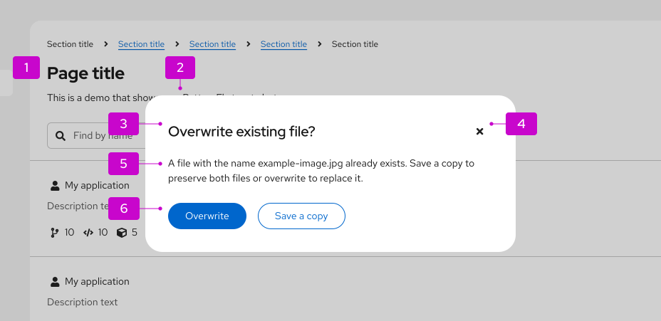
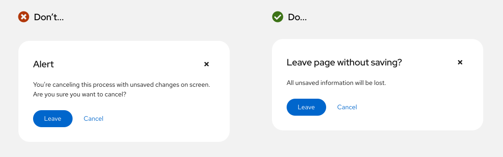
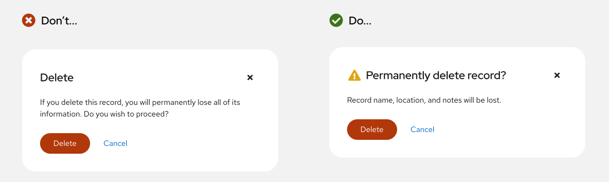
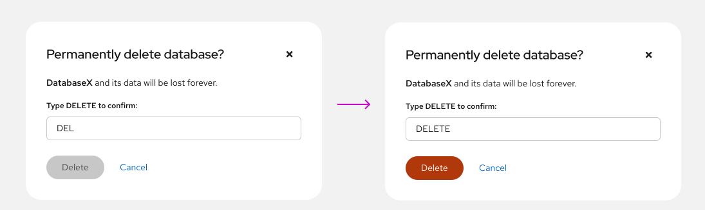
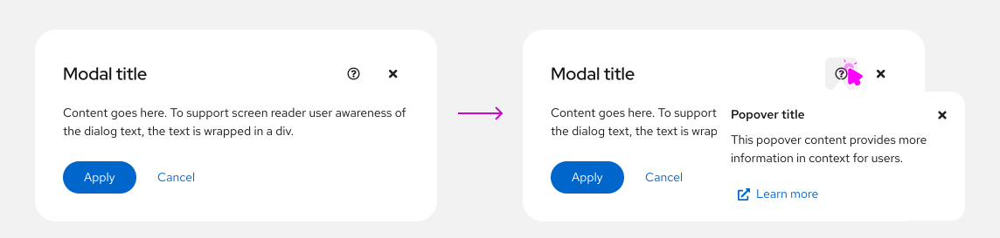
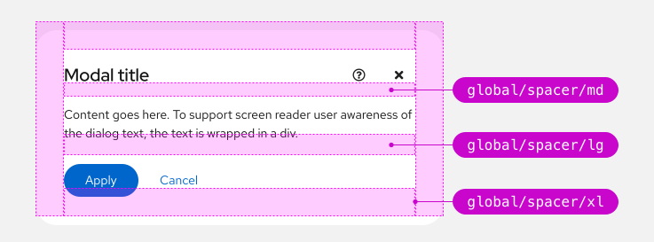
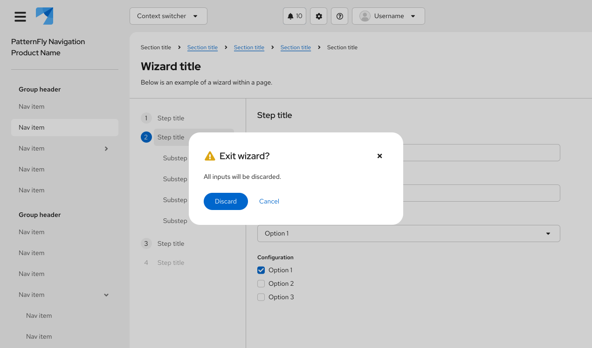
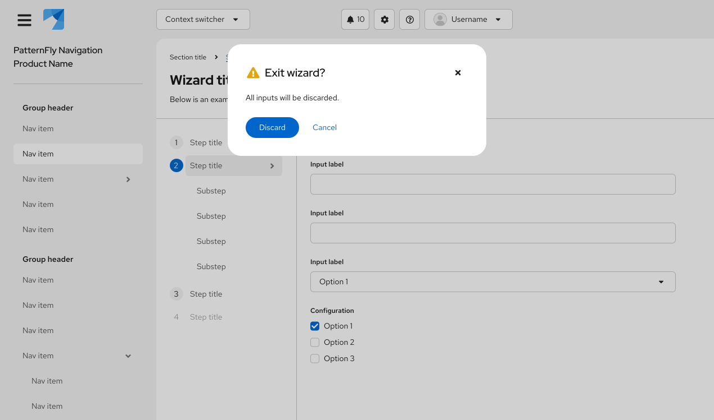

import '../components.css';

import CheckIcon from '@patternfly/react-icons/dist/esm/icons/check-icon';
import TimesIcon from '@patternfly/react-icons/dist/esm/icons/times-icon';

## Elements

1. [**Backdrop:**](/components/backdrop) A screen that covers the main content of a page when a modal is opened, to prevent page interaction until the modal is dismissed.
2. **Modal box:** The container for a modal, which sits on top of other page content.
3. **Headline:** A concise, descriptive title.
4. **Close icon:** Used to close and cancel a modal, without making any changes.
5. **Content area:** Contains the description and body content.
6. **Buttons:** Used to interact with the contents of the modal.

For guidance on writing copy for modals, refer to the [content considerations](#content-considerations) section.

## Usage

Use a **modal** to communicate critical information that requires user input or action. 

Modals can:

* Validate user decisions.
* Confirm non-destructive or destructive actions.
* Report errors.
* Share task results and statuses.
* Prompt required user input.

Don’t use a modal unless its information is vital to user success and worth disrupting a user’s task flow.

## Variations
Modals serve several functions in a UI and appear in the following main types:

* [Confirmation modals](#confirmation-modals)

* [Edit modals](#edit-modals)

* [Error modals](#error-modals)

* [Passive modals](#passive-modals)

* [Session expiration modals](#session-expiration-modals)

* [Input modals](#input-modals)

* [Modals with help](#modals-with-help)

### Confirmation modals

Use a confirmation modal to validate user decisions and communicate their consequences. Confirmation modals can confirm non-destructive and destructive actions.

#### Confirm a non-destructive action

When confirming a non-destructive action, provide specific context about what will happen once a user confirms it.

#### Confirm a destructive action

Use a [primary button](/components/button/design-guidelines#primary-button) to confirm a destructive action. If the action carries serious consequences, then use a [danger button](/components/button/design-guidelines#danger-button) instead.

If an action is difficult or impossible to undo, add a warning icon beside the headline. 

If a destructive action has serious consequences, consider adding an additional step before its destructive button becomes active. Additional confirmation measures like [text input](/components/forms/text-input/design-guidelines) fields safeguard a user from accidentally completing the action. 

When a text input field is added to a confirmation modal, the danger button will only become enabled once a user enters the entire word or phrase.

### Edit modals

Use an edit modal for managing assets. Edit modals contain multiple actions which can include, but are not limited to, saving your changes or deleting the asset. The primary action in the modal should use a primary button, the secondary should use a secondary button, and the cancel button should remain a link button.

For example, an edit modal might contain a "Save" button as the primary action, and a "Delete" button as a secondary action. If the secondary action is destructive, the button should be styled as a [secondary danger button](/components/button/#variant-examples). Additionally, it should be aligned to the right-side of the modal, directly across from the primary action and cancel buttons. 

When using destructive actions, ensure that the user is informed about the consequences of taking this action. Review the general guidelines for [danger button](/components/button/design-guidelines#danger-button) and destructive actions for additional guidance. 

### Error modals

Use an error modal to inform users of problems that interrupt normal or expected behavior. Briefly contextualize the problem and why it happened, then provide actionable steps toward a solution.

Learn more about writing error messages in our [error message guidelines](/content-design/writing-guides/error-messages).

Error modals may use an error icon for visual emphasis.

### Passive modals

Use a passive modal to communicate critical and immediately relevant information like the status of an application or an action’s result. Passive modal content should require or lead to user action.

Passive modals can also notify the user about the status or duration of a critical process, especially if the process may take an unusual amount of time to complete.

Never use a passive modal for non-critical information. Instead, use an [inline alert](/components/alert/design-guidelines/#inline-alerts) or a [toast alert](/components/alert/design-guidelines/#toast-alerts).

### Session expiration modals

Use a session expiration modal to communicate that a user will soon be logged out of their account. This modal should display the time remaining (in seconds) until the user will be logged out, and that number should dynamically update as time passes, like a countdown. 

1. **Timeout countdown:** Display a dynamic countdown until the user's session will expire.
2. **Actions:** Display options that allow users to extend their session before timeout or choose to log out.

Once a user's session has expired, the modal should be updated to display a "Session expired" message that informs users they have already been logged out.

If you choose to return the user back to the login page when their session expires, even if this happens in the background, you can display an inline info alert on the [login page](/components/login-page) that provides context.

### Input modals

Users may need to provide additional input to complete an action. To accomplish this, use forms or other elements within the modal, like in a [modal wizard](/components/wizard#within-modal).

### Modals with help

Use a [modal with help](/components/modal#with-help) to make complex tasks easier to understand within a modal. If needed, link to further documentation in the help popover.

Help popovers at the modal level explain and provide documentation for an entire task. Only place a help icon at the modal level if its information applies to all content in the modal. If the information you'd like to include in a help popover is specific to a particular input, place the help icon at that input level instead.

## Spacing

Basic modals use: 
- A md spacer between the headline and modal content.
- A lg spacer between the modal content and the buttons.
- An xl spacer to separate between the edges of the modal box and modal content.

## Placement

A modal can be aligned at the center or top of a page.

### Center-aligned modal (default)

A [center-aligned modal](/components/modal/html-demos/basic/) appears horizontally and vertically centered on a page, and should be used by default for most use cases.

### Top-aligned modal

A [top-aligned modal](/components/modal/html-demos/top-aligned/) appears horizontally and vertically centered at the top of a page. 

Use a top-aligned modal when your modal contains expanding content or when you'd like to keep content behind the modal visible to the user.

## Content considerations

All modal content should be descriptive and specific so that users can scan, understand an action's context, and make a quick decision.

A modal is comprised of 3 main content sections:

1. **Headline:** A headline introduces a modal’s purpose, usually as a question. Use important key words like “permanently” to contextualize an action and its impact.

2. **Body text:** Body text provides additional information about an action’s consequence in three lines or less, typically concerning changes to a user’s workflow or access to information. If a modal’s headline fully communicates an action’s context and consequences, body text isn’t needed.

3. **Buttons:** Buttons allow a user to answer the headline prompt or question. Write button labels as action-based verbs to clearly communicate their function and consequence, and keep them to 1–3 words. Often, verbs for buttons can be pulled directly from a modal’s headline to increase scannability.   
Example headline: *Permanently delete database?* 
Example buttons: *Delete* and *Cancel*  
For more button guidance, see our [button label guidelines](/components/button/design-guidelines#content).

For general content guidance to help write effective modals, see our [UX writing style guide](/content-design/overview).

### Icon use in modals

Icons are optional in modals. Use or omit them as your use case requires.

| Icon | Description | Usage |
| --- |---|---|
|  <i class="fas fa-exclamation-triangle" />  | **Warning:** Cautions or warns the user of a permanent action, or that information will be deleted upon action completion | Add to confirmation modals or passive modals to indicate a higher level of urgency and importance.|
|  <i class="fas fa-exclamation-circle" />  | **Danger:** Indicates that an error has occured  | Add to error modals. |
|  <i class="fas fa-info-circle" />  | **Info:** Informs the user of an action or result  | Add to confirmation or passive modals to indicate a lower level of urgency. |

## Accessibility 

For information regarding accessibility, visit the [modal accessibility tab](/components/modal/accessibility).