import '../components.css';

## Elements

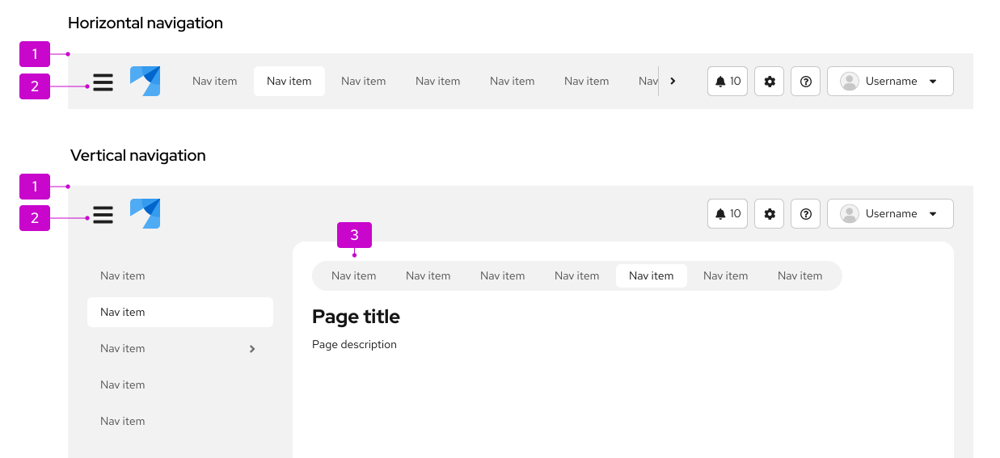

1. [**Masthead:**](/components/masthead) Contains and organizes global properties for easy and consistent access across all pages of an application.
1. **Hamburger menu icon button:** Provides a way for users to toggle vertical navigation
1. [**Secondary horizontal navigation:**](#secondary-horizontal-navigation) A method of nested navigation that provides flexibility and structure for more complex information architecture.

## Usage
Use navigation to organize a page's structure and content for user clarity and convenience. Use cases differ depending on component variation.

## Variations
There are 2 main navigation variations, each with sub-variations. 

1. [Vertical navigation](#vertical-navigation)
    * [Simple vertical navigation](#simple-vertical-navigation)
    * [Grouped navigation](#grouped-navigation)
    * [Expandable 2-level navigation](#expandable-2-level-navigation)
    * [Expandable 3-level navigation](#expandable-3-level-navigation)
    * [Flyout navigation](#flyout-navigation)
    * [Drilldown navigation](#drilldown-navigation)
1. [Horizontal navigation](#horizontal-navigation)
    * [Secondary horizontal navigation](#secondary-horizontal-navigation)

### Vertical navigation 

Vertical navigation is hierarchical global navigation that displays navigation options from top to bottom on the left side of a screen. PatternFly vertical navigation can be collapsed to provide additional screen real estate by using a hamburger menu icon button at the top left.

Use vertical navigation when:
* You have 5 or more primary navigation items
* You have secondary navigation items (even if you have fewer than 5 primary navigation items)
* You expect your application to be used on mobile devices

Vertical navigation can be customized with several variants, described in the following sections.

#### Simple vertical navigation

When you only have 1 level of navigation to display, use a simple, single-level vertical navigation.

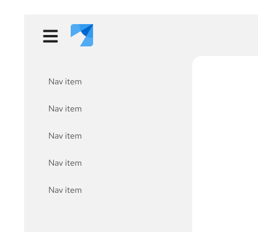

#### Grouped navigation

You can group related navigation items and display them persistently beneath a non-interactive group header, which describes the group of items.

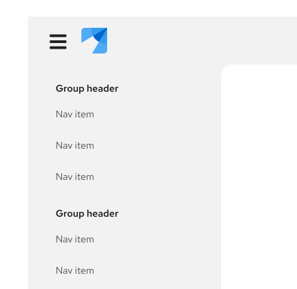

#### Expandable 2-level navigation

Instead of using grouped navigation when you have multiple related navigation items, you can use an expandable navigation that nests secondary items under a primary navigation item. Users can collapse and expand the nested items as needed.

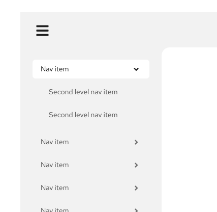

#### Expandable 3-level navigation

When you need 3 levels of nested navigation items, you can use a 3-level expandable navigation.

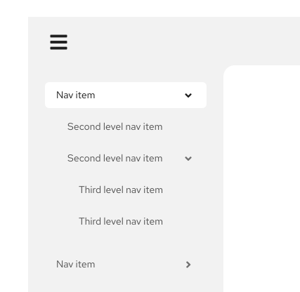

#### Flyout navigation

Flyout navigation exposes navigation items nested within a parent node in an overlay panel that appears to the right of the parent item on hover or click. Flyout menus can be used to expose secondary or tertiary levels of navigation. While flyout menus can be cascaded to display 2 or more levels of hierarchy below the parent page, this is not recommended as the mouse interaction required to navigate a multi-tiered flyout menu can be difficult for some users.

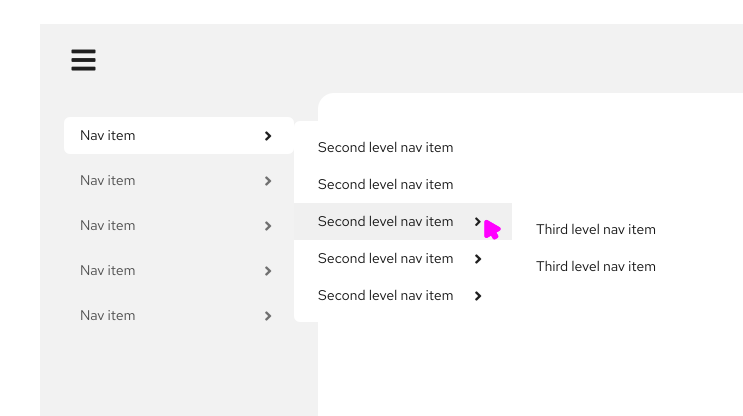

The advantage of flyout menus is that they allow a user to easily scan through secondary menu items. When using flyout menus, keep in mind that the page in view may not be exposed as a selected menu item at the top level. Therefore, when using flyouts, we strongly recommend use of [breadcrumbs](/components/breadcrumb) to help users understand where they are currently working within the site hierarchy.

Also, consider how likely it is that your application will be used on a mobile phone. Flyouts are not mobile friendly and may require substitution for a different menu pattern across platforms (mobile vs desktop).

#### Drilldown navigation

Drilldown menus replace the current navigation menu with the next set of child items in the page hierarchy when the user clicks on a parent item to drill down. A back link is provided at the top of the menu to return to the parent level.

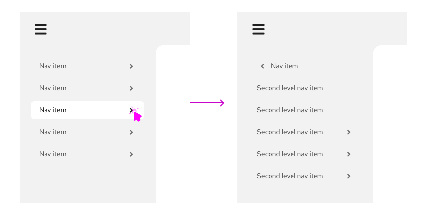

Using drilldown navigation, only the navigation items for the current page and its siblings will be visible at any given time. This pattern is very mobile-friendly as it minimizes the need for scrolling to see the entire menu. However, it should be avoided if you expect users to frequently move between levels.

### Combining vertical navigation patterns

PatternFly's vertical menus are designed to be composable. This means that you can combine different patterns within the same navigation system to address the needs of users working at different levels in the page hierarchy.

When combining different types of menus:

* Use a consistent approach to represent items at the same level in the page hierarchy. For example, if drilldown is used from level 1 to 2, all items with children at that level should display the same behavior. Don’t mix flyouts, drilldowns, and expansion at the same level.

* Consider how important or likely it is for users to move between levels and/or across to items at the same level but in different branches of the hierarchy. Drilldowns are most effective when users will spend most of their time moving between pages with the same parent node. Therefore, drilling into a lower level in the page hierarchy and then employing expansions or flyouts to navigate between pages at that level can be an effective approach.

Here are some examples of hybrid navigation patterns that you may find useful.

#### Flyouts with tertiary drilldown
By using flyouts to expose secondary navigation items and then drilling into third level items, you can keep the current page and its siblings visible as the user works. This is a good pattern to use when you expect users to spend most of their time working within the same section of the application.

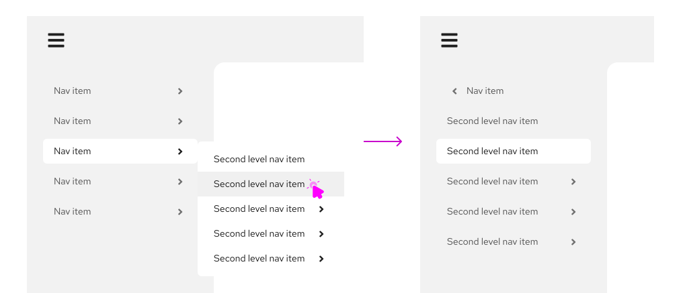

#### 2-level expansion with drilldowns
You can use expanded menus to expose the first 2 or 3 levels of page hierarchy and then drilldown to the lowest level. This pattern is preferred to using flyouts with a drilldown when there are fewer secondary level items and/or you require a mobile friendly solution.

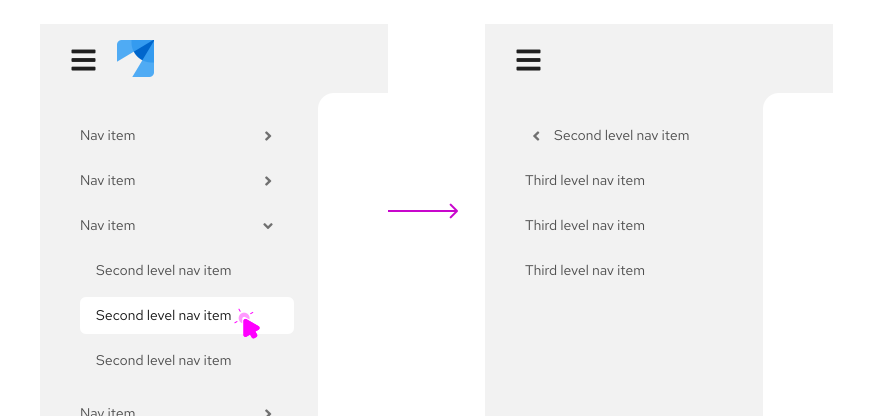

#### Drilldown with tertiary expansion

Consider using a drilldown menu at the primary level and expansion to expose levels 2 and 3 when you want to make it easy for users to move between items at levels 2 and 3 without the need to frequently move back to the primary level to explore other branches.

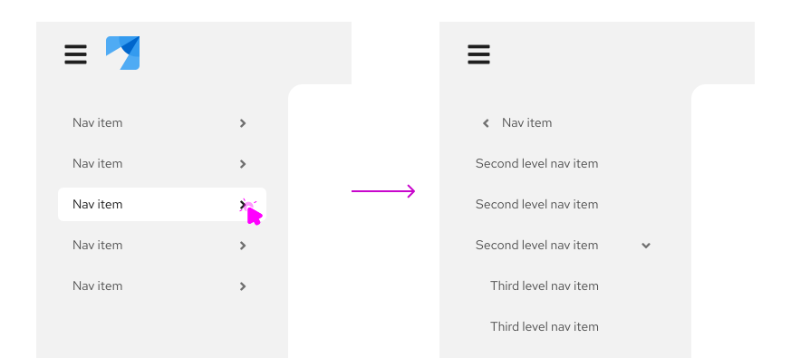

### Horizontal navigation 

Horizontal navigation is global navigation that displays navigation items from left to right in the application's masthead.

Use horizontal navigation when: 
* You have less than 5 primary navigation items
* You have only 1 level of navigation and no secondary navigation items

#### Secondary horizontal navigation

Use secondary horizontal navigation when you want to provide more granular navigation specific to a particular page or window in your application. When using secondary horizontal navigation, the page title should reflect the selected secondary navigation item.

This differs from [tabs](/components/tabs), since tabs would allow you to switch perspective on the same page, while each secondary horizontal navigation item would be sending you to a distinct URL. For example, a user might navigate to settings page using the primary navigation, and then access privacy and general user settings via the secondary navigation.

You can provide additional nested information by using tabs within the page content.

Secondary horizontal navigation follows a similar responsive design as our other horizontal navigation types. For smaller screens, overflow items can be navigated to by using horizontal scroll or the arrows.

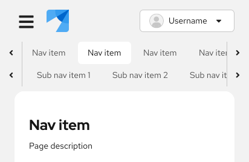

##### Vertical primary navigation

When used with vertical navigation, secondary navigation provides deeper nesting, which may help prevent the main navigation menu from becoming too long.

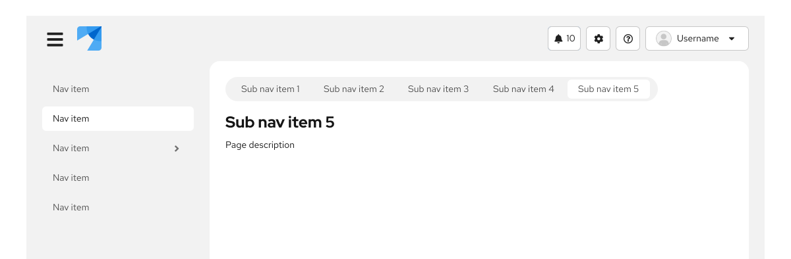

#### Horizontal primary navigation

Secondary horizontal navigation can also be used with primary horizontal navigation. 

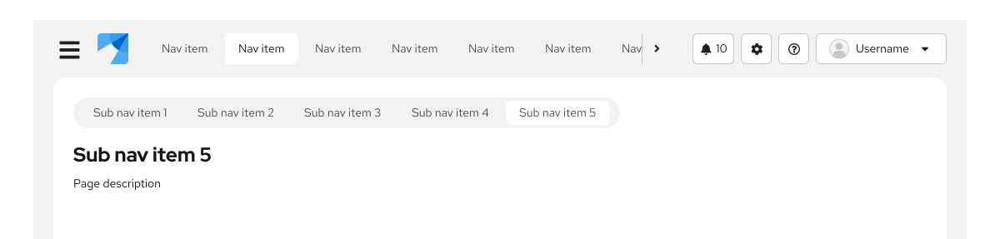

