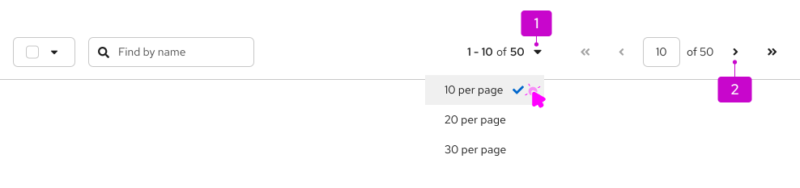
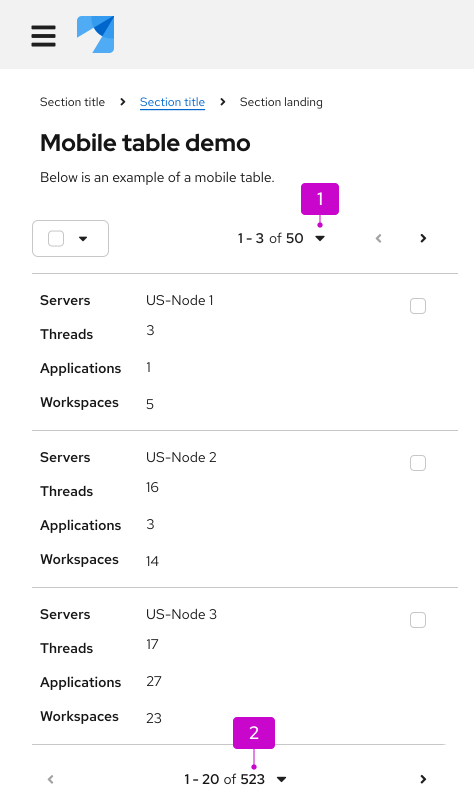

import '../components.css';

## Usage
Pagination allows users to conveniently navigate through content-dense components or page elements.

1. **Top pagination:** Placed above the component it controls and aligned to the right.

2. **Bottom pagination:** Placed directly after the component it controls. On desktop, bottom pagination is right-aligned by default. On mobile, bottom pagination is center-aligned and sticky by default. 

To make either top or bottom pagination sticky, so that it remains in view as users scroll through long content, refer to the [React sticky pagination](/components/pagination#sticky) or [HTML sticky pagination](/components/pagination/html#bottom-sticky) examples for implementation guidance.

## Variations 

There are 3 pagination variations you can choose from, depending on your use case:
- [Full pagination:](#full-pagination) The default component to use for most desktop views when space is not a major constraint. 
- [Compact pagination:](#compact-pagination) Used for narrow spaces or as the primary control for mobile views.
- [Indeterminate pagination:](#indeterminate-pagination) Used when the total number of items is unknown.

### Full pagination

1. **Per-page selector:** Used to choose the number of items displayed on a single page at once.
2. **First page/last page:** Used to jump to the first or last page of content.
3. **Previous page/next page:** Used to navigate back or forward one page of content at a time.
4. **Current page (interactive):** Displays the current location and the total number of pages of content. Users can also manually type in a page number to jump to a desired location.

Full pagination contains a variety of controls that can be used to navigate the linked component, like a table or card view. This is the default recommendation, unless you're restricted in space or for use on mobile devices, in which case you should use [compact pagination](#compact-pagination) instead.

### Compact pagination

1. **Per-page selector:** Used to choose the number of items displayed on a single page at once.
2. **Previous page/next page:** Used to navigate back or forward one page of content at a time.

Compact pagination reduces visual crowding and saves space for additional actions in limited spaces, like toolbars. 

### Indeterminate pagination

When it's difficult to calculate the total number of items or page count upfront, you can use an indeterminate pagination, which replaces the total page number in the per-page selector with a general label of “many”. Users can still choose the number of items shown at once, and the indeterminate label can be used within both full and compact pagination.

## Placement

### Desktop

For desktop views, place [full pagination](#full-pagination) above the content it controls ("top pagination"), typically within a toolbar. 

When used in a toolbar, pagination may leave limited room for other items like filters or bulk selectors. These additional items should automatically move into an [overflow menu](/components/toolbar/design-guidelines#overflow-menu) as needed.

Also place full pagination below the component it controls ("bottom pagination").

Bottom pagination lets users easily navigate lengthy datasets without scrolling back to the top, while ensuring that pagination adapts appropriately when switching from desktop to mobile.

### Mobile 

On mobile, pagination adapts in order to better conserve space. When switching from desktop to mobile, top pagination will collapse to a pagination summary with an item count and bottom pagination will adapt to a more compact design. [Learn how to customize overflow menu breakpoints in our toolbar design guidelines](/components/toolbar/design-guidelines).

1. **Pagination summary:** A non-interactive count of items currently displayed. 

2. **Bottom pagination:** When bottom pagination shrinks in size for mobile, it becomes more compact, with a previous page, next page, and a per-page selector that allows users to choose the number of items shown at once. There are no first-page and last-page controls for bottom pagination on mobile. 

When using pagination in mobile views, follow these best practices: 
- Use a top-pagination summary and bottom pagination. 
- Only use full pagination for top navigation on mobile when you can't use bottom pagination, or when you can only use the bottom-pagination summary (instead of a full bottom pagination).
- Never use full pagination for both the top and bottom pagination on mobile.