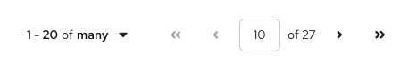

import '../components.css';

## Usage
Pagination allows users to conveniently navigate through content-dense components or page elements.

1. **Top pagination:** Placed above the component it controls and right-aligned.

2. **Bottom pagination:** Placed below the component it controls. Right-aligned for desktop views and center-aligned for mobile. If you want the bottom pagination to be sticky so it does not move out of view as users scroll through long content, place it directly after the component it controls and refer to the [React sticky pagination](/components/pagination#sticky) or [HTML bottom sticky pagination](/components/pagination/html#bottom-sticky) examples for further implementation guidance.

## Variations 

- [Full pagination](#full-pagination) 
- [Compact pagination](#compact-pagination)
- [Indeterminate pagination](#indeterminate-pagination)

### Full pagination

A default "full pagination" component contains multiple controls for navigating the related component. Use a full pagination unless you're restricted to a narrow workspace, in which can you should use a [compact pagination](#compact-pagination) instead. 

When using full pagination a toolbar, you'll have limited room for other items like bulk selectors, buttons, filters, or input fields. You can still incorporate these additional actions with an [overflow menu](/components/toolbar/design-guidelines#overflow-menu), which will automatically form when those additional items need to collapse at specific breaking points. On mobile, full pagination will also collapse to a pagination summary with an item count. Learn how to customize overflow menu breakpoints in our [toolbar design guidelines](/components/toolbar/design-guidelines).

#### Desktop full pagination in toolbar

1. **Displayed items selector:** Allows users to choose the number of items shown at once.

2. **Full pagination:** Supplies pagination controls, including page-back and page-forward, page-first and page-last, and a manual option to type in a desired page number.

#### Mobile full pagination in toolbar

1. **Pagination summary:** At this screen size, the top toolbar only shows the item count to summarize the number of items currently in view. It hides all other pagination controls.

2. **Full pagination:** Supplies pagination controls, including page-back, page-forward, and a displayed items selector, which allows users to choose the number of items shown at once.

The default recommendation for using pagination in mobile views is to place a pagination summary above the component it controls and a full pagination below the component, as shown in this example. If you can't use bottom pagination, or if you can't use the fall pager in the bottom toolbar for some reason, only then you can place the full pagination in the top toolbar. **Do not** use a full pagination in both the top and bottom toolbars.

### Compact pagination

Compact pagination saves space for additional actions in limited spaces, like toolbars, and can help reduce visual crowding. Like with full pagination, compact pagination condenses to a pagination summary for mobile views.

#### Desktop compact pagination in toolbar

1.  **Displayed items selector:** Allows users to choose the number of items shown at once.

2. **Compact pagination:** Supplies pagination controls, including page-back and page-next controls.

### Indeterminate pagination

Use indeterminate pagination if it’s difficult to calculate the total number of items or page count upfront. In these cases, you use “many” instead of a specific page count that would otherwise appear. Users can still select this control to choose the number of items shown at once.

