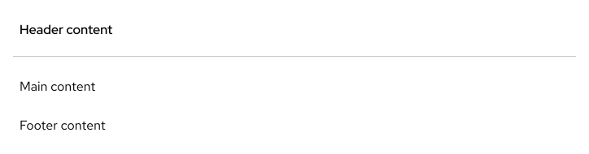
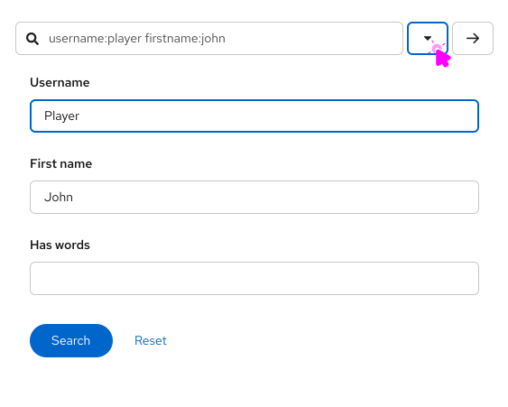

import '../components.css';

## Usage
Panels are commonly used:
- To provide more content structure through the UI.
- To group content and components on a blank canvas.

### Examples

The panel is used as a content block with a header, body, and footer. 

 

The panel is used as a dropdown menu for <a href="https://www.patternfly.org/components/search-input/react-demos#composable-advanced-search">advanced search input</a>. 

