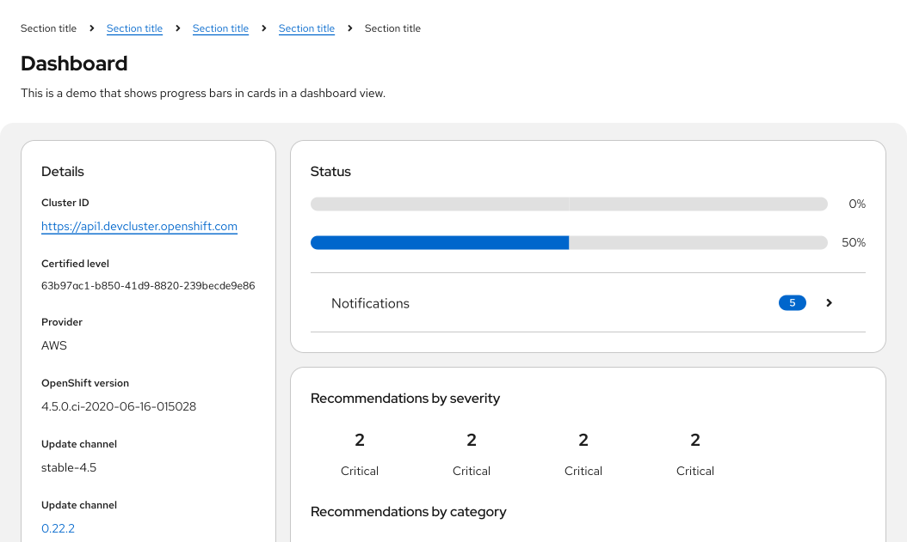

import '../components.css';

## Elements

1. **Title:** Describes the task or process underway.
2. **Track:** Illustrates the path from task start (empty) to task completion (full).
3. **Progress value:** Quantifies progress by sharing a completion percentage or time remaining. For long task sequences, progress value may be used to communicate where a user is in that sequence: “Step 1 of 6.”
4. **Indicator:** Animates the user’s progress toward completion.

## Usage
Use a progress bar to keep users informed about how much effort or time they can expect to allocate for long or ongoing processes like loading or updating an app, submitting a form, or completing a multi-step tutorial.

### When to use
* To show progress as a user completes a series of tasks.
* To indicate that the system is progressing through loading, saving, or downloading.
* To allow users to monitor a background process, especially if that process may take a long time.

### When to use progress bar vs. spinner
Depending on your use case, you might choose between 2 types of loading indicators: Progress bars and [spinners](/components/spinner). Never use a progress bar and spinner together. 

- Default to progress bars for processes that take longer than 4 seconds or require more specific information about process completion.
- If a process takes less than 4 seconds, use a [spinner](/components/spinner) instead. 

### When to use progress bar vs. progress stepper

Use a progress bar: 
- To indicate to a user that the system is progressing through a task.
- To let users monitor background tasks.

Use a [progress stepper](/components/progress-stepper):
- To indicate to a user where they are in a step-by-step linear process on a single page. 

## Variations

### Determinate progress bar

Whenever possible, use a determinate progress bar to communicate progress with measurable values like time or percentage. 

- **Percentage:** Use as a progress value if the process will take less than 1 minute to complete or a percentage will be more accurate than estimating a task’s duration.
- **Time interval:** Use as a progress value to communicate progress if the process takes more than one minute to complete. For example, “4 minutes remaining.”

### Indeterminate progress bar

Avoid using indeterminate progress bars to communicate progress that can’t be measured. To track progress that can’t be quantified with a percentage, time, or step, use a [spinner](/components/spinner) instead.

Follow these general style guidelines when designing your progress bars. For information about writing progress bar titles for each status type, see the [content considerations](#content-considerations).

### Progress bar sizes

There are 3 size options for progress bars depending on your use case: 
- **Small:** A thin progress bar to use in pages or elements without much space.
- **Default:** A basic progress bar to use in the majority of situations.
- **Large:** A thick progress bar to use when a progress value (like a percentage) is displayed within the bar or to use for prominent progress bars, like those [in a wizard](#in-a-wizard).

### In progress

A `--pf-t--global--color--brand--default` progress bar represents a process that is currently underway.

### Error state or failure

A `--pf-t--global--color--status--danger--default` progress bar represents a process that has failed. Accompany a failed progress bar with a [danger icon](/foundations-and-styles/icons/#all-icons) to demonstrate that an error occurred in the process.

### Complete or success

A `--pf-t--global--color--status--success--default` progress bar represents the successful completion of a process. Accompany a complete progress bar with a [check-circle icon](/foundations-and-styles/icons/#all-icons) to demonstrate that the process has finished with no errors.

### In a table

Use a progress bar in a table to communicate the status of processes or tasks within it.

Place a progress bar into a table just as you would other table content. If a progress bar records the progress of multiple line items, group these items in adjoining cells and keep the progress bar inline with the first item it pertains to. For multi-item progress bars that apply to non-consecutive items, consider adding a progress bar inline with each individual item.

If your table includes multiple progress bars, designate a “Status” or “Progress” column for each one.

### In a dashboard view

Use a progress bar in a dashboard view to track the progress trends within each card component on a page.

### During a file download

Use a [toast alert](/components/alert/design-guidelines) and a progress bar to demonstrate progress during a file download.

### In a wizard

**Never** use a progress bar in a wizard to indicate progress through wizard steps, since a wizard’s steps sidebar already communicates this information.

Only use a progress bar in a wizard if its final validation process will take more than a few seconds. As users wait for their changes to be processed, display a progress screen that includes a progress title, progress bar, and an optional 1-2 sentence description to provide more details about the validation step or give users a better idea of how long this process might take.

To learn more about using progress bars in wizard validation progress screens, see our [wizard guidelines](/components/wizard/design-guidelines).

## Spacing 

Right-align progress value text when it’s placed above the progress track, in line with the title. 

Left-align progress value text when it’s placed to the right of the track.

Always set an “outside fixed width measure” for determinate progress bars. This fixed spacing should solve alignment use cases in which stacked progress bar values vary in length. 

## Placement

Always place progress bars in alignment with their relevant context, such as the feature, function, or task they reflect. Keep progress bars within the user’s line of sight: Never isolate a progress bar at the top or bottom of a page, or outside of its relevant content view.

Use progress bars to communicate progress in a variety of contexts including:

* [In a table](#in-a-table)
* [In a dashboard view](#in-a-dashboard-view)
* [During a file download](#during-a-file-download)
* [In a wizard](#in-a-wizard)

## Content considerations

Progress bars should be self-explanatory and therefore include minimal written content: A title and an optional progress value. 

In some use cases, longer progress bars might feature multiple lines of copy that change as a process moves through several phases. Default to 1 title per progress bar, unless your progress bar measures a multi-step process or procedure that isn’t detailed elsewhere.

### Styling for statuses
Styling for progress bar statuses should follow accessibility guidelines by communicating each state through several messaging types: color, microcopy, and icons. 

### Titles

Keep progress bar titles short and specific, between 1-3 words. Use verbs that clearly communicate each process and avoid using generalizations like “This may take a few minutes.” 

Never punctuate progress bar titles, since they consist of fragments, not full sentences. Avoid using ellipses to communicate a loading state — progress bars indicate a process is “in progress” on their own.

| **Don't**                      | **Do**                  |
|:-------------------------------:|:--------------------------:|
| Your application is downloading... | Downloading [application name]  | 
| This may take a few minutes... | Creating cache | 
| We're validating your account credentials | Validating account credentials | 

 

In addition to status styling, use verb tense to communicate the state of a process: In progress, failed, or complete.

For **in progress** statuses, write your progress bar title with present participles (—ing) to share that a process is underway. Avoid passive voice by starting each title with the present participle ("-ing") form of your task’s verb.

| **Don't**                      | **Do**                  |
|:-------------------------------:|:--------------------------:|
| Cluster is installing | Installing cluster | 
| Cluster creation in progress | Creating cache | 

For **failed** statuses, write your progress bar title in past tense. Avoid telling users a process “failed” in favor of providing a more specific description.

| **Don't**                      | **Do**                  |
|:-------------------------------:|:--------------------------:|
| Cluster installation failed | Could not install cluster | 
| Account validation unsuccessful | Could not validate account credentials | 

For **complete** statuses, write your progress bar title in past tense. Use this brief line to confirm that a process or task succeeded. Avoid using adverbs like “successfully” by simply stating the action happened.

| **Don't**                      | **Do**                  |
|:-------------------------------:|:--------------------------:|
| Installation is complete | Cluster installed | 
| Successfully validated account credentials | Validated account credentials | 

Progress bars should only use content in their title and progress value. Never write additional content inside the progress track.