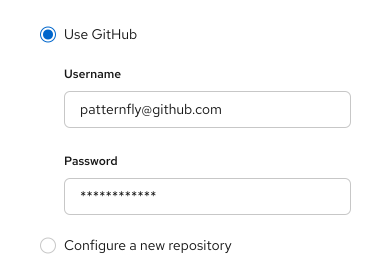

import '../components.css';

## Usage
Radio buttons allow users to select **1 item** from a list of options.

**General guidelines**

*  Use radio buttons when a user needs to make 1 mutually exclusive choice, and only one option can be selected at a time.
* A default option should always be selected for the user. If the user selects a different option, the default option should be automatically deselected.
* To enable the user to select a null option, provide a radio button with the label “None.”
* Use radio buttons if you’re presenting 5 or fewer options to the user. If you’re presenting more than 5 options, use a [single select list](/components/menus/select/design-guidelines#single-select). 
* If space is limited, you can also use progressive disclosure by nesting other controls underneath a radio button.

    

    
    

### Labeling and alignment

Radio button labels fall to the right of the radio button control. You can use headings to label a group of radio buttons. The placement of headings will depend on the layout of other content in the form or on the page you’re designing. For more information on how to arrange radio buttons, see the [forms design guidelines](/components/forms/form/design-guidelines#data-input-arrangement).
