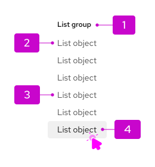

import '../components.css';

## Elements

1. **Section title (optional):** Section titles should be a few words. They are more commonly used in grouped lists. 
2. **Item:** Items are typically single words or short phrases.
3. **Default state:** The state of a simple list before any actions or selections are made by the user.
4. **Selected state:** A selected state communicates which list item the user has chosen.

## Usage

A simple list is used when the information presented does not follow a specific pattern, or does not require bullets to differentiate one list item from another. 
