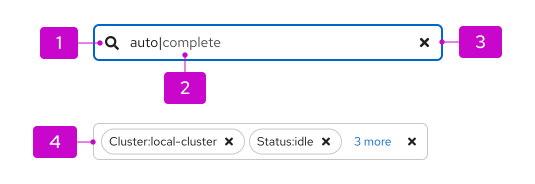
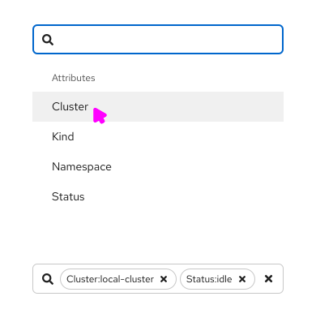
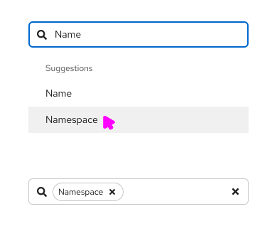

import '../components.css';

## Elements

1. **Icon (optional):** An icon can be used in front of the input field to identify the purpose of the text input.

2. **Input field:** The input field itself can be customized to use multiple text styles as shown here to provide hints for auto-completion or similar use cases. This styling is not possible using a standard text input.

3. **Clear button (optional):** A clear button can be added to clear the contents of the field.

4. **Label group (optional):** A label group can be nested inside of the text input as shown here.

## Usage

The text input group component is useful for building more complex custom inputs. Its usage includes, but is not limited to, the following use cases. Interactive examples of these are available as [React demos](/components/text-input-group/react-demos).

### Attribute value filtering

The text input group can be used to create an attribute-value filter as shown below where the user selects attributes (or keys), then values, and the results are displayed in labels as a key-value pair.

See the [attribute-value filtering demo](/components/text-input-group/react-demos#attribute-value-filtering) for an interactive demo of this.

### Auto-complete search

The text input group can also be used to create an auto-complete search component where suggestions are presented as a dropdown list as the user types. When only a single suggestion is available, the user can complete the entry without further typing by pressing the Tab key.

See the [auto-complete search with typeahead demo](/components/text-input-group/react-demos#auto-complete-search-with-typeahead) for an interactive demo of this.
