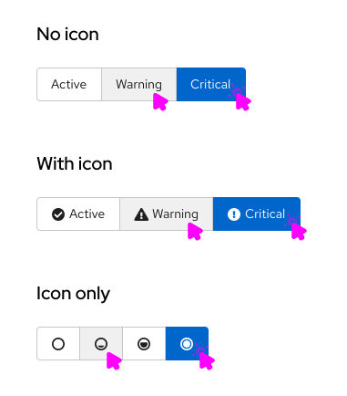
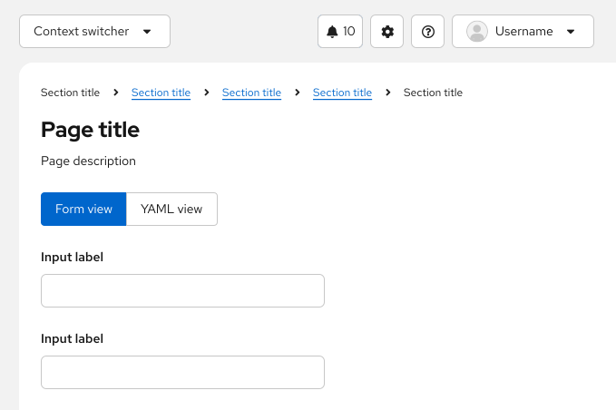
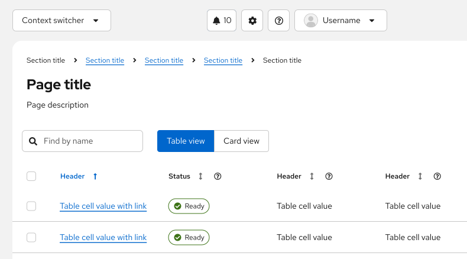
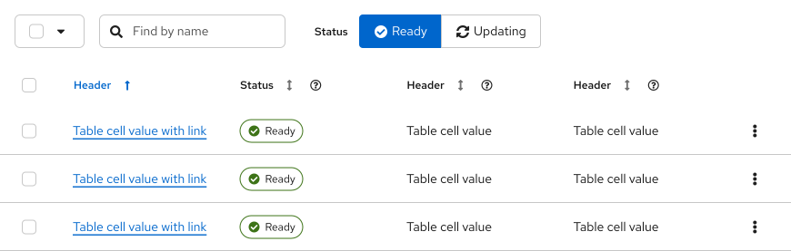
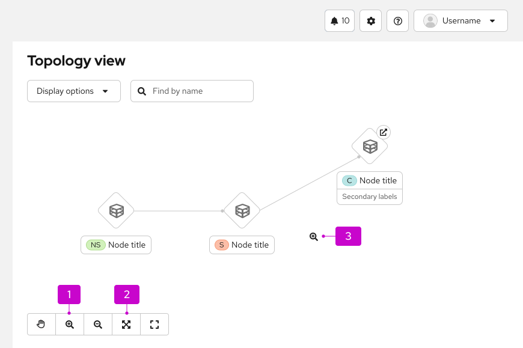

import '../components.css';

## Elements
Toggle items can consist of icons, text, or both. Styling of toggles is dependent on the background color. 

## Usage
Toggle groups can be used when the user must select a single choice from a mutually exclusive set of options and can be used with or without icons. 
Use cases also vary depending on variation. 

## Variations

1. [Single select toggle group](#single-select-toggle-group): Use to toggle between multiple items.
2. [Multi select toggle group](#multi-select-toggle-group): Use to select multiple attributes.
3. [Toggle items](#toggle-items): Use to select a single action.

### Single select toggle group
Use single select toggle groups when you want to toggle between multiple items. There are many use cases where this can apply, such as:
  - Selecting a single action within a group of actions (this can be useful for Topology or similar canvas views).
  - Toggling between multiple views.
  - Filtering by a specific value within a filter group.

#### Examples
Single select toggle groups are commonly used to switch between views including:
  - A form view and a YAML view.
  - A card view and a table view.

### Multi select toggle group
Use single multi select toggle groups when you want to select multiple attributes from a group. This is most commonly used for filtering a content view when there is a lot of space available.

#### Examples
Selecting an attribute will apply that filter to the table. In this case, only nodes that are “ready” are shown.

### Toggle items

Use toggle items when you want to select a single action from a group. We recommend using toggle items when you want to switch the user into a specific “mode”. They look and act similarly to [buttons](/components/button).

#### Examples
Toggle items are most commonly used in canvas views, such as Topology. Selecting a toggle item will switch the user into that “mode” or allow them to take that action.

1. **Zoom in**: This item changes the cursor into a zoom icon and allows the user to zoom, as long as that toggle is selected. 
2. **Fit to screen**: This action will fit the Topology view to screen. After selection, the item will return to its default state, with a white background.
3. **Zoom cursor**: The cursor changes into a zoom icon and the user may exit that mode by selecting the “move” hand toggle item.
