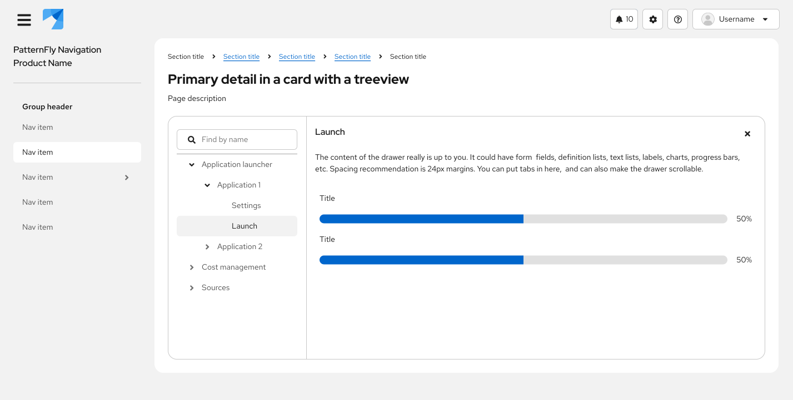
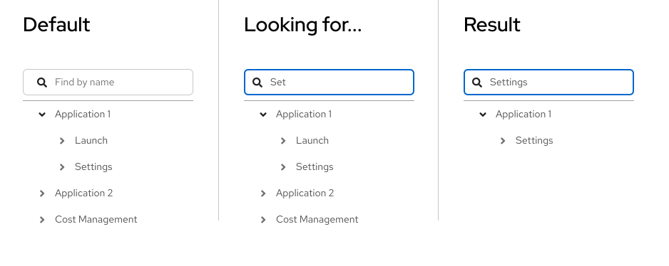
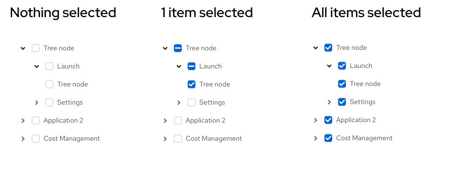
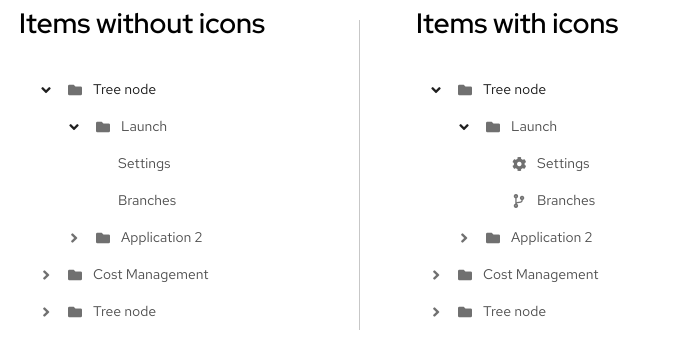
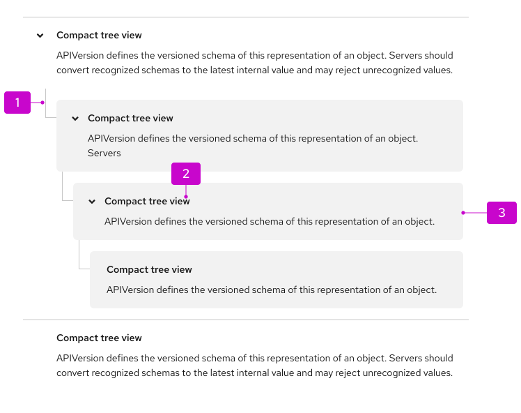

import '../components.css';

A default tree view provides a tree structure with items and arrows to expand or collapse child items. Every tree view can be extended with these [optional variations](#variations).

## Elements

A default tree view consists of 5 elements:

1. **Expand/collapse:** An option to expand or collapse parent nodes to reveal child nodes. 
2. **Parent node:** A node that contains other items (for example, a folder that contains multiple documents).
3. **Child node:** A node within the parent node (for example, a document within a folder).
4. **Leaf node:** A node without children.
5. **Truncation indicator:** Ellipses indicating truncated text for longer names that don't fit in the node width.  

## Usage

A tree view can be used for: 
1. Changing the content on a page based on the selected item. 
2. Selecting items or applying filters. 

### When to use
* Selecting is the main use case. 
* You apply filters that need to be structured in a clear hierarchy. 
* The data is structured into levels.
* You need to display hierarchies that have more than 2 levels.

### When not to use
* You select 1 item from a small set. Instead, use [simple list](/components/simple-list), [select lists](/components/menus/select), [radio buttons](/components/forms/radio), [checkboxes](/components/forms/checkbox), or a [dropdown](/components/menus/dropdown).
* You need to see an overview of a large amount of data.
* You need to compare 2 large sets of data. Use [charts](/components/charts/about-charts) for a better view. 
* The hierarchy is too deep and includes hundreds of items. Instead, use a [drill-down menu](/components/menus/menu#with-drilldown).

### When to use accordions vs. tree tables vs. tree views

**Use [accordions:](/components/accordion)**
- When you have content that users should be able to hide and display as needed.
- When you need to make long content sections easier to navigate and parse through. 
- When your content only includes simple blocks of text or lists&mdash;not complex information, like tables. 

**Use [tree tables](/components/table#tree-table):** 
- When you need to nest related information within a table.

**Use tree views:** 
- When you need to communicate a hierarchical structure.
- When you need to change content on a page, based on selection in a tree view.

### Tree view in a page

Tree views can be included in pages within these components: [dropdown](/components/menus/dropdown), [drawer](/components/drawer), [primary-detail](/patterns/primary-detail), [modal](/components/modal), or [wizard](/components/wizard). 

### Tree view in a wizard
A tree view in a wizard allows users to apply multiple filters or select multiple items that are specific to their current step.

### Tree view in a primary-detail or drawer 
A tree view in a [primary-detail](/patterns/primary-detail) or [drawer](/components/drawer) allows users to switch content based on their selection from a tree. 

## Variations

You can add these variations to a tree view:
* **[Search bar](#adding-a-search-bar-to-a-tree-view)** for searching items in the tree view.
* **[Checkboxes](#adding-checkboxes-to-a-tree-view)** for selecting items in the tree view.
* **[Badges](#adding-badges-to-a-tree-view)** for showing the number of child nodes in the tree view.
* **[Icons](#adding-icons-to-a-tree-view)** for visually representing the node types in the tree view.
* **[Action items](#adding-action-items-to-a-tree-view)** for adding an action to each item in the tree view.

### Adding a search bar to a tree view

Add a search bar to a tree view if you're including a large amount of data and need to provide users with a quick way to find a single item. If your dataset is small and easy to navigate, then you don't need to add a search bar.

### Adding checkboxes to a tree view

Add checkboxes to a tree view if you’re selecting multiple items or applying multiple filters. Selecting should be a primary function of your use-case. If your dataset is small and you select just 1 item, use [select lists](/components/menus/select), [radio buttons](/components/forms/radio), [checkboxes](/components/forms/checkbox), or a [dropdown](/components/menus/dropdown) instead. 

### Adding badges to a tree view

Add badges to a tree view if you want to show the number of items inside. Don’t use it for displaying different information. Items without children can't have badges, as they don't contain anything.

### Adding icons to a tree view

Add icons to a tree view if you want to visually represent the type of items in a tree. For example, a folder system. To maintain consistency, if you choose to add icons to a tree view, apply the icons on all items in a tree or leave the items without children iconless. We don’t recommend using icons and checkboxes at the same time due to the large indentation and loss of space it would result in. 

### Adding action items to a tree view

Add action items to a tree view if you’re triggering some type of action above the items. These actions appear on hover to avoid overcrowding the tree view. We recommend using 1 type of action across the whole tree and to limit the maximum of actions for 1 item to 1.

## Spacing
### Compact tree view
Compact tree view is useful when the nodes of a tree view contain more than one paragraph of text, or the content needs to be formatted. Compact tree views include guides that enhance the ability to more easily navigate between individual rows of data in the tree. You can use a compact tree view [with a background](/components/tree-view#compact) or [without background](/components/tree-view#compact-no-background), depending on your use case. 

1. **Guide:** Connected lines between nodes in a tree view. 
2. **Row:** Content with one or multiple lines that can be formatted.
3. **Container:** Area that holds the content and visually distinguishes individual rows with a filled or transparent background.