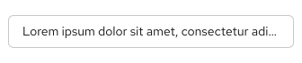
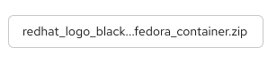

import '../components.css';

## Elements

1. **Content:** A long text string that requires truncation.
2. **Ellipsis:** The truncation indicator (...) placed at the start, middle, or end of a string, depending on the [variation](#variations).
3. **Tooltip:** The message shown on hover to display the full text string.  

## Usage
Truncated items are indicated by an ellipsis (...) and are used to reduce multiple lines of text or when a container is being overflowed by content. Truncation should only be used when 3 or more characters are being represented and there are still at least 4 non-truncated characters displayed. 

Truncated items should always include a tooltip on hover, showcasing the full string sequence. 

### Breadcrumbs
Use a breadcrumbs truncate when there isn’t enough room to display the entire breadcrumbs list, or to manage relevance.

### Long URLs
Use a URL truncate when the URL overflows its container.

### Description text/alerts
Use a truncate for description text to create more room on the page.

### Table inputs
Use truncation when the data within a table overflows its container. If a table column is resizable, the truncated text should adjust accordingly. 

## Behavior
A truncate component indicates that a text string has been shortened. When a user hovers over truncated text, the full text will be displayed as a tooltip.

## Variations

### Default (end)
The default truncate is used at the end of a text string to shorten the sequence and indicate that there is more content located elsewhere. 

### Start
A start truncate is used at the beginning of a text string to indicate the text is being continued from a previous location. 

### Middle
A middle truncate is used to shorten a text string when the end of it can’t be truncated by an ellipsis. Also used when several text strings have the exact same middle characters, but the beginning and endings vary. 

## Content considerations
- Include the ellipsis as part of a link when the truncated text is a link.
- Always provide a tooltip to display the entire string to the user upon hover.
- Avoid truncating navigation items.
- Truncate text within tables when it overflows the cell, but avoid truncating table headings.
- Maintain at least 4 visible characters so users can better understand content (for example, don’t truncate “demo1.internal-el6satellite” to “de…”).
- Avoid placing truncation directly before or after punctuation.