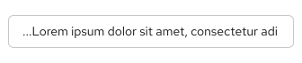

import '../components.css';

## Elements
* **Content**: text string to truncate
* **Position**: where the text will be truncated from, ie. front, middle, or end
* **Tooltip hover**: displayes full-text string 
* **Ellipsis**: indicates a truncate is used

## Usage
Truncated items are indicated by an ellipsis (...) and are used when trying to avoid multiple lines of text or when a container is being overflowed by content. Truncation should only be used when 3 or more characters are being represented and there are still at least 4 non-truncated characters displayed. Truncated items should always include a tooltip on hover, showcasing the full string sequence. 
* **Breadcrumbs**: Use a breadcrumbs truncate when there isn’t enough room to display the entire breadcrumbs list, or as a way of managing relevance.

* **Long URL's**:  Use a URL truncate when the url overflows its container.

* **Description text/alerts**: Use a truncate for description text to create more room on the page.

* **Table inputs**: Use truncation when the data within a table overflows its container.

## Behavior
 A truncate indicates that the text string has been shortened, when the user hovers a mouse over the ellipsis, the full text will be displayed as a tooltip.

## Variations

### Front-line 
A front-line truncate is used at the beginning of a text string to indicate the text is being continued from a previous location. 

### Mid-line
A mid-line truncate is used to shorten a text string when the end of it can’t be truncated by an ellipsis. Also used when several text strings have the exact same middle characters, but the beginning and endings vary. 

### End-line
An end-line truncate is used at the end of a text string to shorten the sequence and indicate that there is more content located elsewhere. 

## Content considerations
* If the text string is part of a link, the ellipsis should also be a part of the link.
* Always include hover tooltip to display the entire string to the user.
* Avoid abbreviations or truncated text in navigation items.
* Truncate text within tables where the content overflows the container. Avoid  truncating table headings.
* When truncating text, aim to leave at least four characters un-truncated so the user understands what it is (for example, don’t truncate “demo1.internal-el6satelite” to “de…”).
* Truncate long item names if necessary.
* Avoid truncation directly before or after punctuation.
* If a table column is resizable, the truncated text should adjust accordingly. 