import '../components.css';

A **wizard** breaks a long or complex task into a sequence of steps.

## Elements
Except where noted, modal and in-page wizards share the same elements and behaviors. For simplicity, the screens here show the modal wizard.

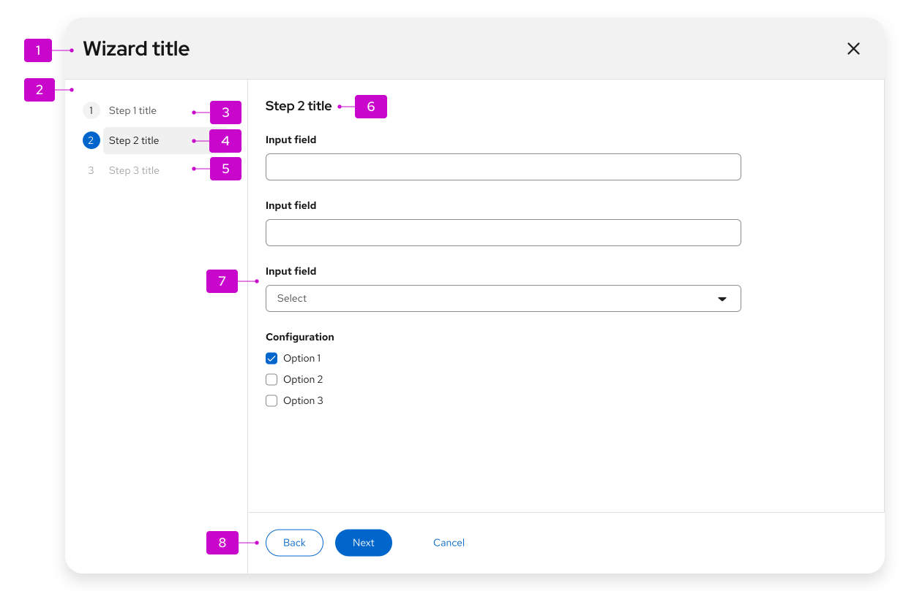

1. **Header (modal wizard only):** Modal wizards always have a header that includes at least the wizard title and a close button. Write an action-oriented title that reflects the outcome of the wizard, for example "Create resource." You can also add a description below the title.
2. **Steps sidebar:** Show numbered steps in the sidebar. Steps can stay fixed, or they can update as someone moves through the process (see [progressive wizard](#progressive-wizard)).
3. **Visited step:** A step that has already been visited. In most cases, people can select this step to return to an earlier point in the flow.
4. **Current step:** The current step is always highlighted.
5. **Disabled step:** Later steps are usually disabled so the flow stays sequential.
6. **Step title:** Give each step a unique title that reinforces that step's outcome. It can match the sidebar label, or it can be more verbose.
7. **Body:** The contents of the current step. You can use any valid form elements in the body. Adjust the modal size to fit the body content. If the body is taller than the viewport, a vertical scrollbar appears. Break the workflow into small enough steps that scrolling isn't needed on typical monitor sizes.
8. **Button footer:** Buttons control the wizard flow. Default buttons are **Back**, **Next**, and **Cancel**. You can add other actions, such as **Skip to finish** or **Start over**. Use only 1 primary action in the footer, typically **Next**.

## Usage
### When to use
- Break a long or complex task into smaller steps so people can focus on one part at a time.
- Follow a known, step-by-step order of tasks that you can group into labeled categories.
- Guide a prescriptive process, where choices in one step affect later steps.
- Support a task that a basic form can't handle on its own.

### When not to use
- Don't use a wizard for simple data entry that a basic form can handle.

## Behavior
In a standard wizard, people move through steps one at a time. Use **Next** to move forward.

- **Back** is disabled on the first step.
- To leave the wizard, select **Cancel** in the footer or **Close** in the header. Closing discards unsaved edits, so show a confirmation before you close.
- You can make steps skippable.
- People can jump to an enabled step by selecting it in the sidebar.

### Mobile considerations
On mobile, the steps sidebar is hidden and collapses into a dropdown menu.

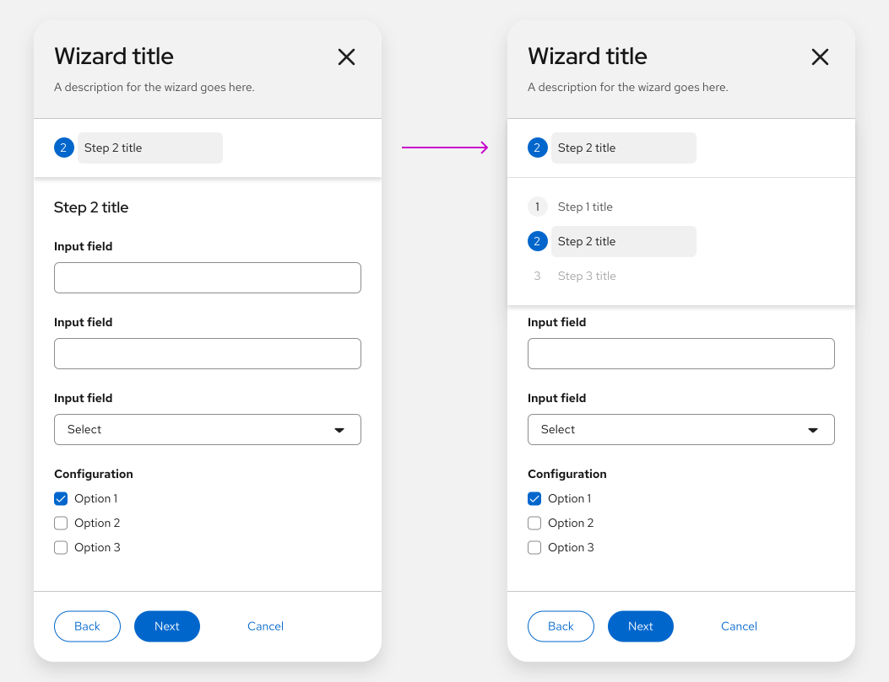

## Variations
You can place a wizard in a modal or in the content area of a page. Behavior can differ by variation.

- [Modal wizard](#modal-wizard)
- [In-page wizard](#in-page-wizard)
- [Progressive wizard](#progressive-wizard)
- [With sub-steps](#wizard-with-sub-steps)
- [With optional steps](#wizard-with-optional-steps)
- [With a drawer](#wizard-with-a-drawer)

### Modal wizard

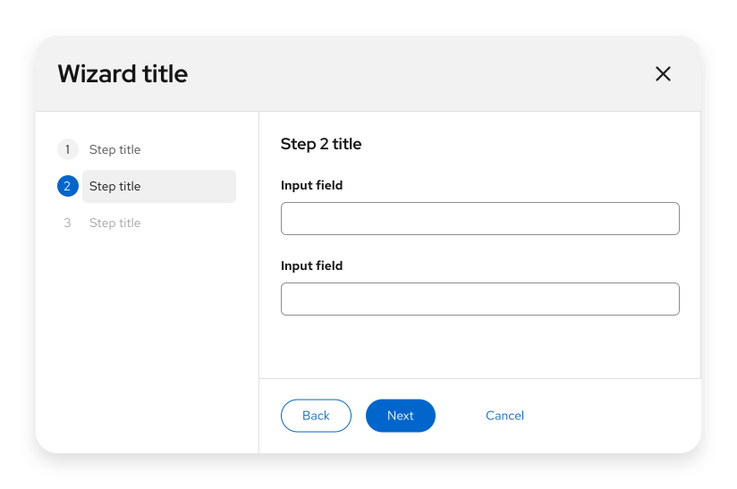

A modal wizard opens in a dialog. Override the default width and height if you need more space for content. Prefer a modal wizard when you want to keep people focused on the task. They must finish all steps or cancel before they can go elsewhere in the application.

### In-page wizard
You can embed a wizard in the content area of a page.

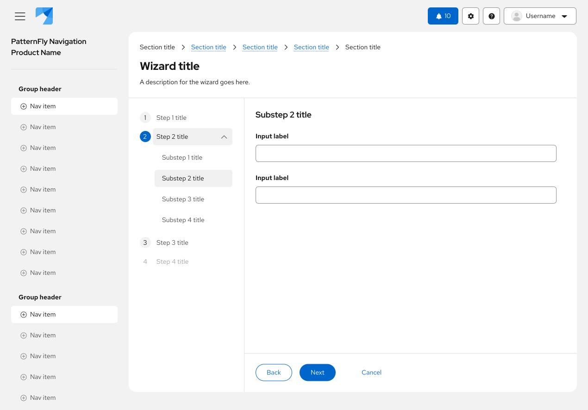

An in-page wizard makes it easier to navigate elsewhere in the application during the flow, but your application must manage state.

When you embed a wizard in a page, place the title and description in the page header. Use the same title and description guidance as the modal wizard.

An in-page wizard also allows interactions that a modal wizard doesn't:

- Open a modal from the wizard to view required information or complete a related subtask that isn't part of the wizard flow.
- Navigate away to look up information or complete a prerequisite task.

If someone leaves the wizard, they might lose what they entered. At a minimum, show a modal alert that warns about data loss and confirms that they want to leave. You can also include **Save as draft** so work in progress can be restored later.

### Progressive wizard
Use a progressive wizard when you don't know the exact number of steps at the start. It uses the same layout as a standard wizard or a wizard with sub-steps. Add or update steps in the sidebar as someone moves through the flow.

For example:

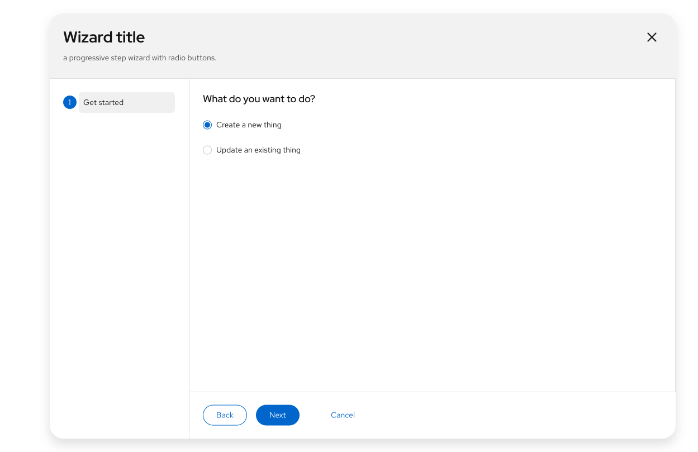

**Step 1:** Present a **Get started** screen so people can choose what they want to do.

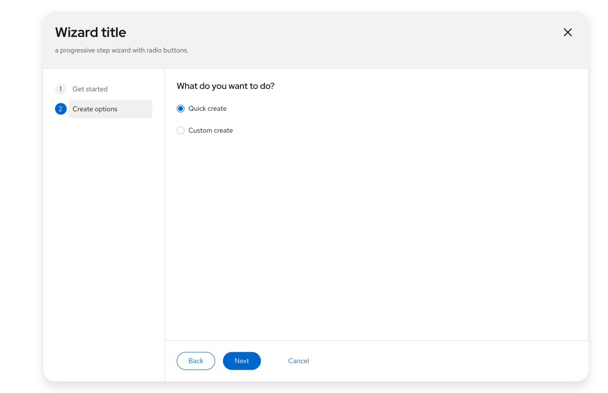

**Step 2:** After they choose to create a new object, present a second set of options. The remaining steps are still unknown.

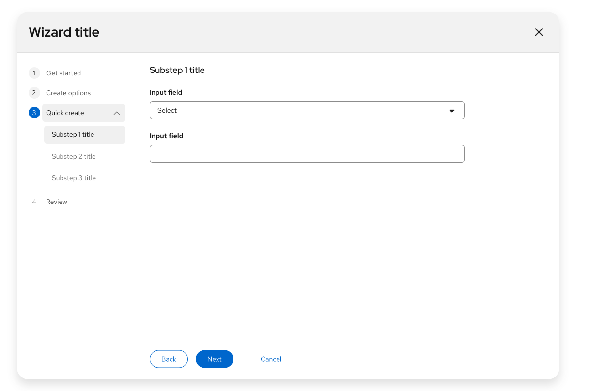

**Step 3:** After they choose **Quick create** and select **Next**, present the full set of steps. People should be able to go back to either of the first 2 steps, make a different choice, and see the later steps update.

### Wizard with sub-steps
Add sub-steps to the sidebar when parent steps have a hierarchy, when a parent step has too much content for 1 page, or when you want to group optional settings that people don't have to visit on every page.

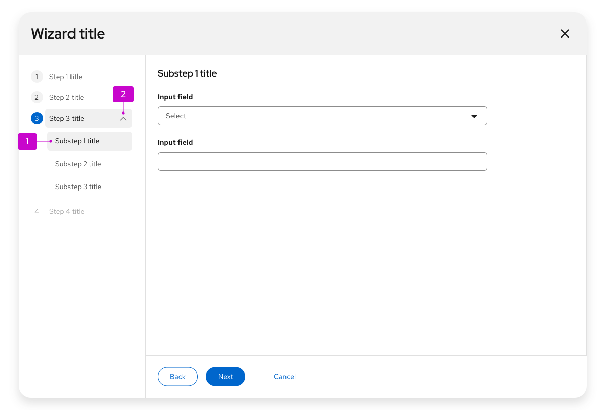

1. **Sub-steps:** Always nest sub-steps inside a parent step.
2. **Expansion (optional):** Use the caret next to the parent step to show or hide sub-steps.

#### Behavior

- To keep a sequential flow, disable later sub-steps. Or enable all sub-steps so people can move between them freely.
- **Next** and **Back** move through sub-steps the same way they move through parent steps.
- If you use an expansion, hide sub-steps until someone expands the parent step or arrives at the first sub-step.
- Collapse a parent step automatically when it's complete. People can expand it again at any time to see the sub-steps, without leaving their current step.

### Wizard with optional steps
Make a step optional when it isn't required to finish the wizard.

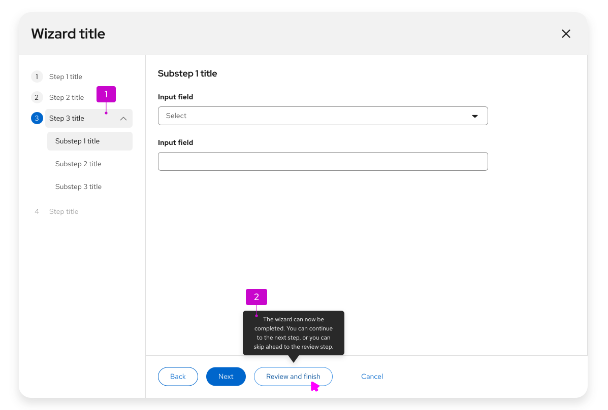

1. **Optional steps:** Group optional steps under a single parent step.
2. **Tooltip (optional):** A tooltip is optional, but recommended. Use it to explain that later steps aren't required and to give context for the **Review and finish** button.

#### Behavior

- Enable the review step once all required steps are complete.
- After required steps are complete, show a tertiary button beside **Back** and **Next**. Selecting it jumps to the review step.

### Wizard with a drawer

Use a [drawer](/components/drawer/design-guidelines) in a wizard when you need to show more information without taking people out of the flow. When opened, the drawer overlays the content instead of pushing it aside. There are 2 types of drawers: dismissible and non-dismissible. To open and close a drawer, use a link button or a link button with an icon.

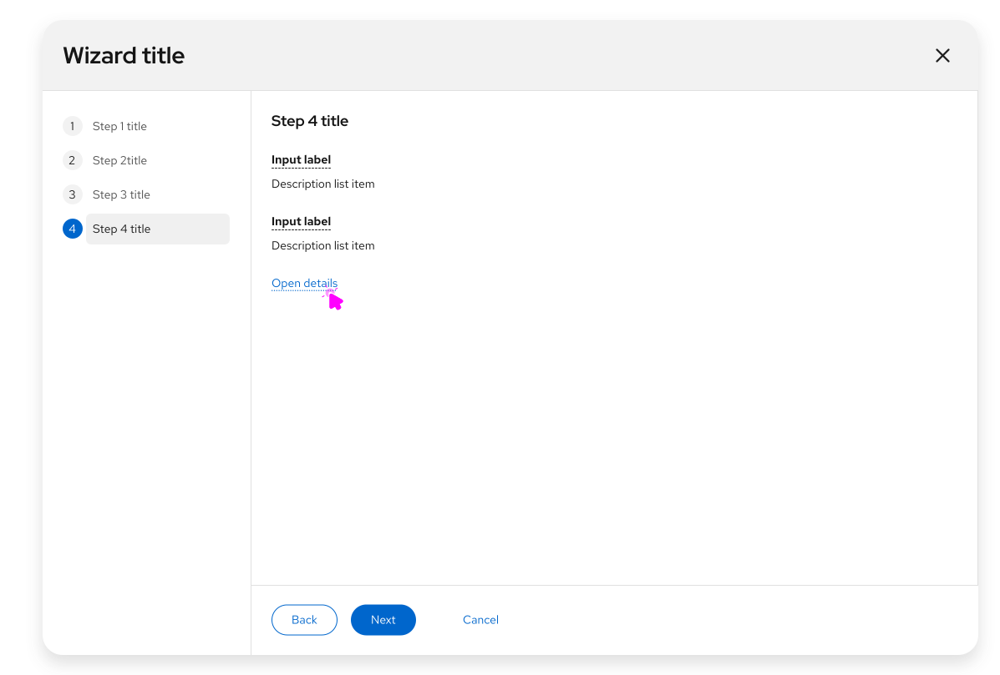

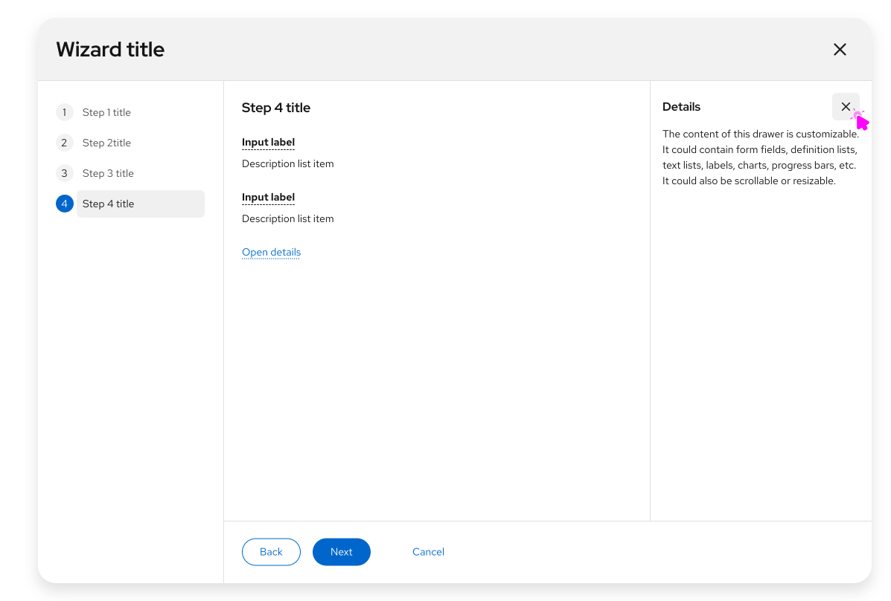

#### When to use a drawer

- Let people review more information without switching context.
- Add context or description around the information you're showing.
- Display additional learning resources.

## Review and completion
Always end with a review step. Summarize what was entered so it can be confirmed before submit.

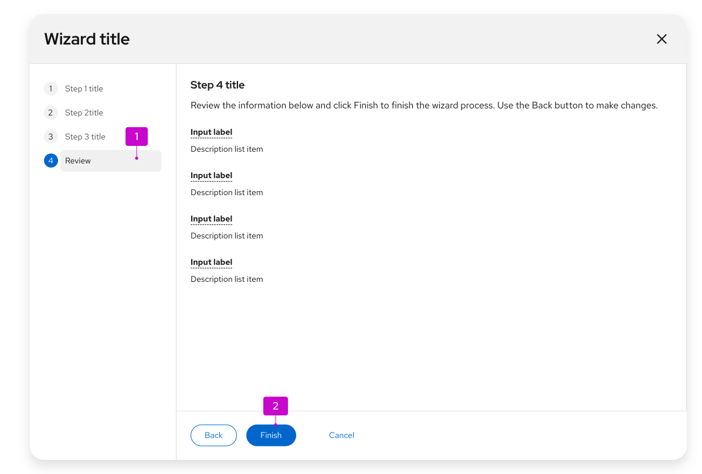

1. **Review step:** The last step in the sidebar. Use it to confirm the information entered in earlier steps.
2. **Finish button:** On the last step, **Next** is labeled **Finish** by default. Replace it with a more specific verb or verb-object pair when you can, such as **Create** or **Configure networks**.

If applying the result takes more than a few seconds, show a progress screen. Build it from the [empty state](/components/empty-state/design-guidelines) pattern: place a progress bar and a short message in the wizard body.

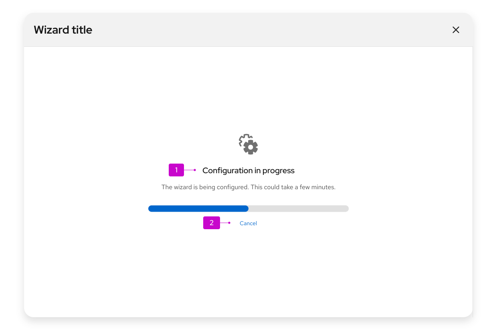

1. **Progress message:** Include a progress bar and a short message, using an empty state pattern.
2. **Cancel button (optional):** Include **Cancel** only if the operation can be stopped after it starts. Cancel should undo the work and return the system to the state it was in before the wizard opened.

After submit, hide the steps sidebar. People can no longer edit earlier steps.

When the work is done, show a confirmation screen. Use an empty state to present a success or failure message.

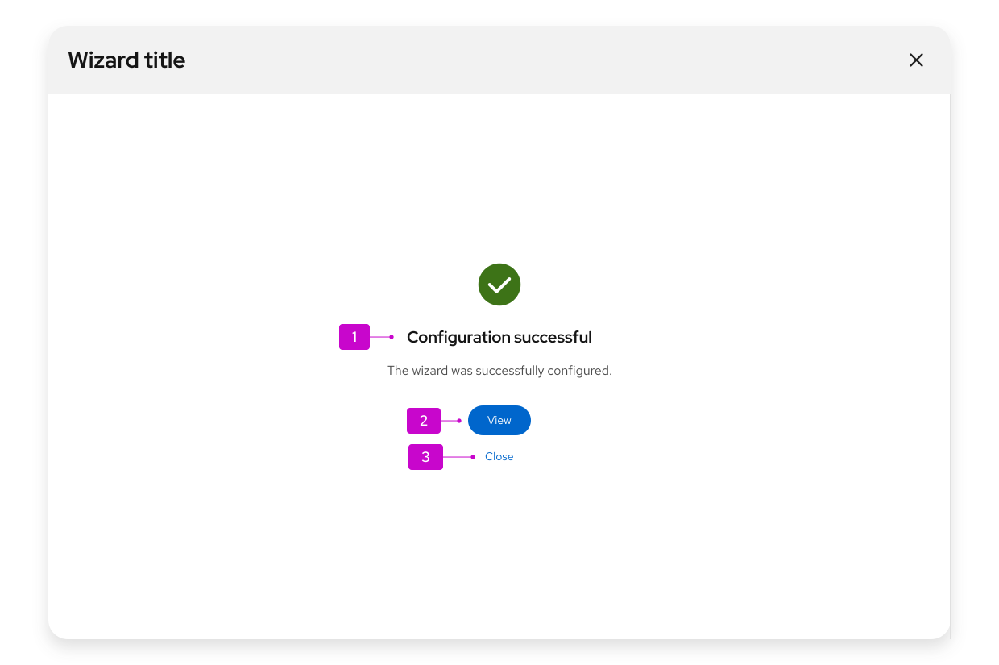

1. **Completion message:** Tell people what happened as a result of the wizard.

2. **Primary action:** In most cases, this is a button that closes the wizard and takes people to where they can see the result, such as a new project. If there's no destination, or the result is already on the current page, make the primary action **Close**.

3. **Secondary action (optional):** If the primary action does something other than close the wizard, add a **Close** button so people can exit and return to the previous page. You can include other secondary actions. See [empty state](/components/empty-state/design-guidelines) for button placement.

Sometimes a wizard starts a background task. Provide a link to monitor progress, a **Close** button, or both.

## Content considerations
When you write wizard content:

- Keep step labels short. The title at the top of each screen can expand on the label, but the label and title should stay clearly related.
- Always label the final submit step **Review**.
- Default navigation buttons are **Back**, **Next**, and **Cancel**. If you replace the defaults, keep labels short and action-oriented, such as **Create network**.

## Accessibility
For information regarding accessibility, visit the [wizard accessibility](/components/wizard/accessibility) tab.
