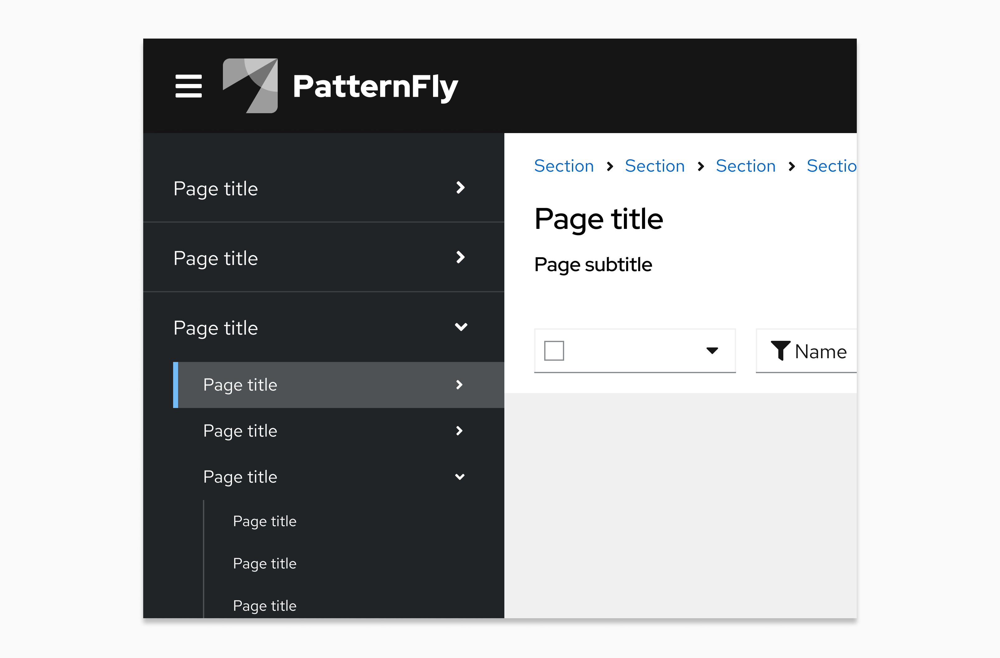
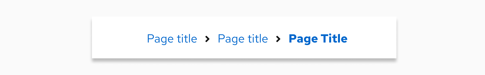
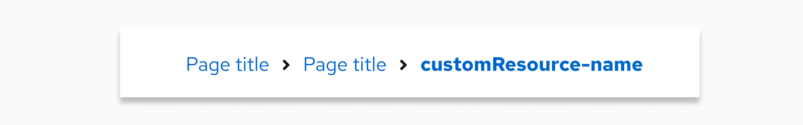
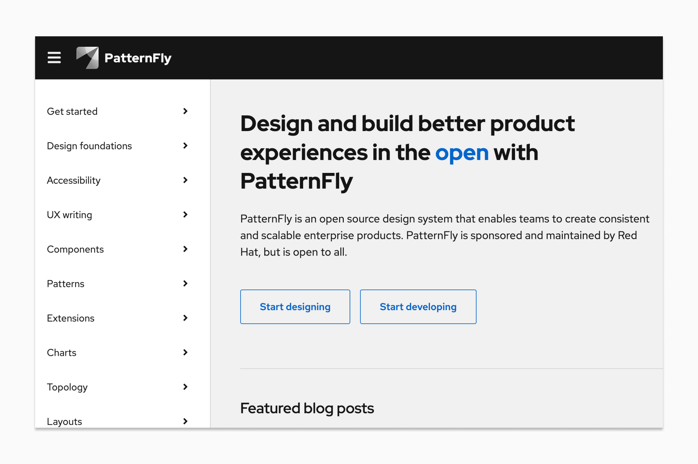
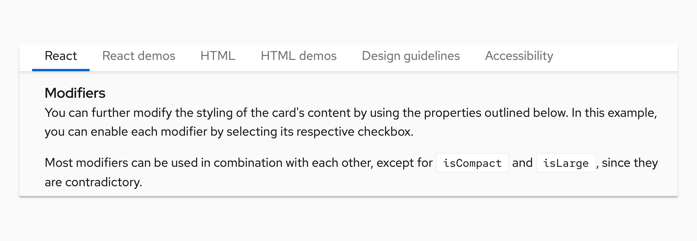

# Capitalization guidelines

Consistent capitalization adds clarity and creates unity across product UIs. PatternFly recommends writing in sentence case for all titles, headings, subtitles, or subheadings. **Sentence case** capitalizes only the first letter of the first word. The only exceptions to this are proper nouns, product names, acronyms, and initialisms, all of which should be capitalized.

For example: “When you use PatternFly’s design resources, you get helpful tips and best practices.”

**Above all else, your main goal should be consistency.** You may need to use different capitalization standards depending on what you're designing, but be sure to keep the capitalization within your product area consistent.

## Red Hat product UIs

When you write for a product, make sure you adhere to the following capitalization patterns.

- Default to sentence case across all UI elements, including navigation items, page titles, buttons, and so on.

 

- Keep capitalization for custom resources the same as the capitalization style used during creation. 
    - For example, if a custom resource name was created with all lowercase letters, don't change any of the letters to uppercase when referencing this resource. 
- Capitalize product feature names when they’re used as proper nouns or when they refer to a capitalized UI term (like a navigation item). Write them in lowercase when they’re used to describe generic concepts. For example:

    

    | **Feature name** | **UI text**  | **Reasoning**    |
    |------------------|--------------|------------------|
    | Compliance   | “Check your system **compliance** using Red Hat Insights **Compliance**.”                                                  | The first “compliance” is lowercase since it refers to a concept. The second “compliance” refers to a specific feature offered on cloud.redhat.com, so it is capitalized.                                     |
    | Sources      | “Add a *source* by going to **Settings > *Sources*.**” "Check the *Sources* table for status."  Button text: "Add *source*" | “Sources” is only capitalized when it directly refers to a subsection, feature, or location in the UI. "Source" is lowercase in the button text because button labels should always be in sentence case. |
    

- Match the capitalization of API resources, as outlined in ["Technical API references"](#technical-api-references-exact-case).

### Capitalization in breadcrumb trails

It is common for page titles to appear as an item in a breadcrumb trail. Match the capitalization of the original page title in the corresponding breadcrumb item even when the item does not use sentence case, or when a breadcrumb trail contains mixed capitalization standards.

  

Sometimes, user-named items will appear in a breadcrumb trail. If a custom resource name (for example, "customResource-name") is included in the breadcrumb trail, you should match the capitalization of the users' original entry. 

 

### API and code reference capitalization

When writing about technical resources and API objects, the appropriate capitalization and formatting depends on whether you are speaking generally about a concept or referencing a specific API resource.

#### General references (sentence case)

When speaking conceptually or generally about features, objects, or workflows in a UI, use sentence case. Do not use special formatting like backticks. This improves readability and treats the object as a common noun.

**When to use:** Descriptive text, help text, or when explaining a workflow.

**Examples:**
- "You can attach a persistent volume to your pod to ensure data is saved."
- "After you create your storage class, it can be used by any developer in the namespace."
- "View resource usage."
- "Ensure all storage class names are defined in the manifest."

#### Technical API references (exact case)

When referring specifically to an actual API object or underlying resource type (like a custom resource definition), use the exact casing defined in the API specification. How you format this reference depends on where it appears in the UI.

**In body text:** Use backticks, brackets, or other code formatting to visually distinguish the API reference from prose.

- PascalCase example: "The `PersistentVolume` must be in a Bound state."
- camelCase example: "Ensure the `storageClassName` is defined in the manifest."
- snake_case example: "The system checks the `volume_id` before mounting."

**In navigation items and page titles:** Match the API casing exactly. Do not use backticks or code formatting in these areas to keep the interface clean. These pages are views of specific data objects, not generic concepts.

- Navigation item example: StorageMap
- Page title example: StorageMap details

**In action buttons:** If the action creates an object defined by the API, the button label must use the exact casing of that API resource. Use the singular form of the resource name. Do not use backticks or code formatting.

- Example: Create UserDefinedNetwork

**Examples**

| **API resource** | **Sentence case (general)** | **Exact API casing (technical)** |
|------------------|-----------------------------|----------------------------------|
| VirtualMachine | "You can migrate your existing virtual machines from VMware directly into OpenShift." | "The `VirtualMachine` must be in a Stopped state before you can change the CPU limits." |
| instanceType | "You can choose an optimized instance type to improve the performance of your database workloads." | "The controller will return a validation error if the `instanceType` is not supported by the underlying cloud provider's region." |

### Tools outside your product portfolio

If you’re referencing tools that aren't part of your company’s product portfolio, write the product names as they appear in the respective company’s documentation.

For example, if you’re referencing a product in Amazon Web Services that Amazon capitalizes, then you should also capitalize it in your writing.

## PatternFly website documentation 

There are additional capitalization guidelines that you should follow if you contribute to any PatternFly content, like documentation or microcopy.

- Use sentence case for page titles, menu items, navigation items, headings, subtitles, and subheadings. 

- Capitalize proper nouns, product names, acronyms, and initialisms. For example: React, PatternFly, and HTML.

Take the PatternFly website as an example, where all navigation items, button text, and headings are written in sentence case and all proper nouns are in title case:

- Write all components in lowercase unless they start a sentence. 

- Format any code snippets according to the standards used for their language. 

For example, the following image from our component documentation uses lowercase for the component name ("card") and capitalizes code appropriately ("isCompact" and "isLarge").

