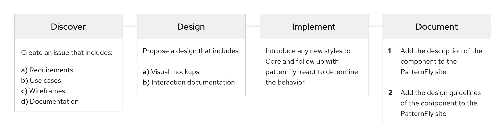

The PatternFly open source community depends on contributions to help our design system grow and evolve. We encourage everyone, regardless of background, to make suggestions for enhancements, contribute new design patterns and ideas, help identify bugs in code, and more. With your help, we can stay on top of the latest and greatest implementation solutions.  

## PatternFly on GitHub
PatternFly has a few repos you can contribute to:
- [patternfly](https://github.com/patternfly/patternfly) ("Core"): For core HTML and CSS contributions. All component contributions should start in Core.
- [patternfly-react](https://github.com/patternfly/patternfly-react): For React contributions.
- [patternfly-org](https://github.com/patternfly/patternfly-org): For PatternFly website content and design documentation contributions.

## PatternFly feature lifecycle

PatternFly features go through a life-cycle development process that requires contributions from multiple disciplines including design, development, and content authoring. The typical feature lifecycle is illustrated below.

## Get help
If you run into trouble and need support, the PatternFly team is here to help. Simply reach out to us on [Slack](https://patternfly.slack.com) to get in touch. We'll always do our best to answer your questions and connect you with the right people quickly.
