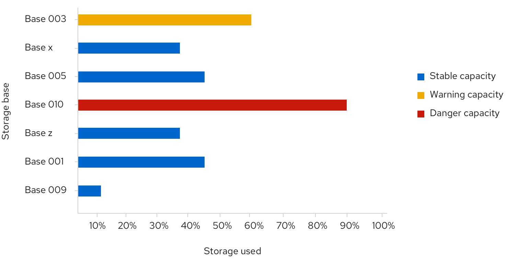
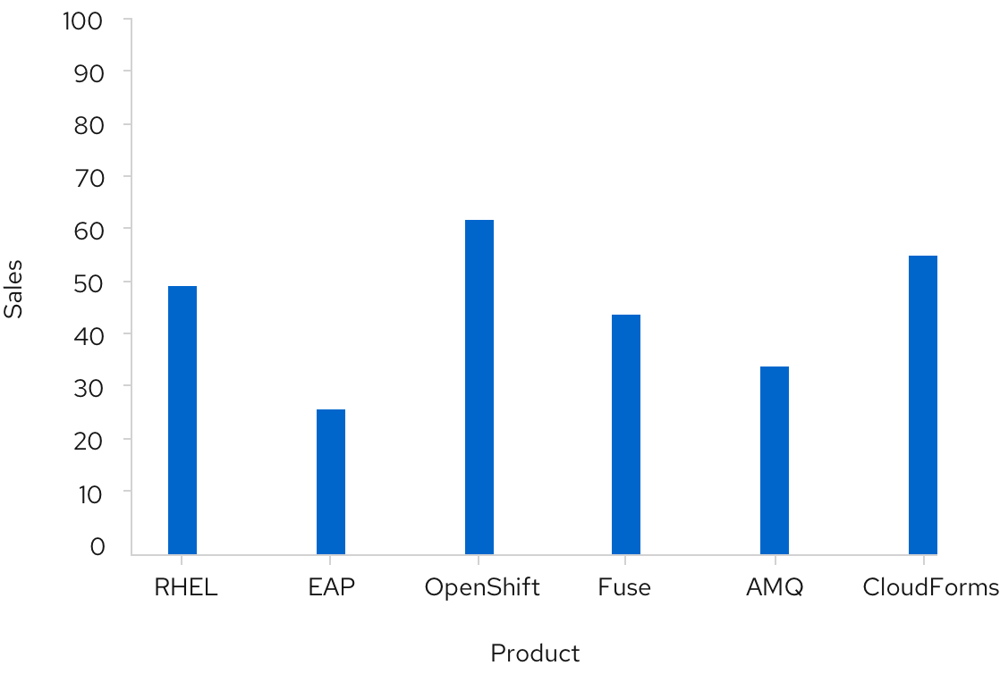

A **bar chart** is used to easily display two variables, one on the horizontal x-axis and one on the vertical y-axis. They are helpful to visualize and compare categorical data.

## Usage
Bar charts are a great way to show and compare categorical data. Unlike donut or pie charts that differentiate by angle area, bar charts differentiate by length. Because of this clearer differentiation, we recommend using bar charts over donut or pie charts in most cases.

If you want to show continuous data over time, you may consider using a [line chart](/charts/line-chart) instead. If you wish to show the percentage utilization ratio between used and available, you should check out the [donut utilization chart](/charts/donut-utilization-chart).

## Horizontal vs. vertical bar charts

The orientation of bar charts is dependent on the data and space at hand. Any bar chart should be able to be displayed in either direction if applicable.

#### Example

 

A bar's height represents its value. All bars should be the same width, and the spacing between them should be equal, mimicking the spacing between axis values. For fill color recommendations, see [colors for charts](/charts/colors-for-charts).
