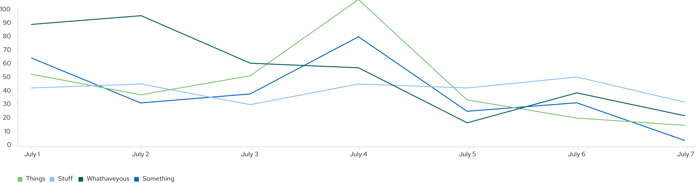

A **line chart** plots a series of discrete data samples to show continuous data and trend information. Sample values on the line can be measured and extracted.

## Usage
The most common use case for line charts is to compare several data sets over a period of time. They can be used to project trends into the past or future. A best fit line is created and extended in both directions to do so, but the validity of the projection is not certain. If you want to show and compare categorical data, you may consider using a [bar chart](/charts/bar-chart).

Multiple lines on the same chart allow the user to visualize relationships between varying data sets, such as correlated events, similarities or unexpected differences. We recommend displaying no more than 6 lines on a single graph to avoid confusion.

### Example

Line charts can optionally represent data points as dots on the line. If so, the same interaction that occurs when hovering over one in an [area chart](/charts/area-chart) will occur in line charts. For line colors, we recommend consulting [colors for charts](/charts/colors-for-charts).