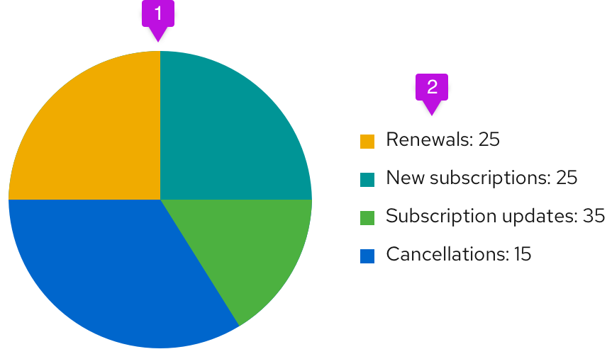

A **pie chart** is commonly used to show percentages or proportional data.

## Usage
Choose a pie chart when you need to compare a set of values to a whole. For example, you might choose a pie chart when visualizing the number of sales made by a team of five people; each segment of the chart represents one salesperson’s performance in the context of the rest of the team. The sum of all of the segments of the chart must equal 100%, and the data points should be mutually exclusive. It is recommended that there are no more than six segments per single pie chart.

A pie chart may be the wrong choice when you need to compare categories to one another, because it can be difficult to distinguish small differences between segments. If you wish to compare values to each other, a [bar chart](/charts/bar-chart) may be a more effective pattern.

### Example

1. **Pie chart fill:** We recommend fill colors based on the [colors for charts](/charts/colors-for-charts).
2. **Legend:** Each variable on the legend should report their current value.
