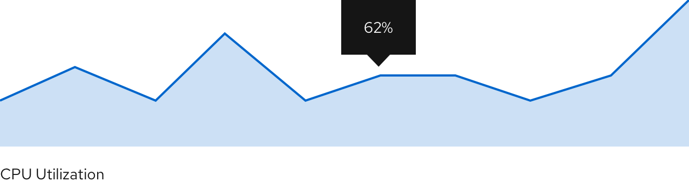

A **sparkline** is a small chart that helps users analyze data and understand trends and patterns.

## Usage
Sparklines are commonly used in tables, reports, and dashboards. A common use case is displaying utilization in an environment over time. Sparklines help to show trends in a series of values or to highlight maximum and minimum values. We recommend using sparklines alone without an axis and placing the name of the item being visualized underneath the chart. 

### Example

We recommend showing sparklines without an x or y-axis. Depending on space, a label can be placed underneath or to the left of the sparkline naming its visualized item.
