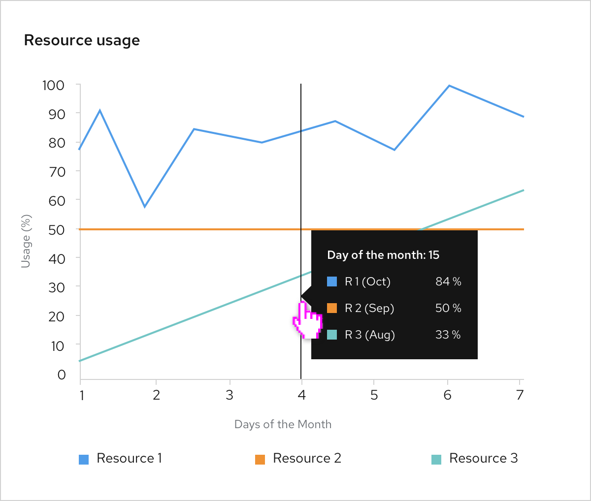

A **tooltip chart** is a chart with tooltips that appear when users hover over items within it.

## Usage
For charts that have more than one data set graphed, a complex chart tooltip can be used to give more detail to a specific point in the multiple data series. This works well for [line](/charts/line-chart), [area](/charts/area-chart), or [stacked](/charts/stack-chart) charts, where data sets may intersect over a period of time.

## Example
On hover, the tooltip shows all the corresponding data points that match a point along the x-axis. Tooltip content could also include any additional information that might be important to the user.

