 
## Elements

### Alerts
Alert elements vary depending on the variation of alert. Toast alerts are always dismissible, but bordered inline alerts can be both dismissable and non-dismissible. All other elements are consistent between toast and bordered inline alerts. Plain inline alerts are never dismissable, and consist of only a status area and alert title.
 
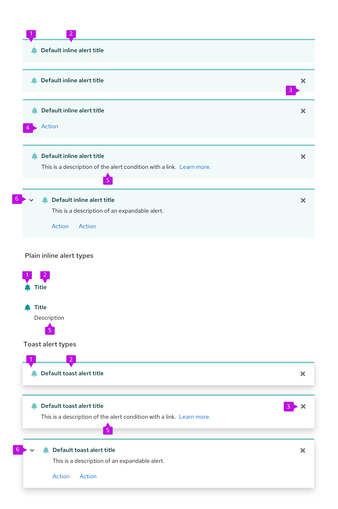

1. **Status area**: The status area indicates the severity of the alert with a specific icon and color. 

2. **Alert title**: The alert title concisely communicates the alert’s main message. Its text color is coded to match the alert type.

3. **Close button**: The close button is used to dismiss the alert. It’s required for toast alerts and optional for inline alerts.

4. **Actions (optional)**: The actions area enables the user to take a specific action in relation to the alert. 1 or more actions can be placed inside of an alert.

5. **Description (optional)**: The description field communicates additional information to the user. It can also include a navigation link as an alternative to an action.

6. **Expandable alert (optional)**: The expansion reveals additional information.

### Alert groups

An alert group stacks and positions 2 or more alerts in a live region, either in a layer over the main content of a page or inline with the page content. Alert groups should always rank alerts by age, stacking new alerts on top of old ones as they surface.

1. **Newest notification:** Always appears at the top of the alert group.
2. **Second newest notification:** Moves down when a newer notification surfaces.
3. **Oldest notification:** Continues to move down the stack as newer notifications surface, until a user closes it.
4. **Overflow footer (optional):** Use this when you do not want to display more than a specified number of alerts at the same time on the user's screen. See [Managing overflow](#managing-overflow) for more information about overflow footer interactions.

### Communicating severity
The status icon, background, and alert title are coded to communicate the severity of an alert.

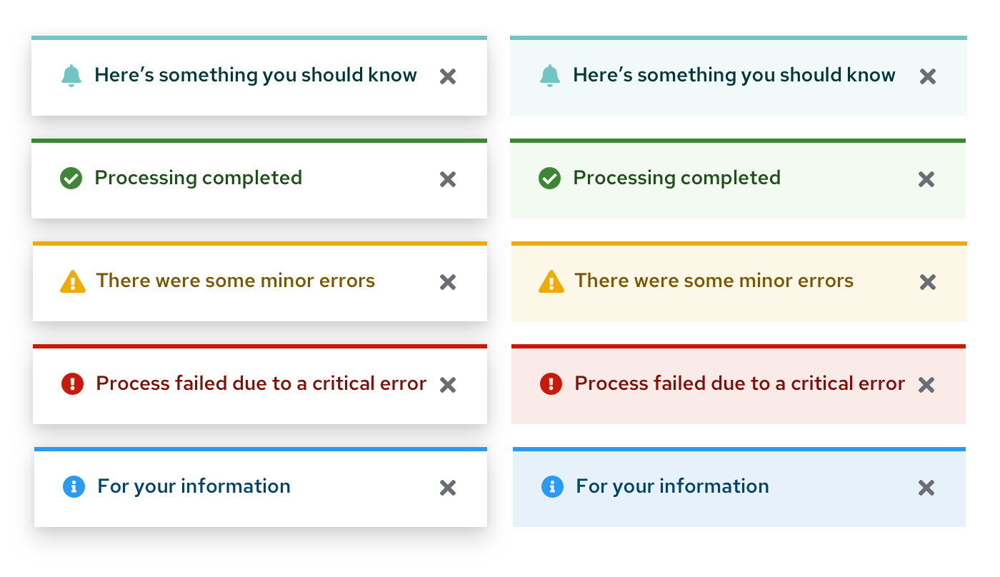

|Type   |Icon   |Usage      |
|---------|--------|--------------|
|Default  |fa-bell | Use for generic messages with no associated severity
|Information    |fa-info-circle |Use for general informational messages|
|Warning  |fa-exclamation-triangle |Use to indicate that a non-critical error has occurred|
|Critical |fa-exclamation-circle | Use to indicate that a critical or blocking error has occurred
|Success  |fa-check-circle | Use to indicate that a task or process has completed successfully

For more information about what colors to use for status and severity, visit the [Colors page](/design-foundations/colors/#status-and-state-colors).

## Usage
Use an alert component when you are trying to give the user essential information in a prominent way. More specific use cases differ based on component variation. 

### Customizing alerts
 
If your use case falls outside of PatternFly's standard alert variations, use [icons](/design-foundations/icons) and [colors](/design-foundations/colors) to create custom alerts that meet your needs.
 
View custom alerts in action in our [custom alert examples](/components/alert#custom-icons).

### Managing overflow

If you don't want multiple alerts to stack and fill the screen until the user dismisses them, you may use the overflow footer in an alert group to manage overflow. When applying overflow, you should decide how many alerts to display before showing the footer. A threshold of 3 alerts is recommended. After that, additional alerts added to the screen will cause older alerts to be hidden, and only the most recent 3 alerts are displayed.

The overflow link should be configured to navigate to a place where the user can view and manage a complete list of incoming alerts. If a [notification drawer](/components/notification-drawer) is being used, it should open the drawer. You may customize the text accordingly to reflect the result of clicking the link. However, we recommend displaying the number of new/unread notifications present to give the user feedback about how many additional notifications are remaining to view as in the example below.

See our [toast alert guidelines](#using-toast-alerts) for more information about using toast alerts.

## Placement
Toast alerts should be placed in an alert group in the upper-right corner of a page. Use 8px of padding between each alert in an alert group. Alert group alignment on a page will depend on your use case.

### Toast alerts
Toast alerts communicate information about an update, confirmation, or other activity. A toast alert overlays content in the upper-right corner of the page and disappears when it times out or when the user dismisses it.
 
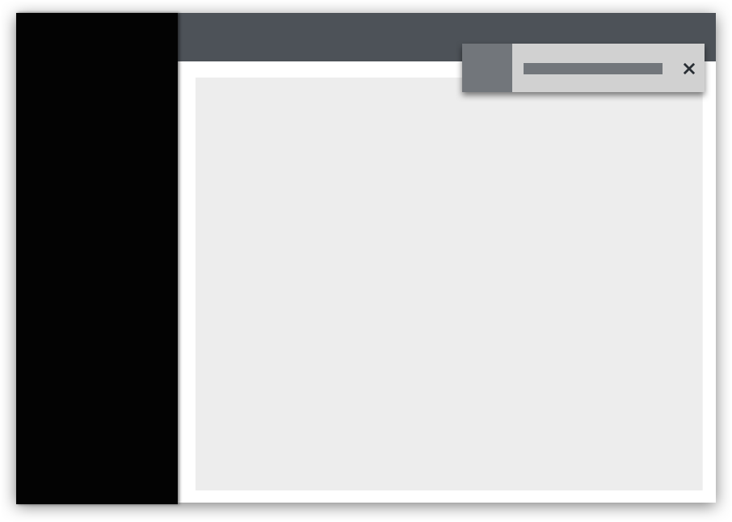
 

#### Using toast alerts
Use toast alerts to communicate an update, confirmation, or other activity to the user without blocking their workflow. For example, you can use a toast alert to inform the user that their message was sent. You can include links in a toast alert for a user to take action on the event that surfaced the alert, but the links should only be a shortcut for the user. A toast alert should never be used as the only means for taking actions on an alert event.
 
Toast alerts stack in the upper-right corner of a page. To properly position and stack a set of alerts, use an [alert group](#alert-groups) component. When alerts stack, the most recent alert appears at the top, and others move down as more alerts come in. When alerts are deleted, the remaining alerts move up.
 
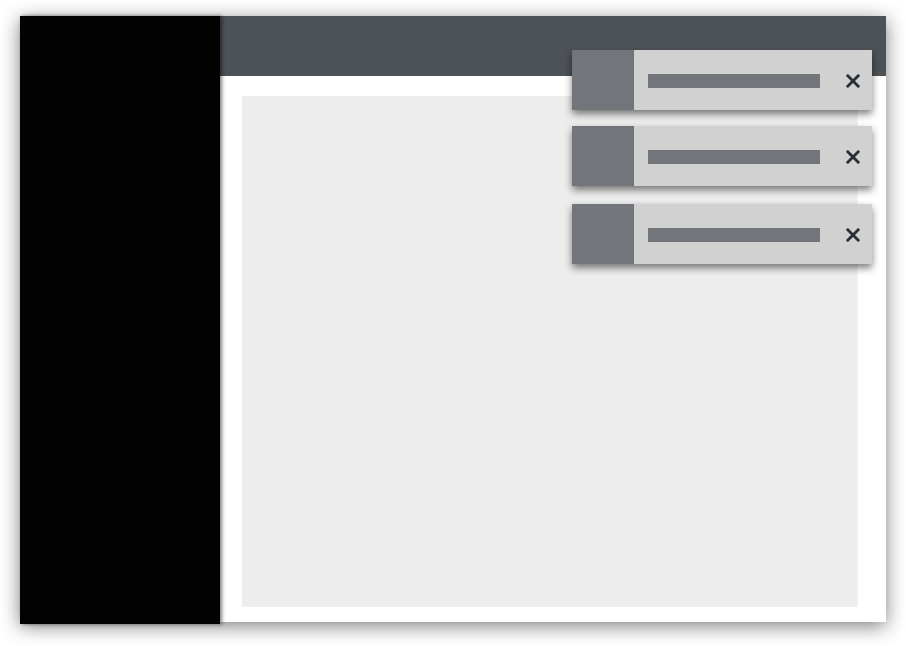
 
Toast alerts should always have a close button so that the user can dismiss them. If you include an automatic timeout for your toast alert, 8 seconds is recommended. Toast alerts should not disappear while the user is hovering over them.
 

 
Toast alerts are commonly used in the following situations:
- Confirming that a message sent
- Confirming that an update was made
- Informing the user that their action was completed successfully
- Informing the user that their action was completed with errors

**For desktop views**, right align toast alert groups over your page content. Each alert should stack on top of one another with 8px of padding in between.

**For mobile views**, center toast alert groups over your page content.

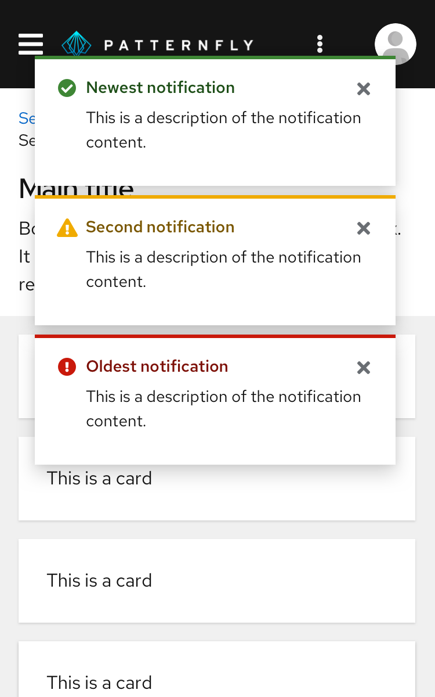

See our [toast alert guidelines](#using-toast-alerts) for more information about using toast alerts.

### Bordered inline alerts
Bordered inline alerts communicate information about a specific user action on a page. An inline alert appears within the content area and disappears when the user closes it or navigates away from the page.

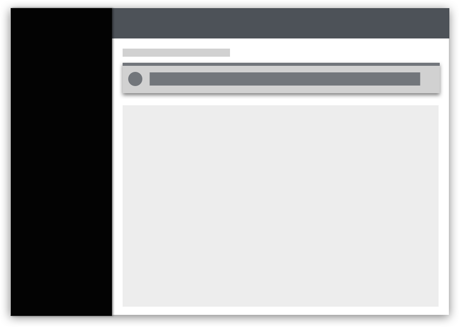

#### Using bordered inline alerts
Use bordered inline alerts to return feedback as the result of a user action within a page without blocking the user’s workflow. Common uses for bordered inline alerts include form validation and warning messages.
 
* **If an alert message applies globally to the content on a page,** place the alert in the page header area just below the title.
 
  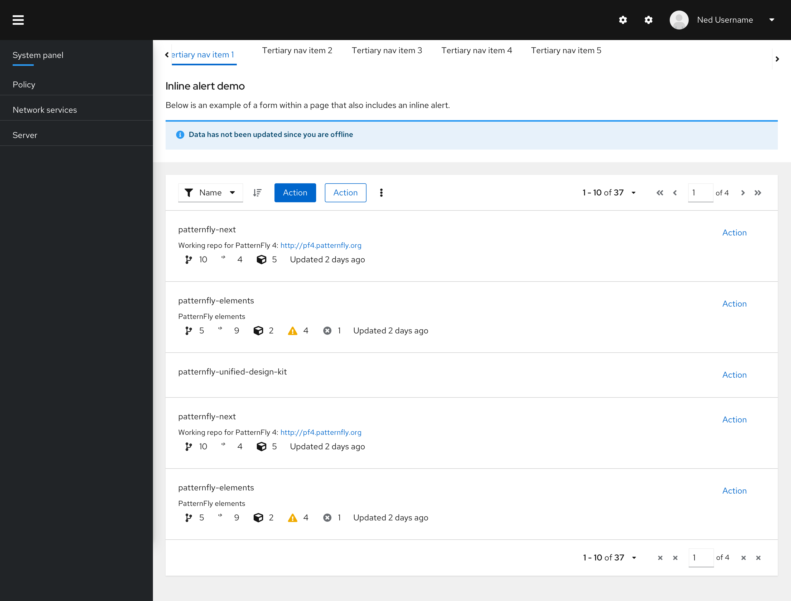
 
* **If the alert applies only to specific content,** place it inline with the page content to call attention to the error.
 
  

* **If the alert is being used to indicate errors,** use an error validation summary at the top of the page to indicate what errors are present. The summary should be a quick, general overview. Show an error alert next to the field that is causing the error. The error message should be concise and actionable. It should tell the user what happened and the next steps needed to fix it. 

  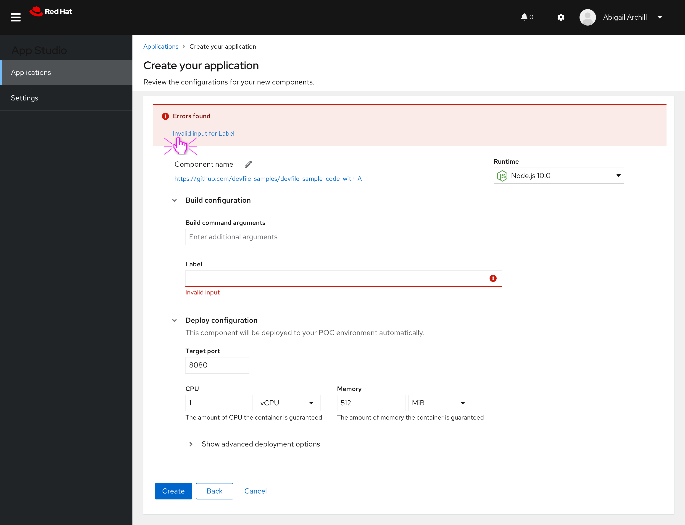 

  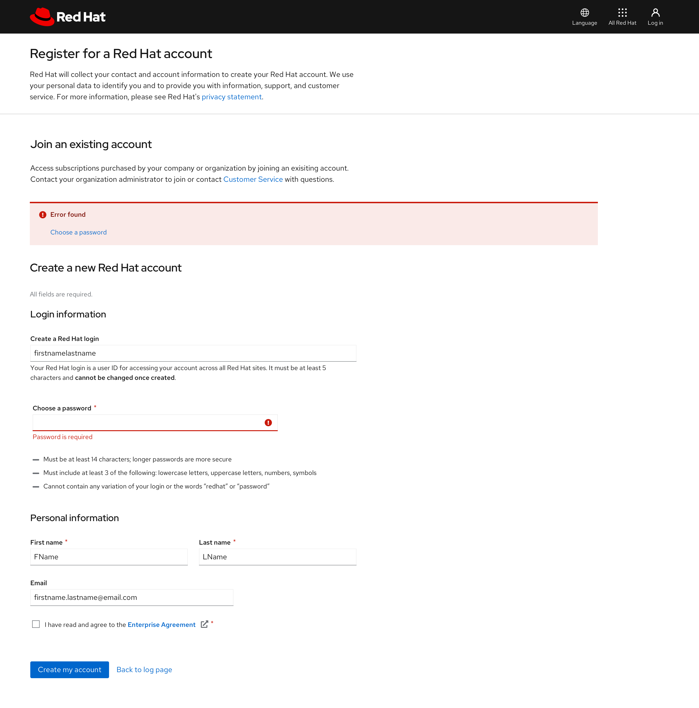

* **If multiple errors are present in the same location,** order them from most to least severe. 

  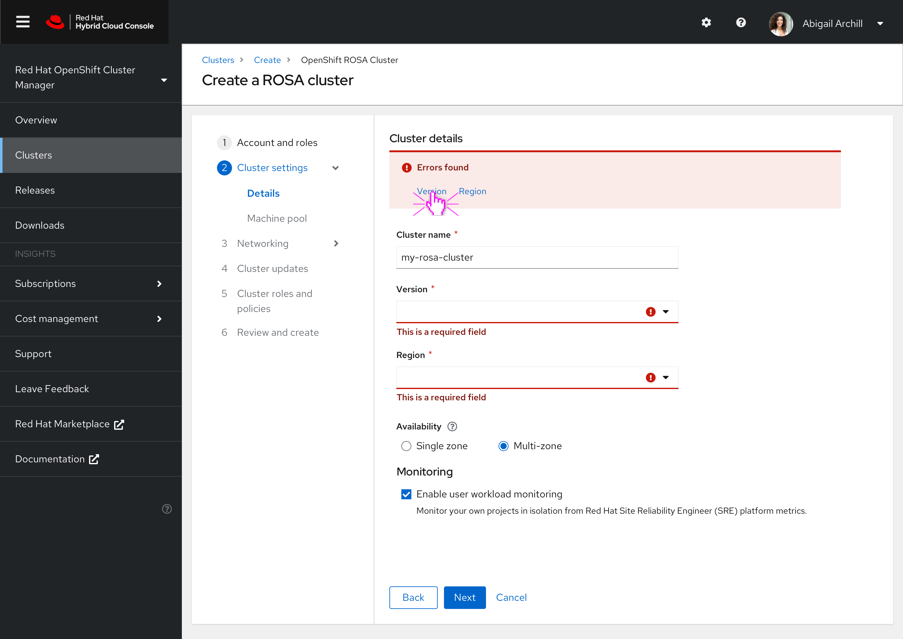

* **If the alert is being used to indicate errors on a modal,** use an error validation summary at the top of the modal below the title to indicate what errors are present. Show an error alert next to the field that is causing the error. The error message should be concise and actionable. It should tell the user what happened and the next steps needed to fix it. 

  

* **If the alert is being used to indicate errors on a modal with an existing alert,** display the new alert above the existing alert.

  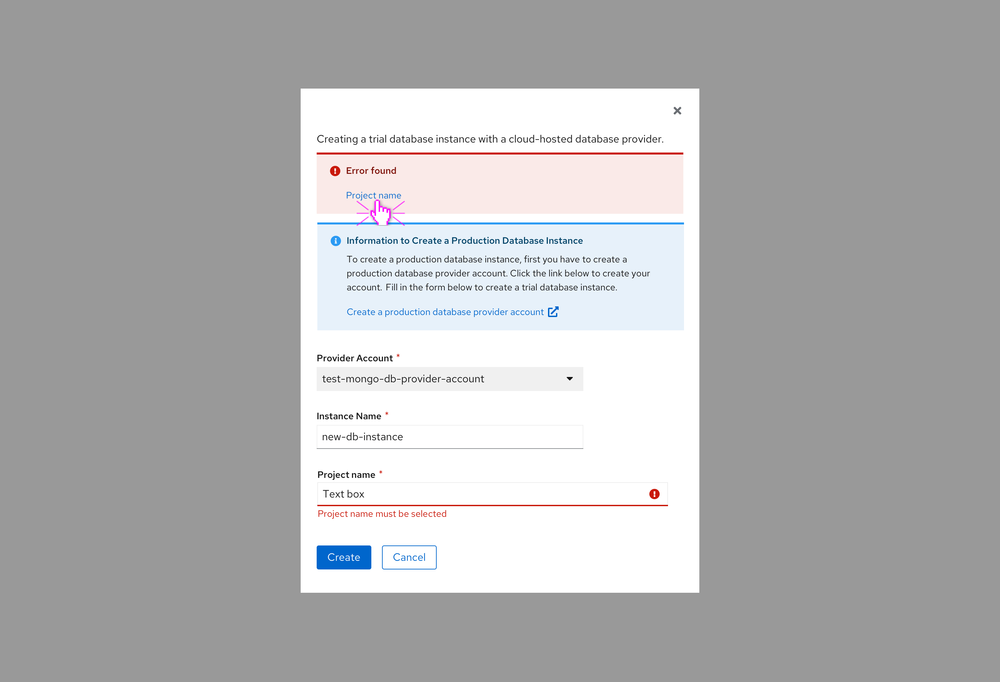

**The user can dismiss an information alert by using the close button.** Error-related alerts (warning and critical severity) should disappear only when the underlying issue that caused the alert is resolved. However, if the issue cannot be resolved on the current page, use a [modal](/components/modal) instead of an inline alert to provide user the options to proceed.
 
In addition to static message content and links, **you have the option of including interactive elements** in the body of an inline alert to ask the user for further input or feedback.

 
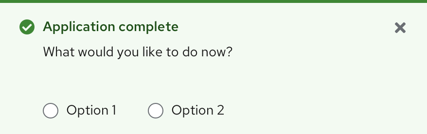

Bordered inline alerts are commonly used in the following situations:
- Informing the user that the information they entered into a form field isn’t valid
- Informing the user of something that needs their attention
- Informing the user that they need to set something up
- Informing the user that a feature is temporarily unavailable

### Plain inline alerts
Plain inline alerts communicate information about a temporarily persistent error or other activity. A plain inline alert is less visually intrusive than a bordered inline alert, and is designed to be placed in content-heavy areas, such as within a form, wizard, or drawer. This alert type persists until the error or action is resolved.
 
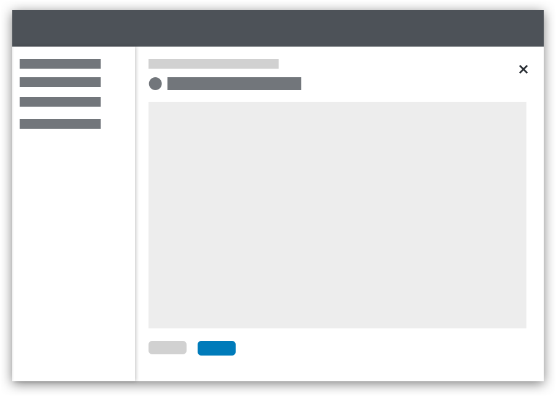

#### Using plain inline alerts
 
Use plain inline alerts to communicate non-imperative messages to the user without adding visual clutter. This alert type is particularly helpful within other components, such as wizards, drawers, modals, side panels, and popovers, which may already contain a lot of information.

Plain inline alerts are non-dismissible, and it is not recommended to use them with actions or links.

**Using plain inline alerts on tabbed pages:**

On a tabbed page that has a gray background, inline alerts do not offer enough contrast. Using them in this context requires additional formatting.
- If the alert is relevant to the entire page and all the tabs within the page, it should be placed on the header:
 
  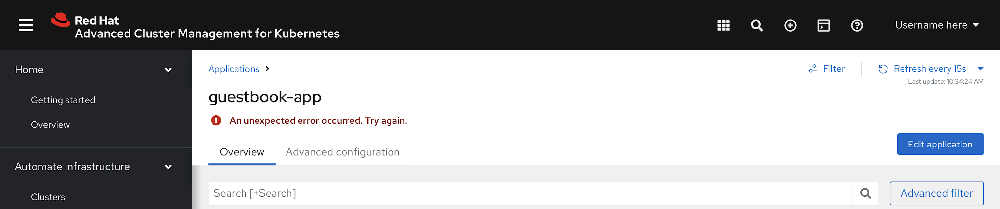
 
- If the alert is not relevant to the entire page, the white header area should be extended below the tab and separated from the tabs by a gray line. Place the plain inline alert in the resulting “banner”:
 
  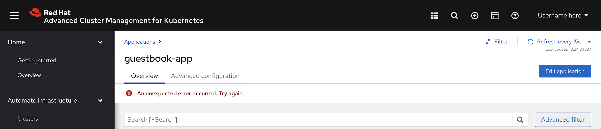
 
Plain inline alerts are commonly used in the following situations:
- Informing the user of something that needs their attention
- Informing the user that a temporary error has occurred
- Informing the user that a feature is temporarily unresponsive

## Content considerations
 
- In inline alerts and toast alerts, avoid using “success” and “successfully.” They’re extraneous.
 

 
| **Do** | **Don’t** |
|:------:|:---------:|
| Account created| Your account was successfully created.|
 

 
- Be concise. In one-line toast alerts, use fragments instead of sentences if possible.
 

 
| **Do** | **Don’t** |
|:------:|:---------:|
| Message sent| Your message has been sent.|
 

- In toast alerts containing links, describe how the user can navigate through the UI to perform the action. Learn more about how descriptive text supports accessibility in the next section.
 

 
| **Do** | **Don’t** |
|:------:|:---------:|
| From the **Settings** tab, click **View logs.**| **View logs**|
 

 
## Accessibility

For information regarding accessibility, visit the [alert accessibility](/components/alert/accessibility) tab.
