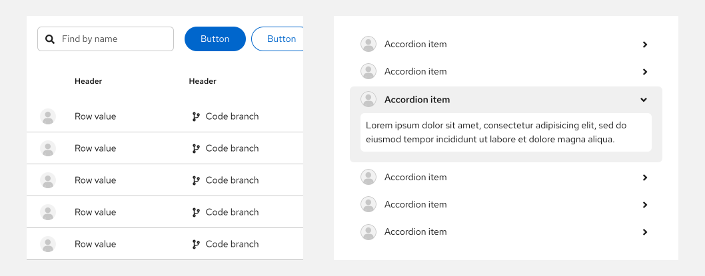
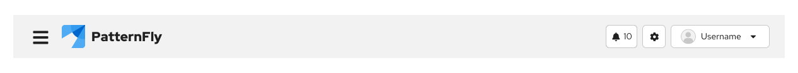
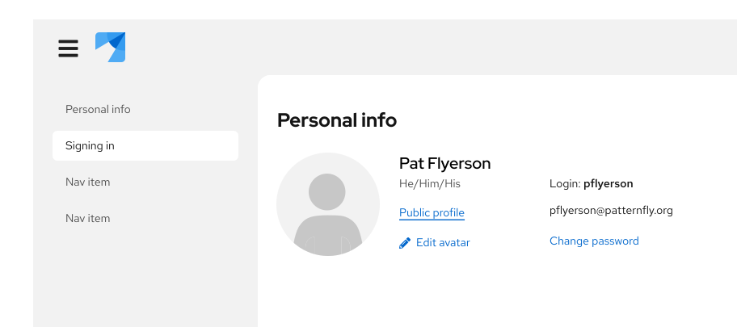

import '../components.css';

## Elements 

1. **Image/graphic:** Visual representation of the user. If there is no custom image for a user, the default graphic will be shown.
1. **Border (optional):** Outline, to improve the visual prominence of an avatar in a UI element.

## Usage

An avatar is typically used to represent the current user in the masthead. However, based on your product's use cases and needs, there is room for customization, as outlined in the following [avatar variations](#variations) section.

## Variations 

There are 4 size variations available to use for different scenarios: 

1. Small (sm), 24px

    - Default size.
    - Used in accordions, data lists, and tables:

    

    
    

    - Also used in the masthead component:

    

    
    

1. Medium (md), 36px

1. Large (lg), 72px 
    
    - Used in cards.

    

    
    

1. Extra large (xl), 128px
    
    - Used in profile displays.

    

    
    

## Accessibility
For information regarding accessibility, visit the [avatar accessibility](/components/avatar/accessibility) tab. 
